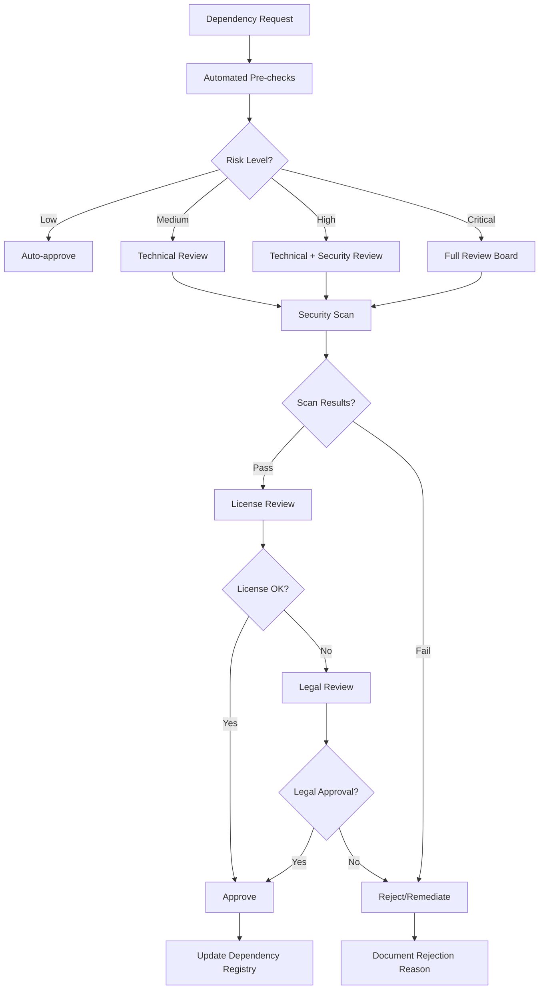

# Dependency Management Policy

## Overview

This document establishes comprehensive policies and procedures for managing dependencies across all projects in the AI-Assisted-Software-Development ecosystem. These policies balance development velocity with security, maintainability, and compliance requirements.

**Target Audience**: Developers, DevOps engineers, security teams, AI assistants, and project maintainers
**Scope**: All dependency management activities including selection, approval, updates, monitoring, and emergency patching

**Related Documentation**:

- [AI-Assisted Output Instructions](.github/instructions/ai-assisted-output.instructions.md)
- [Security Guidelines](../security/README.md)
- [Code Review Guidelines](code-review.instructions.md)

## Table of Contents

- [Dependency Classification](#dependency-classification)
- [Selection Criteria and Approval Process](#selection-criteria-and-approval-process)
- [Version Management and Update Strategies](#version-management-and-update-strategies)
- [Security Vulnerability Monitoring](#security-vulnerability-monitoring)
- [License Compliance and Legal Considerations](#license-compliance-and-legal-considerations)
- [Dependency Isolation and Containerization](#dependency-isolation-and-containerization)
- [Supply Chain Security](#supply-chain-security)
- [Automated Dependency Updates](#automated-dependency-updates)
- [Conflict Resolution Procedures](#conflict-resolution-procedures)
- [Documentation Requirements](#documentation-requirements)
- [AI-Specific Dependency Considerations](#ai-specific-dependency-considerations)
- [Emergency Patching Procedures](#emergency-patching-procedures)
- [Monitoring and Compliance](#monitoring-and-compliance)
- [Tools and Automation](#tools-and-automation)
- [Quality Checklist](#quality-checklist)
- [Templates and Examples](#templates-and-examples)

## Dependency Classification

### 1. Dependency Categories

**Production Dependencies** (Highest Risk):

- Runtime libraries required for application operation
- Framework components and core utilities
- Database drivers and connection libraries
- API clients and communication libraries

**Development Dependencies** (Medium Risk):

- Build tools and compilers
- Testing frameworks and utilities
- Code formatting and linting tools
- Development servers and proxies

**AI/ML Dependencies** (Special Category):

- Machine learning libraries and frameworks
- AI model packages and trained models
- Data processing and transformation tools
- Inference engines and optimization libraries

**Infrastructure Dependencies** (System Critical):

- Container base images
- System libraries and runtime environments
- Cloud provider SDKs
- Deployment and orchestration tools

### 2. Risk Classification Matrix

| Risk Level   | Criteria                                              | Review Requirements                                  |
| ------------ | ----------------------------------------------------- | ---------------------------------------------------- |
| **Critical** | Core functionality, security-sensitive, high exposure | Architecture review + Security review + Legal review |
| **High**     | Major feature enabler, widely used, network access    | Technical review + Security scan + License check     |
| **Medium**   | Supporting functionality, limited scope               | Technical review + Automated scanning                |
| **Low**      | Development tools, testing utilities                  | Automated approval with post-review                  |

## Selection Criteria and Approval Process

### 1. Pre-Selection Evaluation

**MUST Requirements**:

- [ ] Active maintenance (commits within last 6 months)
- [ ] Responsive issue management (average response time < 2 weeks)
- [ ] Documentation quality score ≥ 7/10
- [ ] At least 1000 downloads/month (for public packages)
- [ ] Compatible license (see [License Compliance](#license-compliance-and-legal-considerations))
- [ ] No known critical vulnerabilities
- [ ] Supports current target platforms/versions

**SHOULD Requirements** (Weight in decision):

- [ ] Large community or corporate backing (Weight: 3)
- [ ] Regular release cadence (Weight: 2)
- [ ] Comprehensive test coverage >80% (Weight: 2)
- [ ] Multi-platform support (Weight: 2)
- [ ] Backward compatibility guarantees (Weight: 1)
- [ ] Professional support available (Weight: 1)

### 2. Approval Workflow



### 3. Review Criteria Checklist

**Technical Review**:

- [ ] Dependency size and performance impact assessed
- [ ] Integration complexity evaluated
- [ ] Alternative solutions considered
- [ ] Migration/removal strategy documented
- [ ] Test coverage impact analyzed

**Security Review**:

- [ ] CVE database checked for known vulnerabilities
- [ ] Code quality assessment performed
- [ ] Supply chain analysis completed
- [ ] Maintainer reputation verified
- [ ] Security contact information available

**License Review**:

- [ ] License compatibility verified
- [ ] Commercial use permissions confirmed
- [ ] Attribution requirements documented
- [ ] Redistribution rights clarified
- [ ] Patent implications assessed

## Version Management and Update Strategies

### 1. Versioning Standards

**Semantic Versioning (SemVer) Compliance**:

- **MAJOR** (X.y.z): Breaking changes, requires approval
- **MINOR** (x.Y.z): New features, backward compatible, auto-update allowed
- **PATCH** (x.y.Z): Bug fixes, security patches, auto-update encouraged

**Version Pinning Strategy**:

```yaml
# Production Dependencies - Pin exact versions
production:
  strategy: "exact"
  example: "react: 18.2.0"

# Development Dependencies - Allow patch updates
development:
  strategy: "patch"
  example: "eslint: ^8.45.0"

# AI/ML Dependencies - Pin major.minor, allow patch
ai_ml:
  strategy: "minor-locked"
  example: "tensorflow: ~2.13.0"
```

### 2. Update Approval Matrix

| Update Type      | Auto-Update | Review Required     | Approval Authority |
| ---------------- | ----------- | ------------------- | ------------------ |
| Patch (Security) | ✅ Yes      | Post-deployment     | Automated          |
| Patch (Bug Fix)  | ✅ Yes      | Pre-deployment      | Tech Lead          |
| Minor (Feature)  | ❌ No       | Pre-deployment      | Tech Lead + QA     |
| Major (Breaking) | ❌ No       | Architecture Review | Architecture Board |

### 3. Update Scheduling

**Regular Update Cycles**:

- **Security patches**: Immediate (within 24-48 hours)
- **Patch updates**: Weekly batch updates
- **Minor updates**: Monthly review and deployment
- **Major updates**: Quarterly planning cycle

**Exception Handling**:

- Emergency security updates: Out-of-band deployment
- Critical bug fixes: Expedited review process
- Breaking changes: Extended testing period required

## Security Vulnerability Monitoring

### 1. Continuous Monitoring Setup

**Required Monitoring Tools**:

- [ ] GitHub Dependabot alerts enabled
- [ ] Snyk or similar commercial scanner configured
- [ ] OWASP Dependency Check integrated in CI/CD
- [ ] National Vulnerability Database (NVD) monitoring
- [ ] Vendor security mailing lists subscribed

**Monitoring Frequency**:

- Real-time alerts for critical vulnerabilities
- Daily scans for high-severity issues
- Weekly comprehensive dependency audits
- Monthly security posture reports

### 2. Vulnerability Response Workflow

```yaml
# Vulnerability Severity Response Times
Critical (CVSS 9.0-10.0):
  response_time: "4 hours"
  patch_time: "24 hours"

High (CVSS 7.0-8.9):
  response_time: "24 hours"
  patch_time: "72 hours"

Medium (CVSS 4.0-6.9):
  response_time: "72 hours"
  patch_time: "1 week"

Low (CVSS 0.1-3.9):
  response_time: "1 week"
  patch_time: "next release cycle"
```

### 3. Security Assessment Criteria

**Pre-Integration Security Checklist**:

- [ ] Static code analysis completed
- [ ] Known vulnerability scan passed
- [ ] Maintainer security practices reviewed
- [ ] Update history and response time analyzed
- [ ] Communication channels for security issues verified

## License Compliance and Legal Considerations

### 1. Approved License Categories

**Fully Approved** (Auto-accept):

- MIT License
- Apache License 2.0
- BSD 2-Clause/3-Clause
- ISC License
- Unlicense

**Conditionally Approved** (Review Required):

- GNU LGPL 2.1/3.0 (with restrictions)
- Mozilla Public License 2.0
- Eclipse Public License 2.0
- Creative Commons (specific variants)

**Requires Legal Review**:

- GNU GPL 2.0/3.0
- GNU AGPL 3.0
- Commercial/Proprietary licenses
- Custom or modified licenses

**Prohibited**:

- WTFPL (What The F\*ck Public License)
- Licenses with advertising clauses
- Non-commercial only licenses
- Copyleft with network provisions (for SaaS)

### 2. License Compliance Workflow

**Documentation Requirements**:

- [ ] License inventory maintained in `LICENSES.md`
- [ ] Attribution requirements tracked
- [ ] Redistribution obligations documented
- [ ] Patent grant implications assessed
- [ ] Commercial use restrictions noted

**Compliance Monitoring**:

- [ ] Automated license scanning in CI/CD
- [ ] License changes tracked in updates
- [ ] Legal team notifications for license changes
- [ ] Annual license compliance audit

### 3. License Management Template

```markdown
## Dependency License Registry

| Package    | Version | License    | Commercial OK | Attribution Required | Notes                 |
| ---------- | ------- | ---------- | ------------- | -------------------- | --------------------- |
| react      | 18.2.0  | MIT        | ✅ Yes        | ❌ No                | Standard MIT terms    |
| lodash     | 4.17.21 | MIT        | ✅ Yes        | ❌ No                | Standard MIT terms    |
| tensorflow | 2.13.0  | Apache-2.0 | ✅ Yes        | ✅ Yes               | Include Apache notice |
```

## Dependency Isolation and Containerization

### 1. Isolation Strategies

**Container-Based Isolation**:

```dockerfile
# Multi-stage builds for dependency isolation
FROM node:18-alpine as dependencies
WORKDIR /app
COPY package*.json ./
RUN npm ci --only=production

FROM node:18-alpine as runtime
WORKDIR /app
COPY --from=dependencies /app/node_modules ./node_modules
COPY . .
USER node
EXPOSE 3000
CMD ["npm", "start"]
```

**Virtual Environment Standards**:

```bash
# Python dependency isolation
python -m venv .venv
source .venv/bin/activate  # Linux/Mac
# or
.venv\Scripts\activate.bat  # Windows

# Install dependencies in isolation
pip install -r requirements.txt
```

### 2. Dependency Boundaries

**Service-Level Isolation**:

- [ ] Each microservice manages its own dependencies
- [ ] Shared libraries versioned and published internally
- [ ] API contracts define service boundaries
- [ ] Database dependencies isolated per service

**Environment-Level Isolation**:

- [ ] Development, staging, and production use identical dependency versions
- [ ] Container images built once and promoted through environments
- [ ] Configuration externalized from dependency management
- [ ] Secrets managed separately from dependency configurations

### 3. Containerization Best Practices

**Security Hardening**:

- [ ] Use minimal base images (Alpine, distroless)
- [ ] Regularly update base images
- [ ] Scan container images for vulnerabilities
- [ ] Run containers as non-root users
- [ ] Implement resource limits and constraints

## Supply Chain Security

### 1. Supply Chain Verification

**Package Integrity Verification**:

- [ ] Checksum verification for all packages
- [ ] Digital signature validation when available
- [ ] Package source verification (official registries only)
- [ ] Reproducible build verification when possible

**Maintainer Trust Assessment**:

```yaml
# Maintainer Trust Scorecard
factors:
  - identity_verified: true
  - corporate_backing: preferred
  - contribution_history: >2_years
  - security_response: <48_hours
  - community_reputation: high
  - two_factor_auth: required
```

### 2. Registry and Source Control

**Approved Package Registries**:

- **Primary**: Official language-specific registries (npm, PyPI, Maven Central)
- **Secondary**: Approved corporate registries
- **Prohibited**: Unofficial or unverified registries

**Internal Registry Requirements**:

- [ ] Vulnerability scanning before ingestion
- [ ] License compliance verification
- [ ] Malware detection and quarantine
- [ ] Access control and audit logging
- [ ] Mirror synchronization and backup

### 3. Build and Deployment Security

**Secure Build Pipeline**:

```yaml
# CI/CD Security Controls
security_controls:
  - dependency_scanning: true
  - license_validation: true
  - vulnerability_assessment: true
  - code_signing: required
  - artifact_attestation: true
  - supply_chain_levels_for_software_artifacts: "SLSA Level 2+"
```

## Automated Dependency Updates

### 1. Automation Framework

**Tools Configuration**:

- **Dependabot**: Automated pull requests for security updates
- **Renovate**: Advanced dependency update automation
- **Greenkeeper**: Real-time dependency monitoring
- **Custom Scripts**: Organization-specific update logic

**Update Policies**:

```yaml
# Dependabot Configuration
version: 2
updates:
  - package-ecosystem: "npm"
    directory: "/"
    schedule:
      interval: "weekly"
      day: "monday"
      time: "09:00"
    open-pull-requests-limit: 5
    reviewers:
      - "tech-leads"
    assignees:
      - "security-team"
    commit-message:
      prefix: "deps"
      include: "scope"
```

### 2. Automated Testing Requirements

**Pre-Merge Testing**:

- [ ] Unit tests pass with new dependency versions
- [ ] Integration tests validate functionality
- [ ] Security scans complete successfully
- [ ] Performance benchmarks meet thresholds
- [ ] Compatibility tests verify platform support

**Rollback Procedures**:

- [ ] Automated rollback triggers defined
- [ ] Previous version restoration procedures
- [ ] Incident response procedures documented
- [ ] Communication protocols established

### 3. Human Oversight Requirements

**Review Gates**:

- Major version updates require human approval
- Security updates auto-merge after testing
- Development dependency updates batch weekly
- Production dependency updates require staging validation

## Conflict Resolution Procedures

### 1. Common Conflict Types

**Version Conflicts**:

```bash
# Example: Multiple packages requiring different versions of lodash
package-a requires lodash@^4.17.0
package-b requires lodash@^3.10.0

# Resolution strategies:
1. Peer dependency resolution
2. Version range expansion
3. Alternative package evaluation
4. Custom fork or wrapper
```

**License Conflicts**:

- Copyleft vs. proprietary requirements
- Attribution requirement conflicts
- Commercial use restrictions
- Patent grant incompatibilities

**Security Conflicts**:

- Vulnerable dependency required by secure package
- Security update breaks functionality
- Patch unavailable for critical vulnerability

### 2. Resolution Decision Matrix

| Conflict Type              | Priority Order        | Resolution Authority | Escalation Path    |
| -------------------------- | --------------------- | -------------------- | ------------------ |
| Security vs. Functionality | Security First        | Security Team        | CISO               |
| License vs. Business       | Business Requirements | Legal Team           | Legal Counsel      |
| Performance vs. Features   | Context Dependent     | Tech Lead            | Architecture Board |
| Cost vs. Capability        | Budget Dependent      | Product Manager      | Executive Team     |

### 3. Resolution Procedures

**Step-by-Step Process**:

1. **Identify Conflict**: Document specific incompatibilities
2. **Assess Impact**: Evaluate business, technical, and security implications
3. **Research Alternatives**: Find compatible alternatives or workarounds
4. **Stakeholder Consultation**: Engage relevant teams and decision-makers
5. **Decision Documentation**: Record resolution rationale and implementation plan
6. **Implementation**: Execute the chosen resolution with monitoring
7. **Review and Learn**: Post-implementation review and process improvement

## Documentation Requirements

### 1. Dependency Inventory

**Required Documentation**:

```markdown
# Dependency Registry Template

## Production Dependencies

| Package  | Version | License | Purpose       | Risk Level | Last Updated | Next Review |
| -------- | ------- | ------- | ------------- | ---------- | ------------ | ----------- |
| express  | 4.18.2  | MIT     | Web framework | Medium     | 2024-01-15   | 2024-04-15  |
| mongoose | 7.5.0   | MIT     | MongoDB ODM   | High       | 2024-01-20   | 2024-02-20  |

## Development Dependencies

| Package | Version | License | Purpose           | Auto-Update | Notes               |
| ------- | ------- | ------- | ----------------- | ----------- | ------------------- |
| jest    | 29.6.0  | MIT     | Testing framework | Yes         | Latest stable       |
| eslint  | 8.45.0  | MIT     | Code linting      | Yes         | Config in .eslintrc |
```

### 2. Change Documentation

**Update Log Template**:

```markdown
# Dependency Update Log

## [2024-02-05] Security Update

**Updated Packages**:

- `lodash`: 4.17.20 → 4.17.21
- `minimist`: 1.2.5 → 1.2.8

**Reason**: Critical prototype pollution vulnerability (CVE-2021-44906)
**Testing**: All automated tests passed
**Rollback Plan**: Revert to previous versions if issues detected
**Approved By**: security-team@company.com
```

### 3. Architecture Decision Records (ADRs)

**Template for Dependency Decisions**:

```markdown
# ADR-XXX: Adopt [Technology] for [Purpose]

## Status

Accepted | Proposed | Deprecated

## Context

What is the issue that we're seeing that is motivating this decision or change?

## Decision

What is the change that we're proposing or have agreed to implement?

## Consequences

What becomes easier or more difficult to do and any risks introduced?

## Alternatives Considered

What other options were evaluated and why were they not selected?
```

## AI-Specific Dependency Considerations

### 1. AI/ML Library Management

**Special Considerations**:

- Large model files require artifact management strategy
- GPU/CPU compatibility requirements
- Version compatibility across ML pipeline components
- Performance optimization and hardware acceleration
- Model versioning and lineage tracking

**AI Framework Version Management**:

```yaml
# AI/ML Dependency Strategy
tensorflow: "2.13.0" # Pin exact version for model compatibility
torch: "~2.0.1" # Allow patch updates
transformers: "^4.30.0" # Allow minor updates
numpy: ">=1.21.0,<1.25.0" # Broad compatibility range

# Model Dependencies
models:
  versioning: "semantic"
  storage: "git-lfs"
  registry: "internal-model-registry"
  validation: "checksum-verification"
```

### 2. AI Development Workflow Integration

**Model Training Dependencies**:

- [ ] Reproducible environment specifications
- [ ] Dependency isolation for training vs. inference
- [ ] Version tracking for experiment reproducibility
- [ ] Hardware-specific optimization libraries
- [ ] Data pipeline dependency management

**AI-Assisted Development Dependencies**:

- [ ] GitHub Copilot API access libraries
- [ ] AI code generation supporting tools
- [ ] Natural language processing utilities
- [ ] Code intelligence and analysis tools

### 3. Ethical AI Dependency Review

**Bias and Fairness Assessment**:

- [ ] Pre-trained model bias evaluation
- [ ] Training data provenance and licensing
- [ ] Fairness metric implementation libraries
- [ ] Explainability and interpretability tools

**Privacy and Security**:

- [ ] Differential privacy implementation libraries
- [ ] Secure multi-party computation tools
- [ ] Federated learning frameworks
- [ ] Data anonymization utilities

## Emergency Patching Procedures

### 1. Critical Vulnerability Response

**Immediate Response Protocol** (0-4 hours):

1. **Alert Triage**:
   - [ ] Verify vulnerability authenticity and severity
   - [ ] Assess impact on current systems
   - [ ] Identify affected components and services
   - [ ] Determine if workarounds exist

2. **Emergency Team Assembly**:
   - [ ] Notify security incident response team
   - [ ] Engage technical leads for affected services
   - [ ] Brief engineering managers on scope and timeline
   - [ ] Contact vendor/maintainer if applicable

3. **Risk Assessment**:
   - [ ] Evaluate exploit likelihood and impact
   - [ ] Assess current exposure and attack vectors
   - [ ] Determine if temporary mitigation is sufficient
   - [ ] Calculate business impact of delayed response

### 2. Patch Development and Testing

**Accelerated Development Process** (4-24 hours):

```yaml
# Emergency Patch Workflow
phases:
  assessment:
    duration: "2 hours"
    activities:
      - vulnerability_analysis
      - impact_assessment
      - solution_identification

  development:
    duration: "4 hours"
    activities:
      - patch_development
      - alternative_evaluation
      - testing_strategy

  validation:
    duration: "2 hours"
    activities:
      - automated_testing
      - security_validation
      - integration_testing

  deployment:
    duration: "1 hour"
    activities:
      - staging_deployment
      - production_rollout
      - monitoring_activation
```

### 3. Emergency Approval Process

**Expedited Review Workflow**:

- **Critical (CVSS 9.0+)**: CISO or Security Lead approval sufficient
- **High (CVSS 7.0-8.9)**: Security Lead + Engineering Manager approval
- **Medium (CVSS 4.0-6.9)**: Standard review process with expedited timeline

**Documentation Requirements**:

- [ ] Emergency change ticket created
- [ ] Risk assessment documented
- [ ] Rollback plan prepared and tested
- [ ] Stakeholder communication sent
- [ ] Post-incident review scheduled

## Monitoring and Compliance

### 1. Continuous Monitoring

**Metrics and KPIs**:

```yaml
# Dependency Health Metrics
security:
  - mean_time_to_patch: "<72 hours"
  - vulnerability_count: "trend_downward"
  - critical_exposure_time: "<24 hours"

maintenance:
  - outdated_dependencies: "<10%"
  - maintenance_debt_ratio: "<0.2"
  - update_success_rate: ">95%"

compliance:
  - license_compliance_rate: "100%"
  - policy_adherence_score: ">90%"
  - audit_finding_count: "trend_downward"
```

### 2. Automated Compliance Checking

**CI/CD Integration**:

```yaml
# GitHub Actions Workflow for Dependency Compliance
name: Dependency Compliance Check
on: [push, pull_request]

jobs:
  dependency-check:
    runs-on: ubuntu-latest
    steps:
      - uses: actions/checkout@v3

      - name: Security Scan
        run: npm audit --audit-level=high

      - name: License Check
        uses: fossas/fossa-action@main
        with:
          api-key: ${{ secrets.FOSSA_API_KEY }}

      - name: Policy Validation
        run: |
          python scripts/validate-dependencies.py
          python scripts/check-license-compatibility.py
```

### 3. Compliance Reporting

**Regular Reports**:

- **Daily**: Critical vulnerability alerts and patches
- **Weekly**: Dependency update status and health metrics
- **Monthly**: Comprehensive security and compliance dashboard
- **Quarterly**: Strategic dependency review and roadmap update

**Audit Trail Requirements**:

- [ ] All dependency changes logged with rationale
- [ ] Approval workflows documented and auditable
- [ ] Version history and rollback capabilities maintained
- [ ] Security scan results archived and accessible

## Tools and Automation

### 1. Recommended Tool Stack

**Security and Vulnerability Management**:

- **Snyk**: Commercial vulnerability scanning and monitoring
- **OWASP Dependency-Check**: Open source vulnerability detection
- **GitHub Advanced Security**: Integrated security scanning
- **Veracode SCA**: Enterprise software composition analysis

**License and Compliance Management**:

- **FOSSA**: License compliance and analysis automation
- **WhiteSource (Mend)**: Open source security and license compliance
- **Black Duck**: Comprehensive open source management
- **Licensee**: GitHub's license detection library

**Dependency Management and Updates**:

- **Dependabot**: GitHub-native dependency updates
- **Renovate**: Advanced dependency update automation
- **Greenkeeper**: Real-time dependency monitoring (npm)
- **David**: Dependency status checking

### 2. Custom Automation Scripts

**Health Check Script Template**:

```python
#!/usr/bin/env python3
"""
Dependency Health Check Script
Validates dependency status across multiple projects
"""

import json
import subprocess
import sys
from typing import Dict, List

def check_vulnerabilities(project_path: str) -> Dict:
    """Run security audit and return results"""
    try:
        result = subprocess.run(
            ['npm', 'audit', '--json'],
            cwd=project_path,
            capture_output=True,
            text=True
        )
        return json.loads(result.stdout)
    except Exception as e:
        return {"error": str(e)}

def check_outdated_packages(project_path: str) -> Dict:
    """Check for outdated packages"""
    try:
        result = subprocess.run(
            ['npm', 'outdated', '--json'],
            cwd=project_path,
            capture_output=True,
            text=True
        )
        return json.loads(result.stdout) if result.stdout else {}
    except Exception as e:
        return {"error": str(e)}

def generate_report(projects: List[str]) -> None:
    """Generate dependency health report"""
    for project in projects:
        print(f"\n=== {project} ===")
        vuln_results = check_vulnerabilities(project)
        outdated_results = check_outdated_packages(project)

        # Process and report results
        if "vulnerabilities" in vuln_results:
            vuln_count = len(vuln_results["vulnerabilities"])
            print(f"Vulnerabilities: {vuln_count}")

        if outdated_results and not "error" in outdated_results:
            outdated_count = len(outdated_results)
            print(f"Outdated packages: {outdated_count}")

if __name__ == "__main__":
    projects = sys.argv[1:] if len(sys.argv) > 1 else ["."]
    generate_report(projects)
```

### 3. Integration Templates

**Package.json Security Configuration**:

```json
{
  "scripts": {
    "audit": "npm audit --audit-level=high",
    "audit-fix": "npm audit fix",
    "security-check": "npm audit && npm run license-check",
    "license-check": "license-checker --summary"
  },
  "engines": {
    "node": ">=18.0.0",
    "npm": ">=8.0.0"
  },
  "overrides": {
    "semver": "^7.5.2"
  }
}
```

## Quality Checklist

### Pre-Deployment Checklist

**Dependency Selection**:

- [ ] Selection criteria evaluation completed
- [ ] Risk assessment performed and documented
- [ ] License compatibility verified
- [ ] Security scan passed with acceptable results
- [ ] Alternative solutions evaluated and documented
- [ ] Stakeholder approval obtained for appropriate risk level

**Integration and Testing**:

- [ ] Integration testing completed successfully
- [ ] Performance impact assessed and acceptable
- [ ] Security testing validates no new vulnerabilities
- [ ] Compatibility testing across target platforms
- [ ] Documentation updated with new dependency information
- [ ] Rollback procedures tested and validated

**Compliance and Documentation**:

- [ ] License compliance verified and documented
- [ ] Dependency registry updated with new entries
- [ ] Change documentation completed
- [ ] Architecture decision record created (if applicable)
- [ ] Team notification sent for major additions
- [ ] Monitoring and alerting configured

### Post-Deployment Checklist

**Monitoring and Validation**:

- [ ] Dependency health monitoring activated
- [ ] Vulnerability alerts configured
- [ ] Performance monitoring baseline established
- [ ] Error tracking and logging verified
- [ ] User acceptance feedback collected

**Maintenance Preparation**:

- [ ] Update schedule planned and documented
- [ ] Maintenance responsibilities assigned
- [ ] Escalation procedures communicated
- [ ] Training materials updated (if necessary)
- [ ] Incident response procedures validated

## Templates and Examples

### 1. Dependency Request Template

```markdown
# Dependency Addition Request

## Basic Information

**Requester**: [Name/Team]
**Date**: [YYYY-MM-DD]
**Project**: [Project Name]
**Urgency**: [Low/Medium/High/Critical]

## Dependency Details

**Package Name**:
**Version**:
**Repository**:
**License**:
**Size**:
**Last Updated**:

## Business Justification

**Problem Statement**:
[Describe the problem this dependency solves]

**Value Proposition**:
[Explain the business value and benefits]

**Alternatives Considered**:

1. [Alternative 1] - [Why not selected]
2. [Alternative 2] - [Why not selected]
3. Build in-house - [Why not selected]

## Technical Assessment

**Integration Complexity**: [Low/Medium/High]
**Performance Impact**: [Minimal/Moderate/Significant]
**Security Considerations**: [List any security implications]
**Maintenance Requirements**: [Ongoing maintenance needs]

## Risk Assessment

**Technical Risks**:

- [List technical risks and mitigation strategies]

**Business Risks**:

- [List business risks and mitigation strategies]

**Security Risks**:

- [List security risks and mitigation strategies]

## Implementation Plan

**Timeline**: [Expected implementation timeframe]
**Resources Required**: [Development time, infrastructure changes]
**Testing Strategy**: [How will integration be validated]
**Rollback Plan**: [Steps to remove if issues arise]

## Approval Signatures

**Technical Lead**: **\*\*\*\***\_**\*\*\*\*** Date: \***\*\_\*\***
**Security Review**: **\*\*\*\***\_**\*\*\*\*** Date: \***\*\_\*\***
**Legal Review**: **\*\*\*\***\_**\*\*\*\*** Date: \***\*\_\*\*** (if required)
```

### 2. Vulnerability Response Template

```markdown
# Vulnerability Response Record

## Vulnerability Information

**CVE ID**: [CVE-YYYY-NNNNN]
**CVSS Score**: [0.0-10.0]
**Severity**: [Critical/High/Medium/Low]
**Discovery Date**: [YYYY-MM-DD HH:MM UTC]
**Reporter**: [Internal/External/Vendor]

## Affected Systems

**Dependencies Affected**:

- [Package name] version [x.y.z] in [project/service]
- [Package name] version [x.y.z] in [project/service]

**Services Impacted**:

- [Service name] - [Impact description]
- [Service name] - [Impact description]

## Response Timeline

**Detection**: [YYYY-MM-DD HH:MM UTC]
**Assessment**: [YYYY-MM-DD HH:MM UTC]
**Patch Available**: [YYYY-MM-DD HH:MM UTC]
**Testing Complete**: [YYYY-MM-DD HH:MM UTC]
**Deployed**: [YYYY-MM-DD HH:MM UTC]
**Verified**: [YYYY-MM-DD HH:MM UTC]

## Response Actions

**Immediate Actions**:

- [ ] Vulnerability impact assessed
- [ ] Affected systems identified
- [ ] Stakeholders notified
- [ ] Temporary mitigations implemented

**Remediation Actions**:

- [ ] Patch identified and tested
- [ ] Update deployed to staging
- [ ] Update deployed to production
- [ ] Monitoring confirmed normal operation

## Lessons Learned

**What Went Well**:

- [Positive aspects of the response]

**Areas for Improvement**:

- [Identified improvements for future responses]

**Process Updates**:

- [Changes to be made to improve future responses]
```

### 3. License Compatibility Matrix

```markdown
# License Compatibility Reference

## MIT License Compatibility

| Target License | Compatible     | Notes                                    |
| -------------- | -------------- | ---------------------------------------- |
| MIT            | ✅ Yes         | Perfect compatibility                    |
| Apache 2.0     | ✅ Yes         | Can combine freely                       |
| BSD 2/3-Clause | ✅ Yes         | Can combine freely                       |
| LGPL 2.1/3.0   | ⚠️ Conditional | Can use as library, attribution required |
| GPL 2.0/3.0    | ❌ No          | Would require GPL licensing              |
| AGPL 3.0       | ❌ No          | Would require AGPL licensing             |
| Commercial     | ⚠️ Review      | Depends on specific terms                |

## Apache 2.0 License Compatibility

| Target License | Compatible     | Notes                             |
| -------------- | -------------- | --------------------------------- |
| MIT            | ✅ Yes         | Can upgrade to Apache 2.0         |
| Apache 2.0     | ✅ Yes         | Perfect compatibility             |
| BSD 2/3-Clause | ✅ Yes         | Can combine freely                |
| LGPL 2.1/3.0   | ⚠️ Conditional | Complex, legal review recommended |
| GPL 3.0        | ✅ Yes         | GPL 3.0 is Apache 2.0 compatible  |
| GPL 2.0        | ❌ No          | License incompatibility           |
| AGPL 3.0       | ✅ Yes         | AGPL 3.0 is Apache 2.0 compatible |

## Usage Guidelines

**Commercial Use**: ✅ = Permitted, ⚠️ = Review required, ❌ = Prohibited
**Attribution**: Most open source licenses require attribution
**Patent Grants**: Apache 2.0 provides explicit patent protection
**Copyleft Effect**: GPL/AGPL licenses require derivative works to be licensed similarly
```

---

**Document Version**: 1.0.0
**Last Updated**: 2026-02-05
**Next Review**: 2026-05-05
**Owner**: Engineering Leadership Team
**Approvers**: CISO, Legal Counsel, CTO
