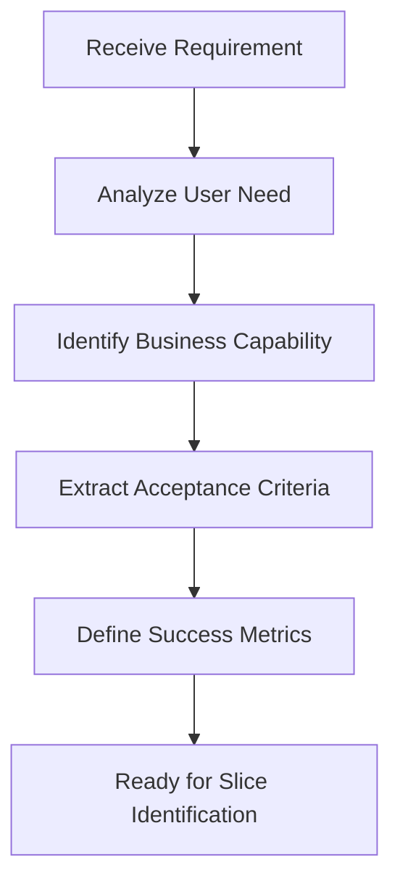
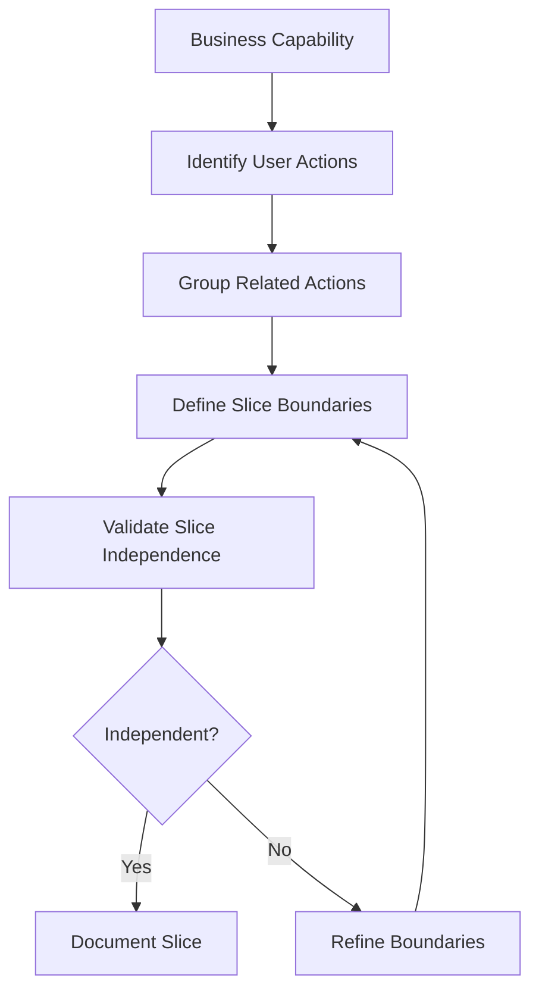
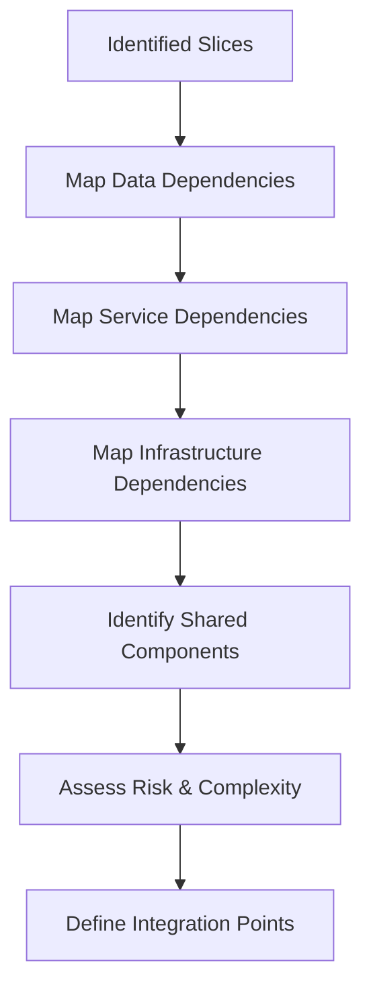
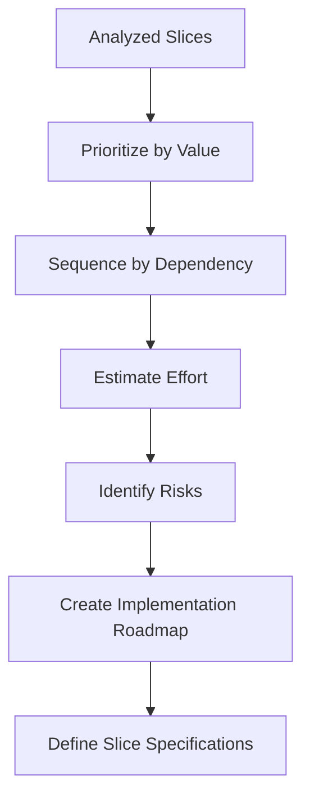
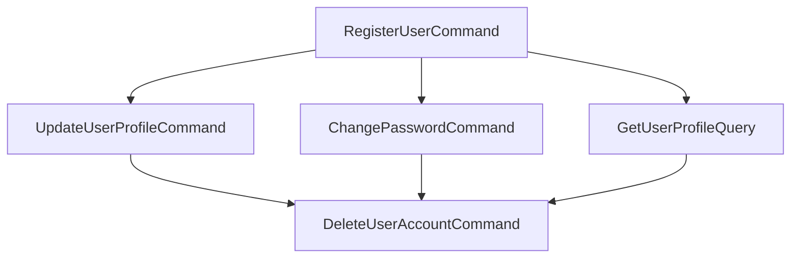

# Vertical Slice Implementation Planning

## Overview

This instruction file guides AI assistants and developers through the planning and analysis phase of vertical slice architecture implementation. It provides systematic approaches for identifying, prioritizing, and defining vertical slices before code generation begins.

**Target Audience**: AI assistants (primary), Product Managers, Architects, Developers
**Scope**: Requirements analysis, slice identification, dependency mapping, implementation planning
**Related Documentation**:

- [Vertical Slice Implementation](vertical-slice.instructions.md) - Code generation rules and patterns
- [Product Requirements (PRD) Creation](.github/prompts/create-prd.prompt.md) - Requirements documentation
- [AI-Assisted Output Instructions](ai-assisted-output.instructions.md) - Provenance and logging

## Table of Contents

- [When to Use This Guide](#when-to-use-this-guide)
- [Planning Workflow](#planning-workflow)
- [Requirements Analysis](#requirements-analysis)
- [Slice Identification Strategies](#slice-identification-strategies)
- [Slice Decomposition](#slice-decomposition)
- [Dependency Analysis](#dependency-analysis)
- [Implementation Sequencing](#implementation-sequencing)
- [Slice Specification Template](#slice-specification-template)
- [Validation Criteria](#validation-criteria)
- [Common Planning Patterns](#common-planning-patterns)
- [Anti-Patterns to Avoid](#anti-patterns-to-avoid)
- [Integration with Existing Systems](#integration-with-existing-systems)
- [Planning Outputs](#planning-outputs)
- [Quality Checklist](#quality-checklist)

## When to Use This Guide

**Apply this planning process when**:

1. **Starting New Feature Development**: Breaking down feature requirements into implementable slices
2. **Refactoring to Vertical Slices**: Converting layered architecture to feature-centric organization
3. **Analyzing Complex Features**: Understanding dependencies and risks before implementation
4. **Sprint Planning**: Determining which slices fit into upcoming iterations
5. **Brownfield Migration**: Planning gradual adoption of vertical slice architecture

**Skip this process when**:

- Working on trivial changes (one-line fixes, configuration updates)
- The slice boundaries are obvious and well-understood
- Following exact specifications with no planning needed
- Prototyping or exploratory work where analysis would slow discovery

## Planning Workflow

### Phase 1: Requirements Gathering



**Key Activities**:

1. Understand the user story or feature request
2. Identify the business capability being delivered
3. Extract or clarify acceptance criteria
4. Define measurable success criteria
5. Gather context about existing system

### Phase 2: Slice Identification



**Key Activities**:

1. List all user actions within the capability
2. Group actions by natural affinity
3. Define clear slice boundaries
4. Validate slices can operate independently
5. Refine boundaries until independence achieved

### Phase 3: Dependency Analysis



**Key Activities**:

1. Identify data access needs per slice
2. Identify service/API dependencies
3. Identify infrastructure requirements
4. Extract shared components and interfaces
5. Assess complexity and implementation risks

### Phase 4: Implementation Planning



**Key Activities**:

1. Prioritize slices by business value
2. Order slices respecting dependencies
3. Estimate implementation effort
4. Identify and document risks
5. Create phased implementation roadmap

## Requirements Analysis

### User Story Analysis Template

Use this template to extract vertical slice candidates from user stories:

```markdown
## User Story Analysis: [Story Title]

**Original Story**:
As a [user type]
I want to [action]
So that [benefit]

**Business Capability**: [High-level capability name]

**User Actions** (potential slices):

1. [Action 1] - [Brief description]
2. [Action 2] - [Brief description]
3. [Action 3] - [Brief description]

**Acceptance Criteria**:

- [ ] [Criterion 1]
- [ ] [Criterion 2]
- [ ] [Criterion 3]

**Data Entities Involved**:

- [Entity 1] - [Usage: read/write/create/delete]
- [Entity 2] - [Usage: read/write/create/delete]

**External Dependencies**:

- [Service/API 1] - [Purpose]
- [Service/API 2] - [Purpose]

**Non-Functional Requirements**:

- Performance: [Requirements]
- Security: [Requirements]
- Scalability: [Requirements]

**Constraints**:

- [Constraint 1]
- [Constraint 2]
```

### Feature Analysis Checklist

Before identifying slices, ensure you understand:

- [ ] **Who** is the primary user/actor?
- [ ] **What** is the complete user workflow?
- [ ] **Why** does the user need this capability?
- [ ] **Where** does this fit in the user journey?
- [ ] **When** is this action triggered?
- [ ] **How** does success look measurably?

## Slice Identification Strategies

### Strategy 1: User Action Decomposition

**Approach**: Break features down by discrete user actions

**Process**:

1. List every action a user can take
2. For each action, identify the complete request-to-response flow
3. Each complete flow is a candidate slice

**Example**:

```
Feature: User Profile Management

User Actions:
1. View Profile → GetUserProfileQuery slice
2. Update Profile → UpdateUserProfileCommand slice
3. Upload Avatar → UpdateUserAvatarCommand slice
4. Change Password → ChangePasswordCommand slice
5. View Activity History → GetUserActivityQuery slice

Result: 5 vertical slices identified
```

### Strategy 2: CRUD Analysis

**Approach**: Identify slices by data operations on entities

**Process**:

1. List all entities in the feature
2. For each entity, identify CRUD operations needed
3. Each operation becomes a slice
4. Combine operations only if they're always used together

**Example**:

```
Feature: Product Catalog

Entities & Operations:
- Product
  ✓ Create → CreateProductCommand
  ✓ Read (List) → ListProductsQuery
  ✓ Read (Detail) → GetProductDetailQuery
  ✓ Update → UpdateProductCommand
  ✓ Delete → DeleteProductCommand

- Category
  ✓ Read (List) → ListCategoriesQuery

Result: 6 vertical slices identified
```

### Strategy 3: Workflow Stage Decomposition

**Approach**: Split multi-stage workflows into slices per stage

**Process**:

1. Map the complete user workflow
2. Identify distinct stages with clear boundaries
3. Each stage becomes a slice
4. Validate stages can operate independently

**Example**:

```
Feature: Order Processing

Workflow Stages:
1. Create Order → CreateOrderCommand slice
2. Submit Payment → ProcessOrderPaymentCommand slice
3. Confirm Order → ConfirmOrderCommand slice
4. Ship Order → ShipOrderCommand slice
5. Track Delivery → GetOrderTrackingQuery slice
6. Complete Order → CompleteOrderCommand slice

Result: 6 vertical slices in processing sequence
```

### Strategy 4: Business Event Decomposition

**Approach**: Identify slices by business events that occur

**Process**:

1. List all business events in the domain
2. For each event, identify the triggering action
3. Each triggering action is a slice
4. Event handlers may be separate slices

**Example**:

```
Feature: User Registration

Business Events:
1. UserRegistered
   → Trigger: RegisterUserCommand slice
   → Handler: SendWelcomeEmailHandler slice

2. UserEmailVerified
   → Trigger: VerifyEmailCommand slice
   → Handler: ActivateUserAccountHandler slice

3. UserProfileCompleted
   → Trigger: CompleteProfileCommand slice

Result: 6 vertical slices (3 commands + 3 event handlers)
```

### Strategy 5: Query vs. Command Separation

**Approach**: Separate all reads from writes as distinct slices

**Process**:

1. Identify all data queries (reads)
2. Identify all data modifications (writes)
3. Create Query slices for reads
4. Create Command slices for writes
5. Never combine reads and writes in same slice

**Example**:

```
Feature: Invoice Management

Queries (Reads):
- GetInvoiceQuery
- ListInvoicesQuery
- SearchInvoicesQuery
- GetInvoiceStatisticsQuery

Commands (Writes):
- CreateInvoiceCommand
- UpdateInvoiceCommand
- SendInvoiceCommand
- MarkInvoicePaidCommand
- CancelInvoiceCommand

Result: 9 vertical slices (4 queries + 5 commands)
```

## Slice Decomposition

### Decomposition Principles

**Principle 1: Single Responsibility**
Each slice should do one thing and do it well.

```
❌ Bad: UserManagementCommand
  - Registers users
  - Updates profiles
  - Changes passwords
  - Deletes accounts

✅ Good: Four separate slices
  - RegisterUserCommand
  - UpdateUserProfileCommand
  - ChangePasswordCommand
  - DeleteUserAccountCommand
```

**Principle 2: Complete Vertical Stack**
Each slice should contain all layers needed for its capability.

```
✅ Complete Slice: RegisterUserCommand
  - API Endpoint (entry point)
  - Command object (request)
  - Validator (input validation)
  - Handler (business logic)
  - Repository (data access)
  - Domain model (entity)
  - Result DTO (response)
  - Tests (verification)
```

**Principle 3: No Horizontal Sharing**
Slices should not directly depend on other slices.

```
❌ Bad:
Features/UserManagement/RegisterUser/
  → imports Features/EmailService/SendEmail/

✅ Good:
Features/UserManagement/RegisterUser/
  → imports Common/Interfaces/IEmailService
  → raises domain event: UserRegistered
```

**Principle 4: Minimize External Dependencies**
Each slice should have minimal coupling to external systems.

```
Acceptable Dependencies:
✓ Shared domain interfaces
✓ Common DTOs and value objects
✓ Infrastructure abstractions (IRepository, IMessageBus)
✓ Domain events (publish only)

Unacceptable Dependencies:
✗ Direct references to other feature slices
✗ Direct infrastructure coupling (DbContext in handler)
✗ Static utility classes with business logic
```

### Slice Sizing Guidelines

**Too Large** (needs decomposition):

- Slice handles multiple user actions
- Handler exceeds 100-150 lines
- More than 5-7 dependencies injected
- Takes more than 1-2 days to implement
- Requires multiple developers

**Just Right**:

- Single user action or query
- Handler is 30-100 lines
- 2-5 dependencies
- 4-16 hours to implement
- Single developer can complete

**Too Small** (consider combining):

- Slice is just a pass-through
- No business logic or validation
- Always used with another slice
- Less than 1 hour to implement

### Decomposition Decision Tree

```
Is the slice doing more than one user action?
├─ Yes → Split by user action
└─ No → Continue

Does the handler exceed 100 lines?
├─ Yes → Look for distinct responsibilities to extract
└─ No → Continue

Does the slice combine reads and writes?
├─ Yes → Split into Query and Command
└─ No → Continue

Does implementation require more than 2 days?
├─ Yes → Find sub-capabilities to extract
└─ No → Continue

✓ Slice is properly sized
```

## Dependency Analysis

### Dependency Categories

**1. Data Dependencies**

Identify all data entities each slice needs:

```markdown
## Slice: RegisterUserCommand

**Data Dependencies**:

- User (Create) - Primary entity
- Role (Read) - Assign default role
- AuditLog (Create) - Log registration event

**Database Tables**:

- Users (INSERT)
- UserRoles (INSERT)
- AuditLogs (INSERT)

**Transactions**: Single transaction required across all writes
```

**2. Service Dependencies**

Identify external services each slice requires:

```markdown
## Slice: RegisterUserCommand

**Service Dependencies**:

- IEmailService - Send welcome email
- IPasswordHasher - Hash user password
- IUserRepository - Persist user data
- IAuditLogger - Log audit trail

**External APIs**:

- None

**Third-Party Services**:

- Email delivery service (via IEmailService)
```

**3. Infrastructure Dependencies**

Identify infrastructure components needed:

```markdown
## Slice: RegisterUserCommand

**Infrastructure Needs**:

- Database connection
- Email service configuration
- Distributed cache (optional, for rate limiting)
- Message bus (optional, for domain events)

**Configuration Required**:

- Email templates
- Password policy settings
- Default role assignments
```

**4. Cross-Slice Dependencies**

Identify dependencies between slices:

```markdown
## Slice Dependencies Graph

RegisterUserCommand
↓ (raises event)
UserRegisteredEvent
↓ (subscribes)
SendWelcomeEmailHandler

VerifyEmailCommand
↓ (requires)
User must exist (from RegisterUserCommand)
```

### Dependency Mapping Template

```markdown
## Dependency Map: [Feature Name]

### Slice: [Slice Name]

**Depends On** (Inbound Dependencies):

- [Slice/Component 1]: [What is needed]
- [Slice/Component 2]: [What is needed]

**Depended Upon By** (Outbound Dependencies):

- [Slice/Component 1]: [How it's used]
- [Slice/Component 2]: [How it's used]

**Shared Interfaces Required**:

- `I[InterfaceName]`: [Purpose]

**Domain Events**:

- Publishes: `[EventName]` - [When and why]
- Subscribes: `[EventName]` - [Handling logic]

**Risk Assessment**:

- Complexity: [Low/Medium/High]
- Coupling: [Low/Medium/High]
- External Dependencies: [Count and risk level]

**Mitigation Strategies**:

- [Strategy 1]
- [Strategy 2]
```

### Dependency Resolution Strategies

**Strategy 1: Shared Interfaces**

Extract common dependencies into shared interfaces:

```csharp
// ❌ Direct dependency
Features/Orders/CreateOrder/Handler.cs
  → new UserRepository()

// ✅ Shared interface
Common/Interfaces/IUserProvider.cs
  → GetUserById(userId)

Features/Orders/CreateOrder/Handler.cs
  → _userProvider.GetUserById(userId)
```

**Strategy 2: Domain Events**

Replace direct calls with event-driven communication:

```csharp
// ❌ Direct coupling
await _emailService.SendWelcomeEmail(user);

// ✅ Event-driven
await _eventBus.Publish(new UserRegisteredEvent(user.Id));
// Separate handler subscribes and sends email
```

**Strategy 3: Anti-Corruption Layers**

Isolate external system dependencies:

```csharp
// ❌ Direct third-party dependency
Features/Orders/CreateOrder/Handler.cs
  → new StripePaymentGateway()

// ✅ Anti-corruption layer
Common/Adapters/PaymentGatewayAdapter.cs
  → implements IPaymentGateway

Features/Orders/CreateOrder/Handler.cs
  → _paymentGateway.ProcessPayment()
```

## Implementation Sequencing

### Sequencing Principles

**Principle 1: Value First**
Prioritize slices by business value delivered.

**Principle 2: Foundation Before Extension**
Implement core capabilities before enhancements.

**Principle 3: Independent Before Dependent**
Implement slices with no dependencies first.

**Principle 4: Risk Mitigation**
Tackle high-risk/high-complexity slices early.

### Sequencing Strategies

**Strategy 1: Dependency-Based Sequencing**

```
Step 1: Identify slices with zero dependencies
Step 2: Implement zero-dependency slices
Step 3: Identify slices with dependencies now satisfied
Step 4: Implement newly unblocked slices
Step 5: Repeat until all slices implemented
```

**Example**:

```
Iteration 1 (No dependencies):
  ✓ CreateProductCommand
  ✓ ListCategoriesQuery

Iteration 2 (Depends on Iteration 1):
  ✓ UpdateProductCommand (depends on CreateProductCommand)
  ✓ GetProductDetailQuery (depends on CreateProductCommand)

Iteration 3 (Depends on Iteration 2):
  ✓ DeleteProductCommand (depends on UpdateProductCommand)
```

**Strategy 2: Value-Based Sequencing**

```
Step 1: Assign business value score (1-10) to each slice
Step 2: Assign implementation effort score (1-10) to each slice
Step 3: Calculate value/effort ratio
Step 4: Sort slices by ratio (highest first)
Step 5: Adjust for dependencies
```

**Example**:

```
Slice                    | Value | Effort | Ratio | Priority
-------------------------|-------|--------|-------|----------
RegisterUserCommand      |   10  |    6   |  1.67 |    1
Login UserCommand        |   10  |    4   |  2.50 |    2*
GetUserProfileQuery      |    5  |    2   |  2.50 |    3
UpdateUserProfileCommand |    7  |    5   |  1.40 |    4
ChangePasswordCommand    |    6  |    6   |  1.00 |    5

* LoginUserCommand depends on RegisterUserCommand, so sequence adjusted
```

**Strategy 3: Risk-Based Sequencing**

```
Step 1: Identify high-risk slices (external APIs, complex logic, new tech)
Step 2: Implement highest-risk slices in early iterations
Step 3: Validate assumptions and learn
Step 4: Implement medium and low-risk slices
```

**Example**:

```
Phase 1 (High Risk - Week 1):
  → ProcessPaymentCommand (external payment gateway)
  → ValidateInventoryQuery (complex business rules)

Phase 2 (Medium Risk - Week 2):
  → CreateOrderCommand (orchestration logic)
  → GetOrderStatusQuery (caching complexity)

Phase 3 (Low Risk - Week 3):
  → ListOrdersQuery (standard CRUD)
  → UpdateOrderNotesCommand (simple update)
```

### Implementation Roadmap Template

```markdown
## Implementation Roadmap: [Feature Name]

**Total Slices**: [Count]
**Estimated Duration**: [Weeks/Sprints]
**Team Size**: [Developer count]

### Phase 1: Foundation (Week 1-2)

**Goal**: Implement core capabilities with no dependencies

**Slices**:

1. [Slice Name] - [Brief description]
   - Priority: P0
   - Business Value: High
   - Dependencies: None
   - Estimated Effort: [Hours/Days]
   - Risk: [Low/Medium/High]

2. [Slice Name] - [Brief description]
   - Priority: P0
   - Business Value: High
   - Dependencies: None
   - Estimated Effort: [Hours/Days]
   - Risk: [Low/Medium/High]

**Deliverables**:

- [ ] [Deliverable 1]
- [ ] [Deliverable 2]

**Success Criteria**:

- [ ] [Criterion 1]
- [ ] [Criterion 2]

### Phase 2: Enhancement (Week 3-4)

**Goal**: Add features that depend on Phase 1

**Slices**:
[Same format as Phase 1]

### Phase 3: Optimization (Week 5-6)

**Goal**: Performance, UX, and edge case handling

**Slices**:
[Same format as Phase 1]

### Risk Mitigation Plan

**High Risks**:

1. [Risk Description]
   - Impact: [High/Medium/Low]
   - Mitigation: [Strategy]
   - Contingency: [Fallback plan]

**Medium Risks**:
[Same format]

### Dependencies and Blockers

**External Dependencies**:

- [Dependency 1]: [Status and timeline]
- [Dependency 2]: [Status and timeline]

**Potential Blockers**:

- [Blocker 1]: [Mitigation strategy]
- [Blocker 2]: [Mitigation strategy]
```

## Slice Specification Template

Each identified slice should have a detailed specification:

````markdown
## Slice Specification: [Slice Name]

### Overview

**Slice Type**: [Command/Query/Event Handler]
**Feature**: [Parent feature name]
**Priority**: [P0/P1/P2]
**Business Value**: [High/Medium/Low]
**Implementation Effort**: [Hours/Days]
**Risk Level**: [High/Medium/Low]

### User Story

As a [user type]
I want to [action]
So that [benefit]

### Acceptance Criteria

- [ ] [Criterion 1]
- [ ] [Criterion 2]
- [ ] [Criterion 3]

### Technical Specification

**Request Model**:

```csharp
public class [SliceName]Command
{
    public Type Property1 { get; set; }
    public Type Property2 { get; set; }
}
```
````

**Response Model**:

```csharp
public class [SliceName]Result
{
    public bool Success { get; set; }
    public Type Data { get; set; }
    public List<string> Errors { get; set; }
}
```

**Validation Rules**:

- Property1: [Validation rules]
- Property2: [Validation rules]

**Business Logic**:

1. [Step 1 description]
2. [Step 2 description]
3. [Step 3 description]

**Data Access**:

- Reads: [Entity 1, Entity 2]
- Writes: [Entity 1, Entity 2]
- Transaction: [Yes/No]

### Dependencies

**Injected Services**:

- `I[ServiceName]`: [Purpose]
- `I[ServiceName]`: [Purpose]

**External Dependencies**:

- [Dependency 1]: [How it's used]
- [Dependency 2]: [How it's used]

**Domain Events**:

- Publishes: `[EventName]` when [condition]
- Subscribes: `[EventName]` to [action]

### Error Handling

**Expected Errors**:

- [ErrorType]: [Condition and response]
- [ErrorType]: [Condition and response]

**Exception Handling**:

- [Exception Type]: [Handling strategy]

### Security Considerations

**Authentication**: [Required/Not Required]
**Authorization**: [Required roles/permissions]
**Data Validation**: [Input sanitization requirements]
**Sensitive Data**: [Data elements requiring protection]

### Performance Considerations

**Expected Load**: [Requests per second]
**Response Time Target**: [Milliseconds]
**Resource Usage**: [Memory, CPU, I/O estimates]
**Optimization Strategies**: [Caching, indexing, etc.]

### Testing Strategy

**Unit Tests**:

- [ ] Test case 1
- [ ] Test case 2
- [ ] Test case 3

**Integration Tests**:

- [ ] Test case 1
- [ ] Test case 2

**Edge Cases**:

- [ ] Edge case 1
- [ ] Edge case 2

### Implementation Notes

**Technical Considerations**:

- [Note 1]
- [Note 2]

**Known Limitations**:

- [Limitation 1]
- [Limitation 2]

**Future Enhancements**:

- [Enhancement 1]
- [Enhancement 2]

### Files to Create/Modify

**New Files**:

- `/Features/[Feature]/[Slice]/[Slice]Command.cs`
- `/Features/[Feature]/[Slice]/[Slice]Handler.cs`
- `/Features/[Feature]/[Slice]/[Slice]Validator.cs`
- `/Features/[Feature]/[Slice]/[Slice]Result.cs`
- `/Tests/Features/[Feature]/[Slice]HandlerTests.cs`

**Modified Files**:

- `/Api/Controllers/[Controller].cs` - Add endpoint
- `/Infrastructure/DependencyInjection.cs` - Register services

### Definition of Done

- [ ] Code implemented and passes all tests
- [ ] Unit test coverage ≥ 80%
- [ ] Integration tests pass
- [ ] Code review completed
- [ ] Documentation updated
- [ ] API endpoint documented
- [ ] Security review completed (if required)
- [ ] Performance benchmarks met
- [ ] Deployed to test environment
- [ ] QA validation completed

```

## Validation Criteria

### Slice Independence Validation

**Test 1: No Feature-to-Feature References**

```

✓ Pass: No imports from Features/[OtherFeature]
✗ Fail: Direct references to other feature folders

```

**Test 2: Self-Contained Vertical Stack**

```

✓ Pass: Slice contains all layers (API → Handler → Repository → Tests)
✗ Fail: Missing layers, requires other slices to function

```

**Test 3: Can Be Deployed Independently**

```

✓ Pass: Slice can be feature-flagged on/off
✗ Fail: Enabling slice breaks other slices

```

### Slice Size Validation

**Test 1: Single Responsibility**

```

✓ Pass: Slice does one thing
✗ Fail: Slice handles multiple unrelated user actions

```

**Test 2: Reasonable Complexity**

```

✓ Pass: Handler is 30-100 lines, 2-5 dependencies
✗ Fail: Handler exceeds 150 lines or has 7+ dependencies

```

**Test 3: Implementable in 1-2 Days**

```

✓ Pass: Single developer can complete in reasonable timeframe
✗ Fail: Requires multiple developers or weeks of work

```

### Slice Cohesion Validation

**Test 1: Related Logic Together**

```

✓ Pass: All logic for this user action is in the slice
✗ Fail: Business logic scattered across multiple slices or layers

```

**Test 2: No Shared State**

```

✓ Pass: Slice maintains no state between requests
✗ Fail: Slice depends on stateful singletons or globals

```

**Test 3: Clear Boundaries**

```

✓ Pass: Easy to explain what the slice does
✗ Fail: Overlapping responsibilities with other slices

````

## Common Planning Patterns

### Pattern 1: CRUD Feature Planning

**Scenario**: Implementing standard CRUD operations for an entity

**Planning Approach**:

```markdown
Entity: Product

Queries (Reads):
1. ListProductsQuery - Paginated list with filters
2. GetProductByIdQuery - Single product details
3. SearchProductsQuery - Full-text search

Commands (Writes):
4. CreateProductCommand - Add new product
5. UpdateProductCommand - Modify existing product
6. DeleteProductCommand - Soft delete product

Implementation Order:
Phase 1: CreateProductCommand, GetProductByIdQuery
Phase 2: ListProductsQuery, UpdateProductCommand
Phase 3: SearchProductsQuery, DeleteProductCommand
````

### Pattern 2: Multi-Stage Workflow Planning

**Scenario**: Implementing a workflow with distinct stages

**Planning Approach**:

```markdown
Workflow: Order Processing

Stages:

1. CreateOrderCommand - Initialize order
2. ValidateInventoryCommand - Check product availability
3. ProcessPaymentCommand - Charge customer
4. ConfirmOrderCommand - Finalize order
5. ShipOrderCommand - Begin fulfillment
6. CompleteOrderCommand - Close order

Queries: 7. GetOrderStatusQuery - Check current stage 8. GetOrderHistoryQuery - View stage transitions

Implementation Order:
Phase 1: CreateOrderCommand, GetOrderStatusQuery
Phase 2: ProcessPaymentCommand, ConfirmOrderCommand
Phase 3: ValidateInventoryCommand, ShipOrderCommand
Phase 4: CompleteOrderCommand, GetOrderHistoryQuery
```

### Pattern 3: Event-Driven Feature Planning

**Scenario**: Implementing features driven by domain events

**Planning Approach**:

```markdown
Feature: User Lifecycle Management

Commands (Event Publishers):

1. RegisterUserCommand → raises UserRegisteredEvent
2. VerifyEmailCommand → raises UserEmailVerifiedEvent
3. ActivateUserCommand → raises UserActivatedEvent
4. SuspendUserCommand → raises UserSuspendedEvent

Event Handlers (Event Subscribers): 5. OnUserRegistered → Send welcome email 6. OnUserRegistered → Create default preferences 7. OnUserEmailVerified → Enable account features 8. OnUserActivated → Notify admin dashboard 9. OnUserSuspended → Revoke active sessions

Implementation Order:
Phase 1: RegisterUserCommand, OnUserRegistered (email)
Phase 2: VerifyEmailCommand, OnUserEmailVerified
Phase 3: ActivateUserCommand, OnUserActivated
Phase 4: SuspendUserCommand, OnUserSuspended
Phase 5: OnUserRegistered (preferences)
```

### Pattern 4: Report/Analytics Planning

**Scenario**: Implementing reporting and analytics features

**Planning Approach**:

```markdown
Feature: Sales Analytics

Queries:

1. GetSalesTotalsQuery - Aggregate totals by date range
2. GetTopProductsQuery - Best-selling products
3. GetSalesByRegionQuery - Geographic breakdown
4. GetSalesTrendQuery - Time-series data
5. GetCustomerSegmentationQuery - Customer categories
6. ExportSalesReportQuery - Generate CSV/PDF

Commands: 7. RecalculateSalesMetricsCommand - Rebuild aggregates

Implementation Order:
Phase 1: GetSalesTotalsQuery (most requested)
Phase 2: GetTopProductsQuery, GetSalesByRegionQuery
Phase 3: GetSalesTrendQuery, GetCustomerSegmentationQuery
Phase 4: ExportSalesReportQuery
Phase 5: RecalculateSalesMetricsCommand (maintenance)
```

### Pattern 5: Brownfield Migration Planning

**Scenario**: Incrementally migrating layered architecture to vertical slices

**Planning Approach**:

```markdown
Existing System: Layered monolith
Target: Vertical slice architecture

Migration Strategy:

1. Identify high-change features (most volatile code)
2. Extract to vertical slices (strangler fig pattern)
3. Keep remaining code in existing structure
4. Gradually migrate remaining features

Phase 1: New Features (Pure Vertical Slices)

- Implement all new features as vertical slices
- No changes to existing code

Phase 2: High-Change Features (Extract and Refactor)

- UserRegistrationFeature (changes monthly)
- ProductSearchFeature (changes weekly)
- OrderCheckoutFeature (changes frequently)

Phase 3: Medium-Change Features (Extract Carefully)

- InvoiceGenerationFeature (changes quarterly)
- ReportingFeature (changes occasionally)

Phase 4: Low-Change Features (Leave Alone)

- LegacyIntegrationsFeature (stable, rarely changes)
- AdminPanelFeature (working well, low risk)

Decision: Migrate high-change first, leave stable code alone
```

## Anti-Patterns to Avoid

### Anti-Pattern 1: Horizontal Slicing

**Problem**: Organizing by technical layer instead of feature

```
❌ Bad Structure (Horizontal):
/Controllers/UserController.cs
/Services/UserService.cs
/Repositories/UserRepository.cs
/Models/UserModel.cs

✅ Good Structure (Vertical):
/Features/UserRegistration/RegisterUserCommand.cs
/Features/UserRegistration/RegisterUserHandler.cs
/Features/UserProfile/GetUserProfileQuery.cs
/Features/UserProfile/GetUserProfileHandler.cs
```

**Detection**: Ask "If I need to change user registration, how many folders do I touch?"

- Horizontal: 4+ folders (Controllers, Services, Repositories, Models)
- Vertical: 1 folder (Features/UserRegistration)

### Anti-Pattern 2: Mega-Slices

**Problem**: Slices that are too large and do too much

```
❌ Bad: UserManagementSlice
- Handles registration, login, profile, password, preferences, admin
- 800+ lines in handler
- 15+ dependencies
- Takes 2 weeks to implement

✅ Good: Multiple focused slices
- RegisterUserCommand (50 lines)
- LoginUserCommand (60 lines)
- UpdateUserProfileCommand (40 lines)
- ChangePasswordCommand (55 lines)
- Each: 2-4 dependencies, 4-8 hours to implement
```

**Detection**: If estimated effort exceeds 2 days, decompose further

### Anti-Pattern 3: Nano-Slices

**Problem**: Slices that are too small and provide no business value alone

```
❌ Bad: Excessive decomposition
- ValidateEmailAddressCommand (pass-through to validator)
- CheckUserExistsQuery (trivial database check)
- FormatUserNameCommand (pure utility)

✅ Good: Appropriately-sized slices
- RegisterUserCommand (includes email validation)
- GetUserProfileQuery (includes existence check)
- UpdateUserProfileCommand (includes name formatting)
```

**Detection**: If slice has no business logic and is just a pass-through, combine it

### Anti-Pattern 4: Feature-to-Feature Dependencies

**Problem**: Slices directly importing other feature slices

```
❌ Bad:
/Features/OrderCheckout/CheckoutHandler.cs
  using Features.UserManagement;
  using Features.Inventory;
  using Features.Shipping;

✅ Good:
/Features/OrderCheckout/CheckoutHandler.cs
  using Common.Interfaces;
  private readonly IUserProvider _userProvider;
  private readonly IInventoryService _inventoryService;
  private readonly IShippingCalculator _shippingCalculator;
```

**Detection**: Grep for `using Features\\.` - Should return zero matches

### Anti-Pattern 5: Anemic Slices

**Problem**: Slices with no business logic, just CRUD operations

```
❌ Bad: Pure pass-through
public class CreateProductHandler
{
    public async Task<Unit> Handle(CreateProductCommand cmd)
    {
        await _repository.AddAsync(cmd.ToEntity());
        return Unit.Value;
    }
}

✅ Good: Business logic present
public class CreateProductHandler
{
    public async Task<Result<Guid>> Handle(CreateProductCommand cmd)
    {
        // Validation
        if (await _repository.SKUExistsAsync(cmd.SKU))
            return Result.Failure("SKU already exists");

        // Business logic
        var product = Product.Create(cmd.Name, cmd.SKU, cmd.Price);
        product.SetCategory(cmd.CategoryId);
        product.ApplyPricingRules(_pricingEngine);

        // Persist
        await _repository.AddAsync(product);

        // Domain event
        await _eventBus.Publish(new ProductCreatedEvent(product.Id));

        return Result.Success(product.Id);
    }
}
```

**Detection**: If handler only calls repository methods with no logic, reconsider boundaries

### Anti-Pattern 6: Planning Every Detail Upfront

**Problem**: Over-planning before any implementation or feedback

```
❌ Bad: 6-week planning phase
- Specify every slice in complete detail
- Design every model, validator, DTO
- Plan all error codes and messages
- Create complete database schema
- Result: Over-engineered, brittle plan

✅ Good: Iterative planning
- Identify high-level slices (1 day)
- Specify Phase 1 slices in detail (1 day)
- Implement Phase 1, learn (1-2 weeks)
- Use learnings to specify Phase 2
- Repeat in iterations
```

**Detection**: If planning phase exceeds implementation phase, you're over-planning

### Anti-Pattern 7: Ignoring Existing Patterns

**Problem**: Imposing vertical slices on a codebase that doesn't support it

```
❌ Bad: Force vertical slices into layered monolith
- Existing code is tightly coupled
- Shared database context everywhere
- No dependency injection
- Result: Awkward hybrid, technical debt increases

✅ Good: Assess and decide
- Is codebase amenable to vertical slices?
- Do we have DI and interfaces?
- Can we incrementally migrate?
- If not, fix foundations first OR accept layered architecture
```

**Detection**: If vertical slices feel unnatural and awkward, validate the architecture first

## Integration with Existing Systems

### Assessment Checklist

Before planning vertical slices for an existing system:

- [ ] **Architecture Review**: Does the system support feature-centric organization?
- [ ] **Dependency Injection**: Is DI available and used consistently?
- [ ] **Coupling Assessment**: How tightly coupled is existing code?
- [ ] **Database Strategy**: Can we avoid shared DbContext in features?
- [ ] **Team Buy-In**: Is the team aligned on vertical slice adoption?
- [ ] **Migration Path**: Can we migrate incrementally or need big-bang refactor?

### Integration Strategies

**Strategy 1: Strangler Fig (Recommended)**

```markdown
Approach: Gradually wrap and replace existing components

Phase 1: Identify Boundaries

- Map existing features and their components
- Identify high-change vs. low-change areas

Phase 2: New Features Only

- All new features implemented as vertical slices
- Existing features remain untouched

Phase 3: Extract High-Change Features

- Refactor frequently-modified code to vertical slices
- Leave stable code in existing structure

Phase 4: Gradual Migration

- Over time, extract more features
- Eventually most code is vertical slices

Timeframe: 6-18 months for large systems
Risk: Low (incremental, reversible)
```

**Strategy 2: Feature-by-Feature**

```markdown
Approach: Migrate one complete feature at a time

Phase 1: Select Feature

- Choose a well-bounded feature
- Ideally with low external dependencies

Phase 2: Extract to Vertical Slice

- Move all layers into Features/[Feature] folder
- Refactor to handler pattern
- Add tests

Phase 3: Validate

- Ensure functionality unchanged
- Performance acceptable
- Team comfortable

Phase 4: Repeat

- Select next feature
- Apply learnings

Timeframe: 1-2 weeks per feature
Risk: Medium (more invasive per feature)
```

**Strategy 3: Adapter Pattern**

```markdown
Approach: Create vertical slice facade over existing code

Phase 1: Define Slice Interface

- Create command/query objects
- Define handlers without implementation

Phase 2: Adapter Layer

- Handlers call into existing services/repositories
- Minimal refactoring of existing code

Phase 3: Gradual Replacement

- Over time, move logic from old services into handlers
- Eventually remove old services

Example:
RegisterUserCommand → RegisterUserHandler
↓ (adapter)
UserService.Register() (existing)
↓
UserRepository.Add() (existing)

Timeframe: Immediate (facade), then gradual (migration)
Risk: Low (non-invasive initially)
```

### Brownfield Migration Plan Template

```markdown
## Vertical Slice Migration Plan: [System Name]

### Current State Assessment

**Architecture**: [Current pattern - layered, N-tier, etc.]
**Primary Language**: [Language/Framework]
**Codebase Size**: [Lines of code, file count]
**Team Size**: [Developer count]
**Change Frequency**: [Features per month]

**Current Pain Points**:

1. [Pain point 1]
2. [Pain point 2]
3. [Pain point 3]

**Blockers to Vertical Slices**:

- [ ] No dependency injection
- [ ] Tightly coupled components
- [ ] Shared mutable state
- [ ] Database-per-feature not possible
- [ ] Team resistance

### Migration Strategy

**Selected Approach**: [Strangler Fig / Feature-by-Feature / Adapter Pattern]

**Rationale**: [Why this approach fits this system]

### Phase 1: Preparation (Week 1-2)

**Goals**:

- Set up vertical slice infrastructure
- Choose pilot feature
- Create example/template slice

**Tasks**:

- [ ] Create /Features folder structure
- [ ] Set up MediatR or similar pattern
- [ ] Create slice templates/generators
- [ ] Team training on vertical slices
- [ ] Document migration guidelines

### Phase 2: Pilot (Week 3-4)

**Pilot Feature**: [Feature name]

**Why This Feature**:

- [Reason 1: e.g., well-bounded]
- [Reason 2: e.g., low coupling]
- [Reason 3: e.g., high change frequency]

**Pilot Slices**:

1. [Slice 1]
2. [Slice 2]
3. [Slice 3]

**Success Criteria**:

- [ ] Feature works identically
- [ ] Tests pass
- [ ] Performance unchanged
- [ ] Team comfortable with approach

### Phase 3: Expansion (Month 2-6)

**Target Features** (in priority order):

1. [Feature 1] - [Rationale]
2. [Feature 2] - [Rationale]
3. [Feature 3] - [Rationale]
4. [Feature 4] - [Rationale]
5. [Feature 5] - [Rationale]

**Per Feature**:

- Estimated: [Days/Weeks]
- Dependencies: [Other features]
- Risk: [Low/Medium/High]

### Phase 4: Stabilization (Month 7-12)

**Goals**:

- Continue migrating medium-priority features
- Leave low-change features in existing structure
- Optimize and refactor as patterns emerge

**Features to Leave Alone**:

- [Feature 1] - [Reason: stable, working well]
- [Feature 2] - [Reason: low change frequency]

### Success Metrics

**Technical Metrics**:

- % of features in vertical slice structure: Target 60-80%
- Average feature change touches N files: Target <5
- Test coverage: Target maintain or improve
- Build time: Target maintain or improve

**Team Metrics**:

- Time to implement new feature: Target -20%
- Onboarding time for new developers: Target -30%
- Cross-team dependencies: Target -40%
- Developer satisfaction: Target +20%

### Risk Mitigation

**High Risks**:

1. [Risk]: [Mitigation strategy]
2. [Risk]: [Mitigation strategy]

**Rollback Plan**:

- [How to revert if migration fails]

### Timeline

| Phase         | Duration | Milestones             |
| ------------- | -------- | ---------------------- |
| Preparation   | 2 weeks  | Infrastructure ready   |
| Pilot         | 2 weeks  | 1 feature migrated     |
| Expansion     | 4 months | 5+ features migrated   |
| Stabilization | 6 months | 60%+ features migrated |

**Total Duration**: 12 months
```

## Planning Outputs

### Output 1: Feature Slice Catalog

```markdown
## Feature Slice Catalog: [System/Feature Name]

**Last Updated**: [Date]
**Owner**: [Name]

### Feature: [Feature Name 1]

**Description**: [Brief description of business capability]

**Slices**:

| Slice Name | Type    | Priority | Status      | Est. Effort |
| ---------- | ------- | -------- | ----------- | ----------- |
| [Slice 1]  | Command | P0       | Not Started | 8h          |
| [Slice 2]  | Query   | P0       | Not Started | 4h          |
| [Slice 3]  | Command | P1       | Not Started | 6h          |

**Dependencies**:

- [Dependency 1]
- [Dependency 2]

**Total Effort**: [Hours/Days]
**Target Completion**: [Date]

### Feature: [Feature Name 2]

[Same structure]
```

### Output 2: Implementation Matrix

```markdown
## Implementation Matrix

| Slice                    | Feature         | Priority | Value | Effort | Risk | Dependencies        | Sprint   | Status      |
| ------------------------ | --------------- | -------- | ----- | ------ | ---- | ------------------- | -------- | ----------- |
| RegisterUserCommand      | User Management | P0       | High  | 8h     | Low  | None                | Sprint 1 | ✓ Done      |
| GetUserProfileQuery      | User Management | P0       | High  | 4h     | Low  | RegisterUserCommand | Sprint 1 | ✓ Done      |
| UpdateUserProfileCommand | User Management | P1       | Med   | 6h     | Low  | RegisterUserCommand | Sprint 2 | In Progress |
| ChangePasswordCommand    | User Management | P1       | Med   | 6h     | Med  | RegisterUserCommand | Sprint 2 | Not Started |
| DeleteUserAccountCommand | User Management | P2       | Low   | 8h     | High | All above           | Sprint 3 | Not Started |
```

### Output 3: Dependency Graph



### Output 4: Sprint Plan

```markdown
## Sprint Plan: [Feature Name]

### Sprint 1 (2 weeks)

**Goal**: Implement core user registration and profile retrieval

**Slices**:

1. RegisterUserCommand (8h)
   - Assignee: [Developer]
   - Dependencies: None
   - Definition of Done: [Checklist]

2. GetUserProfileQuery (4h)
   - Assignee: [Developer]
   - Dependencies: RegisterUserCommand
   - Definition of Done: [Checklist]

**Sprint Capacity**: 80 hours (2 devs × 40h)
**Allocated**: 12 hours
**Buffer**: 68 hours for other work

**Risks**:

- [Risk 1]: [Mitigation]

**Sprint Deliverables**:

- [ ] Users can register accounts
- [ ] Users can view their profiles
- [ ] Unit tests pass (80%+ coverage)
- [ ] Integration tests pass
- [ ] Deployed to test environment

### Sprint 2 (2 weeks)

[Same format]
```

## Quality Checklist

### Planning Phase Checklist

- [ ] **Requirements Analysis Complete**
  - [ ] User stories documented
  - [ ] Acceptance criteria defined
  - [ ] Business value understood

- [ ] **Slice Identification Complete**
  - [ ] All user actions identified
  - [ ] Slices follow single responsibility
  - [ ] Each slice has clear boundary
  - [ ] Slices are appropriately sized

- [ ] **Dependency Analysis Complete**
  - [ ] Data dependencies mapped
  - [ ] Service dependencies identified
  - [ ] Infrastructure needs documented
  - [ ] Cross-slice dependencies minimal

- [ ] **Validation Passed**
  - [ ] Slices are independent (no feature-to-feature refs)
  - [ ] Slices are complete (full vertical stack)
  - [ ] Slices are cohesive (related logic together)

- [ ] **Implementation Plan Complete**
  - [ ] Slices prioritized by value
  - [ ] Slices sequenced by dependency
  - [ ] Effort estimated for each slice
  - [ ] Risks identified and mitigated

- [ ] **Specifications Complete**
  - [ ] Each slice has detailed specification
  - [ ] Request/response models defined
  - [ ] Validation rules documented
  - [ ] Error handling approach defined

- [ ] **Team Alignment**
  - [ ] Plan reviewed with team
  - [ ] Technical feasibility validated
  - [ ] Timeline accepted
  - [ ] Roles and responsibilities assigned

### Per-Slice Specification Checklist

- [ ] Slice name follows naming conventions
- [ ] User story and acceptance criteria documented
- [ ] Request and response models defined
- [ ] Validation rules specified
- [ ] Business logic described
- [ ] Dependencies identified
- [ ] Error handling approach defined
- [ ] Security considerations addressed
- [ ] Performance targets set
- [ ] Test strategy documented
- [ ] Files to create/modify listed
- [ ] Definition of done established

### Quality Gates

**Gate 1: After Slice Identification**

- Are all user actions covered by slices?
- Are slices appropriately sized (4-16h effort)?
- Zero feature-to-feature dependencies?

**Gate 2: After Dependency Analysis**

- All dependencies documented?
- Shared interfaces defined?
- Risks identified with mitigation plans?

**Gate 3: After Implementation Planning**

- Slices prioritized and sequenced?
- Timeline realistic and achievable?
- Team capacity sufficient?

**Gate 4: Before Implementation**

- All specifications complete?
- Team aligned on approach?
- Technical feasibility validated?

---

## Summary

This instruction file provides comprehensive guidance for planning vertical slice implementations. Follow the workflow systematically:

1. **Analyze Requirements**: Understand user needs and business capabilities
2. **Identify Slices**: Break down features using proven strategies
3. **Analyze Dependencies**: Map data, service, and infrastructure needs
4. **Sequence Implementation**: Prioritize by value, dependency, and risk
5. **Create Specifications**: Document each slice in detail
6. **Validate Quality**: Ensure independence, completeness, and cohesion

**Key Principles**:

- Plan incrementally, not exhaustively
- Each slice delivers business value
- Slices are independent and self-contained
- Dependencies are explicit and minimal
- Implementation is sequenced logically

**Remember**: Good planning enables fast, confident implementation. Invest time in planning to save time in execution.

---

**Document Version**: 1.0.0
**Last Updated**: 2026-02-12
**Next Review**: 2026-05-12
**Owner**: Architecture Team
**Status**: Active
