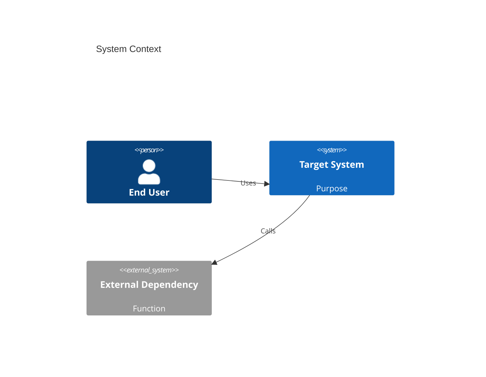
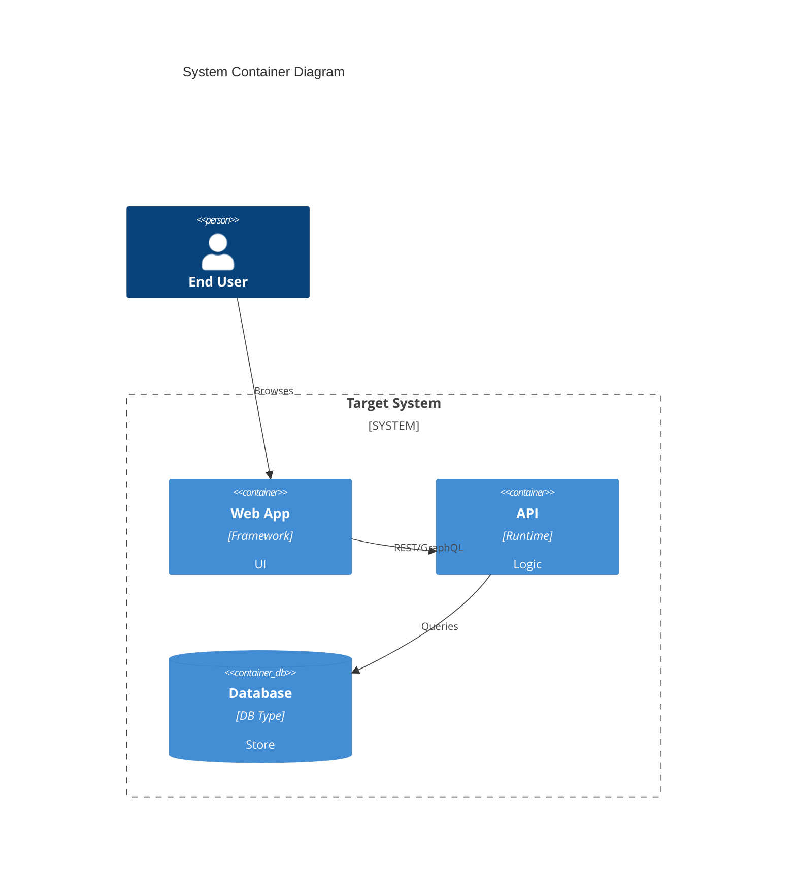

Update application documentation to include current-state details and Mermaid C4 diagrams.

## Scope

- Audit repo for current state (features, services, workflows)
- Update README.md or create /docs/overview.md with:
  - Executive summary of system
  - Technology stack and high-level architecture
  - Build/run instructions if missing
- Add Mermaid C4 diagrams (at minimum):
  - C4 Context (C1)
  - C4 Container (C2)
  - Optional: C4 Component (C3) for critical service

## Acceptance Criteria

- README.md/docs/overview.md contains:
  - Accurate current app state description
  - At least one Mermaid C1 and C2 diagram
  - Links to deeper docs/diagrams
- Diagrams render correctly (GitHub Mermaid support)
- Assumptions/unknowns called out with TODOs

## Example Stubs

## Notes

- Multiple services: include per-service sections, repeat C2 as needed
- Keep diagrams small, focused; link to deeper C3/C4 as architecture evolves
