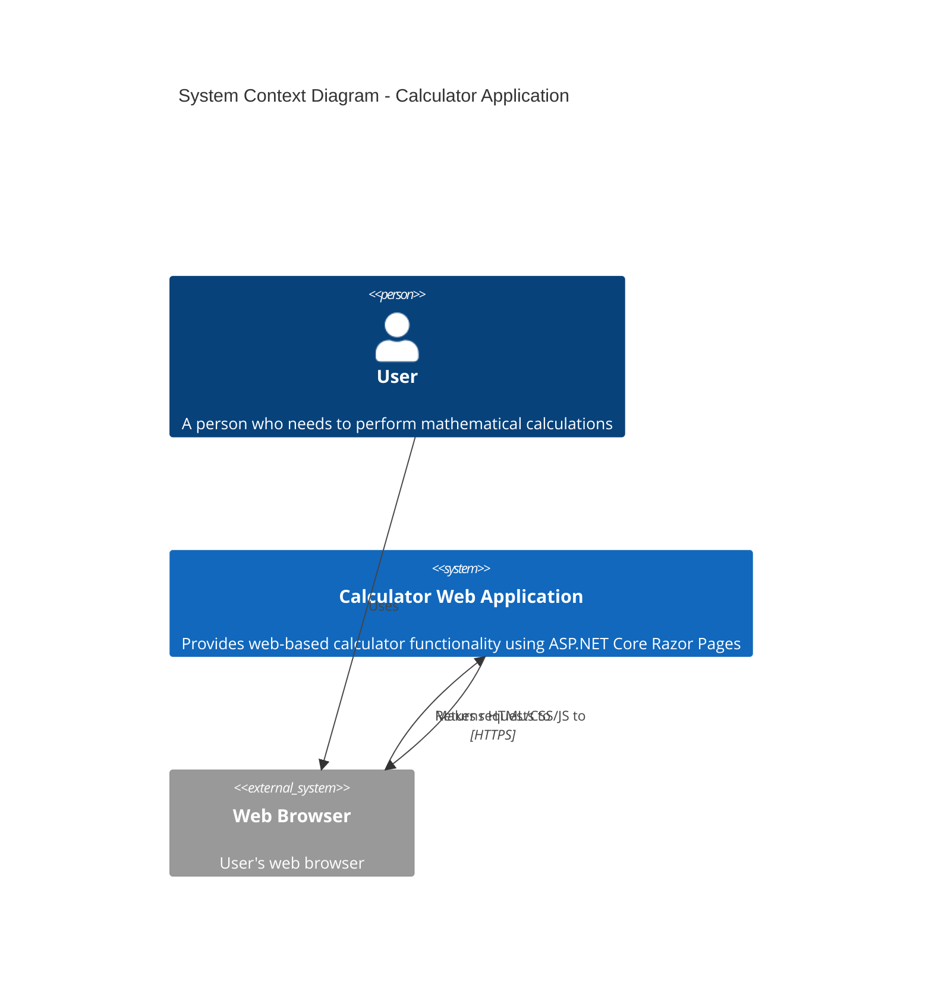
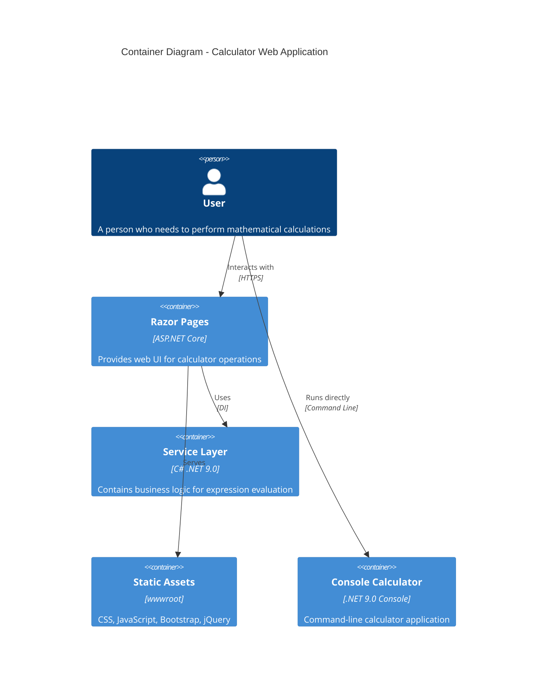
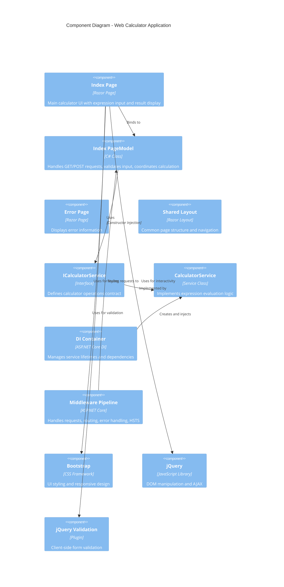
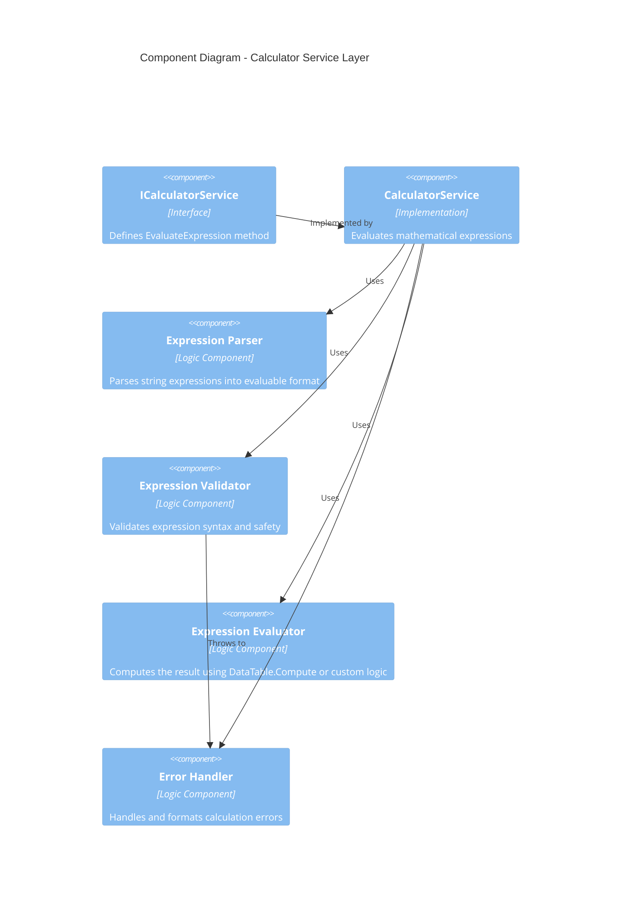
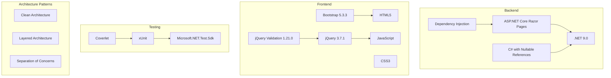
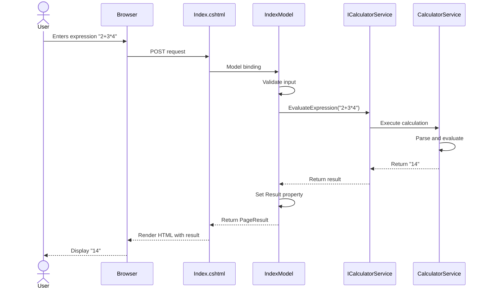

# C4 Architecture Diagrams - Calculator Project

This document contains C4 model diagrams for the Calculator Web Application using Mermaid syntax.

## Level 1: System Context Diagram

Shows the high-level system and its users.



## Level 2: Container Diagram

Shows the containers (applications, data stores, etc.) that make up the system.



## Level 3: Component Diagram - Web Application

Shows the components within the web application container.



## Level 3: Component Diagram - Service Layer Detail

Shows the internal structure of the service layer.



## Deployment Diagram

Shows how the system is deployed.

```mermaid
C4Deployment
    title Deployment Diagram - Calculator Application

    Deployment_Node(devMachine, "Developer Machine", "Windows/Mac/Linux")
    Deployment_Node(dotnetRuntime, ".NET 9.0 Runtime", "Runtime Environment")
    Deployment_Node(browser, "Web Browser", "Chrome/Firefox/Edge")
    
    Container(webApp, "Web Calculator", "ASP.NET Core", "Runs on localhost:5297")
    Container(consoleApp, "Console Calculator", ".NET Console", "Runs in terminal")
    Container(ui, "Web UI", "HTML/CSS/JavaScript", "Rendered calculator interface")

    Rel(browser, webApp, "HTTPS requests", "HTTP/HTTPS")
    Rel(dotnetRuntime, webApp, "Hosts")
    Rel(dotnetRuntime, consoleApp, "Hosts")
```

## Technology Stack Summary



## Data Flow Diagram



## Architecture Principles

The application follows these key architectural principles:

1. **Separation of Concerns**: Presentation (Razor Pages), Business Logic (Services), and Infrastructure are separated
2. **Dependency Injection**: Services are injected via DI container with scoped lifetime
3. **Interface-Based Design**: ICalculatorService interface allows for testability and flexibility
4. **Clean Architecture**: Dependencies point inward toward business logic
5. **Testability**: Unit tests for services, integration tests for pages
6. **Modern .NET Practices**: Nullable reference types, implicit usings, file-scoped namespaces

## Notes

- The web application uses scoped dependency injection for the calculator service
- The console application is a standalone executable
- Static assets are served via ASP.NET Core's static file middleware
- The application supports both development and production environments with different middleware configurations
- HTTPS redirection and HSTS are enabled in production
