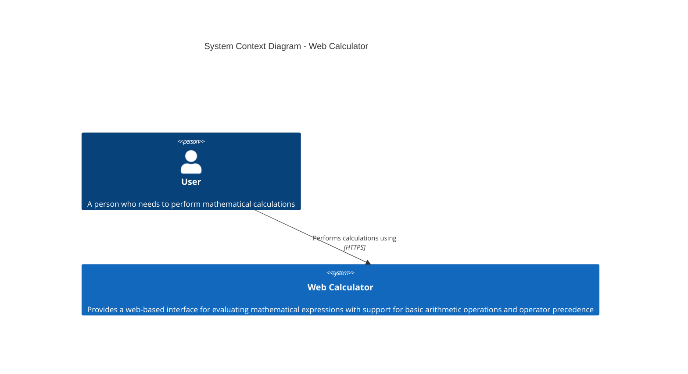
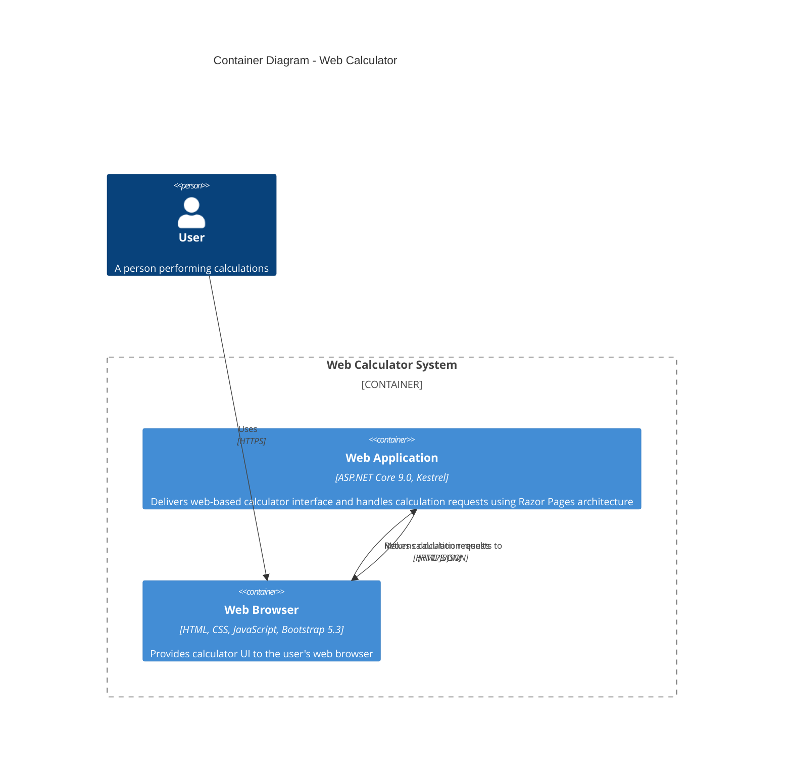
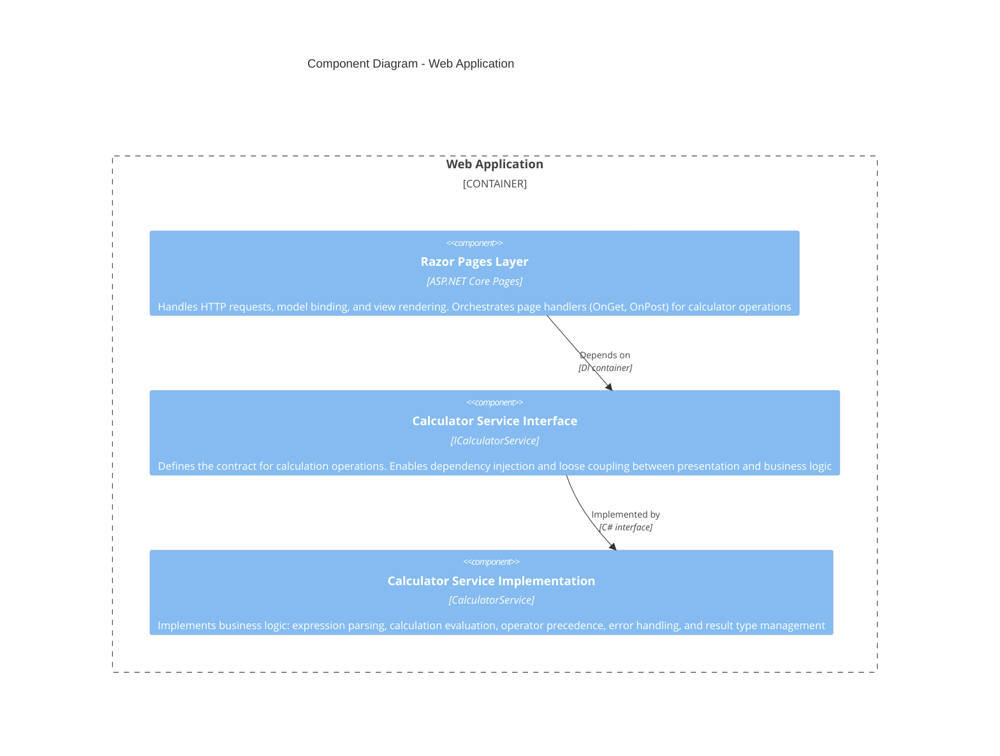

# AIASD-20260209

AI-Assisted Software Development repository demonstrating best practices for AI-generated code with comprehensive provenance tracking, evergreen development practices, and quality assurance.

## Repository Contents

### Applications

- **calculator/** - Simple console calculator application (.NET 9.0)
  - Basic arithmetic operations (add, subtract, multiply, divide)
  - Command-line interface
  - Built with .NET 9.0

- **calculator-web/** - Web-based calculator with ASP.NET Core Razor Pages (.NET 9.0)
  - **web-calculator/** - Main web application
    - Razor Pages architecture
    - Bootstrap 5.3 UI
    - Service layer pattern with dependency injection
    - Comprehensive unit and integration tests
  - **web-calculator.Tests/** - Test project
    - Unit tests for calculator service
    - Integration tests for web pages
    - xUnit test framework

### Documentation

- **docs/** - Project documentation
  - [Organization Instruction Files](docs/organization-instruction-files.md) - Guide to instruction file ecosystem
  - [Path-Scoped Instructions](docs/path-scoped-instructions.md) - Context-aware AI behavior documentation

- **.github/instructions/** - Comprehensive instruction files for development standards
  - [AI-Assisted Output Instructions](.github/instructions/ai-assisted-output.instructions.md) - AI provenance and logging requirements
  - [Architecture Patterns: DI & Service Layer](.github/instructions/architecture-patterns-di-service-layer.instructions.md) - Dependency injection and service layer standards
  - [Bootstrap Standards](.github/instructions/bootstrap.instructions.md) - Bootstrap 5.3 CSS and JavaScript practices
  - [Chatmode File Instructions](.github/instructions/chatmode-file.instructions.md) - Chat mode configuration guidance
  - [.NET 9.0 Development Standards](.github/instructions/dotnet-development.instructions.md) - .NET development best practices
  - [Evergreen Development](.github/instructions/evergreen-development.instructions.md) - Continuous modernization practices
  - [Instruction Files Creation](.github/instructions/instruction-files.instructions.md) - How to create instruction files
  - [Instruction Prompt Files](.github/instructions/instruction-prompt-files.instructions.md) - Prompt file standards
  - [Prompt File Standards](.github/instructions/prompt-file.instructions.md) - Prompt file creation guidelines
  - [Razor Pages & Kestrel Standards](.github/instructions/razor-pages-kestrel.instructions.md) - ASP.NET Core web standards

- **.github/prompts/** - Prompt files for generating AI-assisted artifacts
  - Various prompt templates for instruction file generation

### AI Activity Logs

- **ai-logs/** - Complete conversational history and provenance for all AI-generated artifacts
  - Organized by date: `ai-logs/yyyy/mm/dd/<chat-id>/`
  - Each chat includes:
    - `conversation.md` - Full transcript with timestamps
    - `summary.md` - High-level overview with resumability context
    - `artifacts/` - Generated files (when applicable)

### Analysis and Reports

- **context-analysis-report.md** - Comprehensive analysis of instruction file ecosystem quality and consistency
- **ai-validation-section.md** - AI-powered validation approach for provenance requirements

## AI-Assisted Artifacts

This section documents all AI-generated or AI-assisted content in the repository, with links to their creation conversation logs for full transparency and reproducibility.

### Instruction Files

- [AI-Assisted Output Instructions](.github/instructions/ai-assisted-output.instructions.md) - Comprehensive policy for AI provenance metadata, conversation logging, and quality gates for all AI-generated artifacts ([AI Log](ai-logs/2026/01/20/generate-ai-output-policy-20260120/conversation.md))

- [Architecture Patterns: Dependency Injection and Service Layer](.github/instructions/architecture-patterns-di-service-layer.instructions.md) - Standards and best practices for implementing Dependency Injection using .NET's built-in DI container (AddScoped, AddTransient, AddSingleton) and Service Layer pattern with interface-based separation of concerns, including service lifetimes, registration patterns, constructor injection, testing strategies, and anti-patterns ([AI Log](ai-logs/2026/02/10/arch-patterns-di-service-20260210/conversation.md))

- [Bootstrap CSS and JavaScript Standards](.github/instructions/bootstrap.instructions.md) - Comprehensive standards and best practices for Bootstrap 5.3.x CSS framework and JavaScript components, covering responsive design, utility classes, component usage, accessibility guidelines, customization, performance optimization, and common patterns for building modern web interfaces ([AI Log](ai-logs/2026/02/10/bootstrap-instructions-20260210/conversation.md))

- [.NET 9.0 Development Standards](.github/instructions/dotnet-development.instructions.md) - Comprehensive standards and best practices for .NET 9.0 development, including project configuration, C# language features, ASP.NET Core patterns, testing strategies, security practices, performance optimization, and deployment considerations ([AI Log](ai-logs/2026/02/10/dotnet-instructions-20260210/conversation.md))

- [Evergreen Development Instructions](.github/instructions/evergreen-development.instructions.md) - Comprehensive practices for continuous software modernization, technical debt prevention, dependency management, security posture, code quality standards, infrastructure evolution, and sustainable development velocity ([AI Log](ai-logs/2026/02/10/evergreen-dev-instructions-20260210/conversation.md))

- [Razor Pages and Kestrel Standards](.github/instructions/razor-pages-kestrel.instructions.md) - Comprehensive standards and best practices for developing ASP.NET Core web applications using Razor Pages and Kestrel web server, covering architecture, routing, model binding, page handlers, security, performance optimization, error handling, structured logging, testing strategies, and deployment considerations ([AI Log](ai-logs/2026/02/10/razor-kestrel-instructions-20260210/conversation.md))

### Analysis Reports

- [Context Analysis Report](context-analysis-report.md) - Comprehensive analysis of instruction file ecosystem identifying critical issues, inconsistencies, and areas of excellence, with prioritized recommendations for improvement ([AI Log](ai-logs/2026/02/10/context-analysis-20260210/conversation.md))

## Getting Started

### Prerequisites

- .NET 9.0 SDK or later
- Visual Studio 2022, Visual Studio Code, or Rider
- Git
- Optional: Docker (for containerized deployment)

### Build Instructions

**Console Calculator:**

```bash
cd calculator
dotnet build
dotnet run
```

**Web Calculator:**

```bash
cd calculator-web/web-calculator
dotnet restore
dotnet build
dotnet run --launch-profile https
```

Access at: `https://localhost:7191` or `http://localhost:5191`

### Running Tests

```bash
cd calculator-web/web-calculator.Tests
dotnet test
```

For coverage report:

```bash
dotnet test /p:CollectCoverage=true /p:CoverletOutputFormat=opencover
```

### Development Workflow

1. **Create Feature Branch**: `git checkout -b feature/your-feature-name`
2. **Follow Standards**: Review relevant instruction files in `.github/instructions/`
3. **Write Tests**: Maintain ≥80% code coverage
4. **Document AI Work**: If using AI assistance, follow [AI-Assisted Output Instructions](.github/instructions/ai-assisted-output.instructions.md)
5. **Submit PR**: Ensure all quality gates pass

## Contributing

This repository follows strict AI provenance and quality standards. Before contributing:

1. Review [AI-Assisted Output Instructions](.github/instructions/ai-assisted-output.instructions.md)
2. Review [Evergreen Development Instructions](.github/instructions/evergreen-development.instructions.md)
3. Review domain-specific instruction files relevant to your changes
4. Ensure all AI-generated content includes full provenance metadata
5. Create conversation logs for all AI-assisted work
6. Update this README with new artifacts

### PR Requirements

All pull requests must:

- ✅ Pass all CI/CD quality gates
- ✅ Include tests for new functionality
- ✅ Maintain or improve code coverage (≥80%)
- ✅ Include AI provenance metadata for AI-assisted code
- ✅ Update documentation as needed
- ✅ Follow evergreen development practices
- ✅ Address all code review feedback

## Repository Policies

### AI-Assisted Development

All AI-generated or AI-assisted artifacts must comply with [.github/instructions/ai-assisted-output.instructions.md](.github/instructions/ai-assisted-output.instructions.md), including:

- Full provenance metadata (model, operator, timestamps, etc.)
- Conversation logs stored in `ai-logs/` structure
- Session summaries for resumability
- Links from artifacts to conversation logs
- README updates for notable artifacts

**Note**: These requirements apply ONLY to AI-assisted content. Human-written code follows standard development practices without provenance requirements.

### Evergreen Practices

This repository follows evergreen software development practices as defined in [.github/instructions/evergreen-development.instructions.md](.github/instructions/evergreen-development.instructions.md):

- Continuous dependency updates and security patching
- Proactive code modernization and technical debt management
- Automated quality gates and security scanning
- Regular infrastructure and tooling evolution
- Sustainable development velocity
- SBOM generation for all releases

### Quality Standards

- **Code Coverage**: Minimum 80% for business logic
- **Security**: All vulnerabilities addressed within SLA by severity
  - Critical (CVSS 9.0-10.0): Within 8 hours
  - High (CVSS 7.0-8.9): Within 48 hours
  - Medium (CVSS 4.0-6.9): Within 14 days
- **Dependencies**: Updated within 90 days of release
- **Documentation**: Kept current with code changes
- **Tests**: Comprehensive unit, integration, and E2E coverage
- **Build Time**: PR builds complete in <5 minutes

### Technology Stack

- **Framework**: .NET 9.0
- **Language**: C# 12 (latest language features enabled)
- **Web Framework**: ASP.NET Core with Razor Pages
- **Web Server**: Kestrel
- **UI Framework**: Bootstrap 5.3.x
- **Testing**: xUnit, Moq, WebApplicationFactory
- **Architecture**: Service layer pattern with dependency injection
- **Build System**: .NET SDK CLI

## Project Status

**Current Version**: 1.0.0
**Active Development Branch**: `mob/fundamentals-3`
**Last Major Update**: 2026-02-10

### Recent Updates

- ✅ Implemented web calculator with Razor Pages architecture
- ✅ Added comprehensive instruction files for .NET 9, Bootstrap, Razor Pages, and Kestrel
- ✅ Established evergreen development practices
- ✅ Completed context analysis of instruction file ecosystem
- ✅ Implemented service layer pattern with dependency injection
- ✅ Added comprehensive test coverage (unit + integration)
- ✅ Configured AI provenance tracking system

### Upcoming Work

- [ ] Implement deployment pipeline (Azure Static Web Apps)
- [ ] Add performance benchmarking suite
- [ ] Enhance calculator with scientific functions
- [ ] Implement advanced error handling patterns
- [ ] Add API endpoints for calculator service
- [ ] Create developer onboarding documentation

## Architecture

### C4 Architecture Diagrams

The following diagrams use the C4 model to show the system architecture at different levels of detail, from high-level context down to component-level details.

#### Level 1: System Context Diagram

Shows how the Web Calculator fits into the overall context and its users.



#### Level 2: Container Diagram

Shows the high-level technical building blocks of the Web Calculator system.



#### Level 3: Component Diagram

Shows the internal components of the Web Application container.



### Architecture Highlights

**Layered Architecture**:
- **Presentation Layer** (Razor Pages): Handles user interaction, request/response, model binding
- **Service Layer** (Interface): Abstracts business logic, enables testability and DI
- **Business Logic Layer** (Implementation): Core calculation algorithms and validation

**Design Patterns**:
- **Service Layer Pattern**: Separates business logic from presentation concerns
- **Dependency Injection**: Loose coupling via constructor injection
- **Result Type Pattern**: Explicit success/failure handling without exceptions for control flow
- **Interface Segregation**: Clean abstraction boundaries between layers

**Technology Choices**:
- **Kestrel**: High-performance cross-platform web server
- **Razor Pages**: Page-focused routing and organization for web UI
- **Bootstrap 5.3**: Responsive, mobile-first CSS framework
- **.NET 9.0**: Latest LTS framework with C# 12 features

### Dependency Injection Configuration

Services are registered in `Program.cs`:

```csharp
builder.Services.AddScoped<ICalculatorService, CalculatorService>();
builder.Services.AddRazorPages();
```

### Testing Strategy

- **Unit Tests**: Test service layer in isolation using mocks
- **Integration Tests**: Test Razor Pages with real service using `WebApplicationFactory`
- **Coverage Target**: ≥80% for business logic, ≥90% for utilities

## Instruction File Ecosystem

This repository maintains a comprehensive set of instruction files that guide both developers and AI assistants. The instruction files are organized by domain and provide:

- **Standards**: What must be done
- **Best Practices**: How to do it well
- **Examples**: Concrete demonstrations
- **Quality Checklists**: Validation criteria
- **Anti-Patterns**: What to avoid

All instruction files follow the standards defined in [.github/instructions/instruction-files.instructions.md](.github/instructions/instruction-files.instructions.md).

## License

[MIT License - Specify if applicable]

## Contact

**Repository Owner**: johnmillerATcodemag-com
**Primary Contributors**: See AI conversation logs for detailed attribution
**Issues**: Submit via GitHub Issues
**Questions**: Use GitHub Discussions

---

**Repository Version**: 1.0.0
**Last Updated**: 2026-02-10T21:00:00Z
**Primary Language**: C# (.NET 9.0)
**Framework**: ASP.NET Core with Razor Pages
**Maintained By**: johnmillerATcodemag-com
**AI Model Used**: Claude 3.5 Sonnet (anthropic/claude-3.5-sonnet@2024-10-22)
