# AIASD Project Dependency Graph

```mermaid
graph TB
    subgraph "AIASD Repository"
        REPO[AIASD Repository<br/>AI-Assisted Software Development]
    end

    subgraph ".NET Projects"
        CALC[calculator<br/>.NET 9.0 Console App]
        WEBCALC_WEB[web-calculator<br/>.NET 9.0 Web App<br/>ASP.NET Core Razor Pages]
        WEBCALC_TEST[web-calculator.Tests<br/>.NET 9.0 Test Project<br/>xUnit]
        SIMPLE_WEBCALC[web-calculator<br/>Simple Web Calculator]
    end

    subgraph "Training Labs"
        PY_LAB[lab1-3-python<br/>Python 3.8+<br/>Book Library System]
        TS_LAB[lab1-3-typescript<br/>TypeScript/Node.js<br/>Book Library System]
    end

    subgraph "Development Guidelines"
        INSTRUCTIONS[.github/instructions<br/>Development Standards]
    end

    subgraph "External Dependencies - .NET"
        DOTNET[.NET 9.0 SDK]
        ASPNET[ASP.NET Core]
        XUNIT[xUnit Framework]
        COVERLET[Coverlet Coverage]
        TESTFRAMEWORK[Microsoft.NET.Test.Sdk]
    end

    subgraph "External Dependencies - Python"
        PYTHON[Python 3.8+]
    end

    subgraph "External Dependencies - TypeScript"
        NODE[Node.js 18+]
        TS[TypeScript 5.0+]
        TYPES_NODE["@types/node"]
    end

    subgraph "Frontend Dependencies"
        BOOTSTRAP[Bootstrap]
        JQUERY[jQuery]
        JQUERY_VAL[jQuery Validation]
    end

    %% Repository to Projects
    REPO --> CALC
    REPO --> WEBCALC_WEB
    REPO --> WEBCALC_TEST
    REPO --> SIMPLE_WEBCALC
    REPO --> PY_LAB
    REPO --> TS_LAB
    REPO --> INSTRUCTIONS

    %% .NET Project Dependencies
    CALC --> DOTNET
    WEBCALC_WEB --> DOTNET
    WEBCALC_WEB --> ASPNET
    WEBCALC_WEB --> BOOTSTRAP
    WEBCALC_WEB --> JQUERY
    WEBCALC_WEB --> JQUERY_VAL
    SIMPLE_WEBCALC --> DOTNET
    SIMPLE_WEBCALC --> ASPNET

    %% Test Project Dependencies
    WEBCALC_TEST --> DOTNET
    WEBCALC_TEST --> XUNIT
    WEBCALC_TEST --> COVERLET
    WEBCALC_TEST --> TESTFRAMEWORK

    %% Python Lab Dependencies
    PY_LAB --> PYTHON

    %% TypeScript Lab Dependencies
    TS_LAB --> NODE
    TS_LAB --> TS
    TS_LAB --> TYPES_NODE

    %% Guidelines Dependencies
    INSTRUCTIONS -.-> CALC
    INSTRUCTIONS -.-> WEBCALC_WEB
    INSTRUCTIONS -.-> WEBCALC_TEST
    INSTRUCTIONS -.-> PY_LAB
    INSTRUCTIONS -.-> TS_LAB

    %% Styling
    classDef netProjects fill:#512bd4,stroke:#333,stroke-width:2px,color:#fff
    classDef trainLabs fill:#2b7489,stroke:#333,stroke-width:2px,color:#fff
    classDef external fill:#90ee90,stroke:#333,stroke-width:2px
    classDef frontend fill:#563d7c,stroke:#333,stroke-width:2px,color:#fff
    classDef guidelines fill:#ffa500,stroke:#333,stroke-width:2px
    classDef repo fill:#24292e,stroke:#333,stroke-width:3px,color:#fff

    class CALC,WEBCALC_WEB,WEBCALC_TEST,SIMPLE_WEBCALC netProjects
    class PY_LAB,TS_LAB trainLabs
    class DOTNET,ASPNET,XUNIT,COVERLET,TESTFRAMEWORK,PYTHON,NODE,TS,TYPES_NODE external
    class BOOTSTRAP,JQUERY,JQUERY_VAL frontend
    class INSTRUCTIONS guidelines
    class REPO repo
```

## Legend

- **Solid lines** (→): Direct dependencies
- **Dotted lines** (-.->): Guidelines and standards influence
- **Purple boxes**: .NET projects
- **Teal boxes**: Training lab projects
- **Green boxes**: External runtime/framework dependencies
- **Dark purple boxes**: Frontend dependencies
- **Orange boxes**: Development guidelines and instructions
- **Dark gray box**: Repository root

## Project Relationships

### Calculator Projects
1. **calculator**: Standalone console calculator application
2. **web-calculator** (in calculator-web): Full-featured web calculator with tests
3. **web-calculator** (root): Simple web calculator implementation

### Training Labs
- **lab1-3-python**: Python implementation of book library system for Copilot training
- **lab1-3-typescript**: TypeScript implementation of book library system for Copilot training

### Testing Infrastructure
- **web-calculator.Tests**: Comprehensive test suite using xUnit, Coverlet for coverage

### Development Standards
All projects follow guidelines defined in `.github/instructions/` including:
- .NET 9.0 Instructions
- ASP.NET Core Razor Pages Instructions
- C# Coding Standards Instructions
- Evergreen Software Development Instructions
- AI-Assisted Output Instructions
