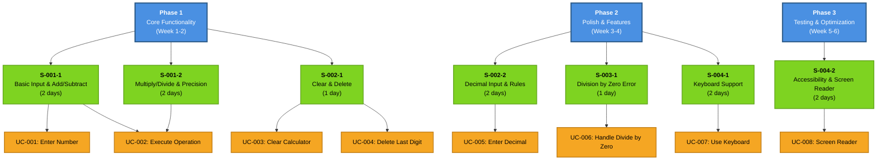
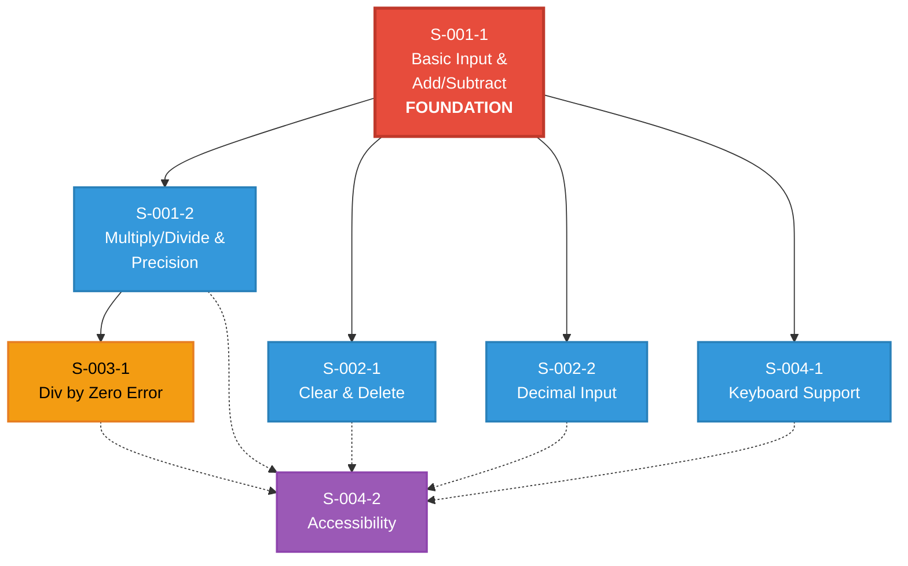

# Simple Calculator Application - Requirements Document

**Version**: 1.0
**Date**: 2026-02-07
**Status**: Approved for Development
**Owner**: Product Management Team

## Executive Summary

This document defines the requirements for a Simple Calculator Application—a cross-platform desktop and web application that enables users to perform basic arithmetic operations with an intuitive, user-friendly interface. The calculator targets casual users seeking a lightweight, responsive alternative to system-native calculators.

**Target Launch**: Q2 2026
**Priority**: Medium
**Strategic Alignment**: Enhance user productivity through accessible computing tools

---

## 1. Business Context & Objectives

### 1.1 Problem Statement

Users need a simple, fast, and reliable calculator application that:

- Works across desktop and web platforms
- Provides an intuitive interface requiring minimal learning curve
- Performs calculations with accuracy and immediate feedback
- Is lightweight and responsive without external dependencies

### 1.2 Business Objectives

- **Primary**: Launch a fully functional calculator application within Q2 2026
- **Secondary**: Establish a foundation for future advanced calculator features (scientific, graphing)
- **Tertiary**: Demonstrate cross-platform development capabilities using modern tooling

### 1.3 Success Metrics (KPIs)

| Metric                         | Target                                                      | Measurement Method           |
| ------------------------------ | ----------------------------------------------------------- | ---------------------------- |
| **Application Responsiveness** | <100ms for standard operations                              | Performance monitoring       |
| **Calculation Accuracy**       | 100% accuracy for basic operations                          | Automated test coverage >95% |
| **User Satisfaction**          | 4.5+ stars on app stores                                    | User ratings and reviews     |
| **Platform Coverage**          | Windows, macOS, Linux (desktop) + all modern browsers (web) | Cross-platform testing       |
| **Uptime (Web)**               | 99.9% availability                                          | Infrastructure monitoring    |

### 1.4 Target Audience

| User Type               | Description                                         | Primary Use Case                   |
| ----------------------- | --------------------------------------------------- | ---------------------------------- |
| **Casual Users**        | General population 13-65 years old                  | Quick everyday calculations        |
| **Students**            | Educational users in grades 7-12 and beyond         | Homework and learning calculations |
| **Professionals**       | Desk workers and business users                     | Business-related calculations      |
| **Accessibility Users** | Users with disabilities (visual, motor impairments) | Accessible calculation interface   |

---

## 2. Functional Requirements

### 2.1 Core Functionality

#### 2.1.1 Basic Arithmetic Operations

The application shall support the following operations:

- **Addition** (+): Combine two or more numbers
- **Subtraction** (−): Find the difference between numbers
- **Multiplication** (×): Perform multiplication operations
- **Division** (÷): Perform division operations with error handling for division by zero
- **Clear** (C): Reset the calculator to initial state
- **Delete** (⌫): Remove the last entered digit

#### 2.1.2 Calculation Display

- **Input Display**: Show current number being entered and previous operands
- **Result Display**: Display calculation results with up to 15 significant digits
- **Operation Indicator**: Visual indication of the selected operation (+, −, ×, ÷)
- **Error Messages**: Clear, user-friendly error messages for invalid operations

#### 2.1.3 Number Input

- **Numeric Keypad**: Numbers 0-9 via buttons or keyboard
- **Decimal Support**: Support for decimal numbers (e.g., 3.14) with single decimal point per number
- **Leading Zero Handling**: Prevent leading zeros (e.g., "0" displays as "0", not "00")
- **Number Limits**: Support numbers up to 15 digits before decimal point

### 2.2 User Interface Elements

#### 2.2.1 Visual Layout

```
┌─────────────────────────────┐
│           DISPLAY [0]       │
├─────────────────────────────┤
│ [C] [←] [÷] [×]             │
│ [7] [8] [9] [−]             │
│ [4] [5] [6] [+]             │
│ [1] [2] [3]                 │
│ [0]     [.] [=]             │
└─────────────────────────────┘
```

#### 2.2.2 Button Functions

| Button | Label       | Function             |
| ------ | ----------- | -------------------- |
| 0-9    | Numbers     | Input numeric values |
| +      | Addition    | Add operation        |
| −      | Subtraction | Subtract operation   |
| ×      | Multiply    | Multiply operation   |
| ÷      | Divide      | Divide operation     |
| =      | Equals      | Calculate result     |
| C      | Clear       | Reset calculator     |
| ←      | Backspace   | Delete last digit    |
| .      | Decimal     | Add decimal point    |

#### 2.2.3 Display Specifications

- **Resolution**: Adaptive to screen size (responsive design)
- **Font Size**: Minimum 14pt for readability
- **Color Contrast**: WCAG AA accessibility standard (7:1 minimum contrast ratio)
- **Visual Feedback**: Button press animation and hover states

### 2.3 Keyboard Support

The application shall support keyboard input for common use cases:

| Key        | Action            |
| ---------- | ----------------- |
| 0-9        | Numeric input     |
| +          | Addition          |
| -          | Subtraction       |
| \*         | Multiplication    |
| /          | Division          |
| .          | Decimal point     |
| Enter / =  | Calculate result  |
| Backspace  | Delete last digit |
| Escape / C | Clear calculator  |

---

## 3. Non-Functional Requirements

### 3.1 Performance

- **Response Time**: All operations complete within 100ms
- **Load Time**: Application initializes within 2 seconds
- **Memory Usage**: <50MB for desktop application, <10MB for web
- **CPU Usage**: <5% at idle, <20% during active use

### 3.2 Reliability

- **Uptime (Web Version)**: 99.9% availability
- **Error Recovery**: Graceful handling of edge cases and invalid inputs
- **Data Accuracy**: 100% calculation accuracy for basic operations
- **State Persistence**: NO persistent state required (stateless session)

### 3.3 Usability

- **Learning Curve**: < 30 seconds for new users to perform first calculation
- **Accessibility**: WCAG 2.1 Level AA compliance
- **Platform Adaptation**: Native look-and-feel on each platform
- **Responsive Design**: Functional on screens from 320px width upward (mobile-first)

### 3.4 Security

- **Input Validation**: All inputs sanitized and validated before processing
- **No Data Collection**: NO persistent user data collection or third-party services
- **Secure Transport**: HTTPS for web version (when deployed)
- **No External Dependencies**: Minimal third-party library dependencies

### 3.5 Compatibility

- **Desktop Platforms**:
  - Windows 10 and later
  - macOS 10.15 and later
  - Linux (Ubuntu 20.04+, Fedora 32+)

- **Web Browsers**:
  - Chrome/Edge 90+
  - Firefox 88+
  - Safari 14+
  - Mobile browsers (iOS Safari, Chrome Android)

---

## 4. User Stories & Acceptance Criteria

### User Story 1: Basic Arithmetic Operation

**As a** casual user
**I want to** perform simple addition
**So that** I can quickly calculate totals

**Acceptance Criteria**:

- [ ] User can click buttons or use keyboard for numeric input
- [ ] User can select addition operation via button or keyboard (+)
- [ ] User can enter second number
- [ ] User can press equals to calculate result
- [ ] Result displays correctly (e.g., 5 + 3 = 8)
- [ ] Display updates in real-time as numbers are entered

**Test Scenarios**:

- 5 + 3 = 8 ✓
- 0 + 0 = 0 ✓
- 999 + 1 = 1000 ✓
- 3.14 + 2.86 = 6.00 ✓

---

### User Story 2: Clear and Reset

**As a** user
**I want to** reset the calculator to start a new calculation
**So that** I don't have to start over manually

**Acceptance Criteria**:

- [ ] Clear button (C) is visually distinct from number buttons
- [ ] Clicking C resets display to "0"
- [ ] Clicking C clears all previous calculations
- [ ] Pressing Escape key triggers same behavior as C button
- [ ] After clear, user can immediately start new calculation

**Test Scenarios**:

- C button clears previous calculation ✓
- Escape key clears calculator ✓
- Display shows "0" after clear ✓

---

### User Story 3: Decimal Number Support

**As a** user working with decimals
**I want to** input and calculate decimal numbers
**So that** I can perform precise calculations

**Acceptance Criteria**:

- [ ] Decimal (.) button is available
- [ ] Only one decimal point allowed per number
- [ ] Decimal numbers display with appropriate precision
- [ ] Calculations with decimals produce accurate results
- [ ] No leading zeros before decimal (e.g., ".5" displays as "0.5")

**Test Scenarios**:

- 3.14 + 2.86 = 6.00 ✓
- 10.5 ÷ 2 = 5.25 ✓
- 0.1 + 0.2 = 0.3 ✓

---

### User Story 4: Error Handling - Division by Zero

**As a** user
**I want to** be informed when I attempt an invalid operation
**So that** I understand why the calculator won't calculate

**Acceptance Criteria**:

- [ ] Attempting 5 ÷ 0 shows error message "Cannot divide by zero"
- [ ] Error message is clear and user-friendly
- [ ] Calculator remains functional after error
- [ ] User can clear error and continue calculating
- [ ] No application crash occurs

**Test Scenarios**:

- 5 ÷ 0 displays error ✓
- User can clear and continue ✓
- No system crash ✓

---

### User Story 5: Backspace/Delete Functionality

**As a** user who makes input mistakes
**I want to** delete the last digit without clearing everything
**So that** I can correct mistakes quickly

**Acceptance Criteria**:

- [ ] Backspace button (←) is available
- [ ] Clicking ← removes last entered digit
- [ ] Pressing Backspace key triggers same behavior
- [ ] Display updates immediately after deletion
- [ ] Deleting all digits shows "0"

**Test Scenarios**:

- Enter "123" then backspace shows "12" ✓
- Backspace on "0" remains "0" ✓
- Multiple backspaces work correctly ✓

---

### User Story 6: Accessibility

**As a** user with visual impairments
**I want to** use the calculator with keyboard and screen reader
**So that** I can perform calculations independently

**Acceptance Criteria**:

- [ ] All buttons have descriptive aria-labels
- [ ] Screen reader announces current number displayed
- [ ] Screen reader announces operation selected
- [ ] Tab navigation works through all controls
- [ ] Color contrast meets WCAG AA standard (7:1)
- [ ] Font size minimum 14pt

**Test Scenarios**:

- Screen reader announces numbers and operations ✓
- Keyboard navigation completes full calculation ✓
- Color contrast validated in accessibility checker ✓

---

## 5. Technical Specifications

### 5.1 Technology Stack

| Component       | Recommended Technology | Rationale                       |
| --------------- | ---------------------- | ------------------------------- |
| **Desktop App** | Electron or Tauri      | Cross-platform compatibility    |
| **Web App**     | React or Vue.js        | Lightweight, responsive UI      |
| **Build Tool**  | Vite or Webpack        | Fast builds and dev experience  |
| **Testing**     | Jest + Cypress         | Unit and integration testing    |
| **Language**    | TypeScript             | Type safety and maintainability |

### 5.2 Data Model

```typescript
interface CalculatorState {
  display: string; // Current display value
  currentNumber: string; // Number being entered
  previousNumber: string; // Previous operand
  operation: string | null; // Current operation (+, -, *, /)
  resultDisplayed: boolean; // Flag for result state
}
```

### 5.3 Core Operations Logic

```typescript
function calculate(
  previousNum: number,
  currentNum: number,
  operation: string,
): number {
  switch (operation) {
    case "+":
      return previousNum + currentNum;
    case "-":
      return previousNum - currentNum;
    case "*":
      return previousNum * currentNum;
    case "/":
      if (currentNum === 0) throw new Error("Division by zero");
      return previousNum / currentNum;
    default:
      return currentNum;
  }
}
```

### 5.4 Architecture

**Single Responsibility Principle**:

- UI Component: Display management and user interaction
- Logic Layer: Calculation operations and state management
- Input Handler: Keyboard and button input processing
- Error Handler: Exception handling and user feedback

### 5.5 Testing Strategy

| Test Type               | Coverage Target      | Tool                         |
| ----------------------- | -------------------- | ---------------------------- |
| **Unit Tests**          | >90% code coverage   | Jest                         |
| **Integration Tests**   | All user workflows   | Jest + React Testing Library |
| **UI Tests**            | All interactions     | Cypress                      |
| **Accessibility Tests** | WCAG AA compliance   | axe DevTools                 |
| **Performance Tests**   | <100ms response time | Lighthouse                   |

---

## 6. Design Specifications

### 6.1 Color Palette

| Element            | Color      | Hex Code | Purpose              |
| ------------------ | ---------- | -------- | -------------------- |
| Display Background | Dark Gray  | #2B2B2B  | Clear readability    |
| Display Text       | White      | #FFFFFF  | High contrast        |
| Number Buttons     | Light Gray | #E0E0E0  | Standard interaction |
| Operation Buttons  | Orange     | #FF9500  | Visual distinction   |
| Equals Button      | Green      | #4CAF50  | Action confirmation  |
| Clear Button       | Red        | #F44336  | Destructive action   |
| Button Hover       | Darkened   | -        | User feedback        |

### 6.2 Typography

- **Primary Font**: System sans-serif (Segoe UI, Roboto, Helvetica)
- **Display Font Size**: 28px minimum
- **Button Font Size**: 16px
- **Line Height**: 1.5 for readability

### 6.3 Responsive Breakpoints

| Breakpoint | Width          | Layout                 |
| ---------- | -------------- | ---------------------- |
| Mobile     | 320px - 767px  | Single column buttons  |
| Tablet     | 768px - 1024px | 2-column layout option |
| Desktop    | 1025px+        | Standard grid layout   |

---

## 7. Out of Scope

**The following features are explicitly OUT OF SCOPE for v1.0**:

- ❌ Scientific functions (sin, cos, log, etc.)
- ❌ Graphing or charting capabilities
- ❌ Calculation history or memory functions
- ❌ Multi-language support beyond English
- ❌ User accounts or cloud synchronization
- ❌ Advanced statistics or financial calculations
- ❌ Voice input functionality
- ❌ Offline data persistence

**These features may be considered for v2.0 based on user feedback.**

---

## 8. Dependencies & Constraints

### 8.1 External Dependencies

**Required**:

- None (pure vanilla JavaScript option available)

**Optional**:

- React 18+ (web version)
- TypeScript 5.0+ (for type safety)

### 8.2 Browser Support

- Minimum ES6 JavaScript support required
- NO polyfills for IE11 support
- Native NumberFormat API supported

### 8.3 Development Constraints

- **Development Timeline**: 6 weeks
- **Team Size**: 2-3 developers
- **Budget**: Within standard project allocation
- **Platforms**: Windows, macOS, Linux, Web

---

## 9. Implementation Plan

### 9.1 Planning Approach: Phases + Vertical Slices

This implementation plan uses **two complementary organizational approaches**:

**🕐 Phases (Time-Based)** - _Answer: WHEN will work be completed?_

- Time-boxed delivery periods for stakeholder timeline visibility
- Resource allocation and budget tracking units
- Coordination milestones for cross-team dependencies
- Used for: Project management, executive reporting, external commitments

**📦 Vertical Slices (Feature-Based)** - _Answer: WHAT will be built?_

- Independently deliverable features spanning all technical layers (UI → Logic → Tests)
- Complete user workflows that provide immediate value
- Minimally dependent, can be built and tested in isolation
- Used for: Development work breakdown, sprint planning, priority decisions

**Why Both?**

- **Phases** provide timeline predictability for business stakeholders
- **Slices** enable technical flexibility and incremental value delivery
- **Slices can be reordered** within or across phases based on emerging priorities
- If a slice takes longer than expected, other slices can proceed independently

#### Implementation Hierarchy: Phases → Slices → Use Cases



**Diagram Key**:

- 🔵 **Blue boxes** = Phases (time-based milestones)
- 🟢 **Green boxes** = Vertical Slices (independently deliverable features)
- 🟠 **Orange boxes** = Use Cases (user workflows implemented by slices)

---

### 9.2 Delivery Timeline (Phases - WHEN)

These phases define the **6-week timeline** for MVP delivery and serve as project milestones.

#### Phase 1: Core Functionality (Week 1-2)

- [ ] Display component fully functional
- [ ] Number input (0-9) working
- [ ] Basic arithmetic operations (+, −, ×, ÷) working
- [ ] Equals functionality producing correct results
- [ ] Clear button resetting calculator

#### Phase 2: Polish & Features (Week 3-4)

- [ ] Keyboard input support
- [ ] Backspace/delete functionality
- [ ] Decimal point input
- [ ] Error handling for division by zero
- [ ] Visual feedback (button press animation)

#### Phase 3: Testing & Optimization (Week 5-6)

- [ ] > 90% unit test coverage
- [ ] Cross-browser testing complete
- [ ] Performance optimization (<100ms operations)
- [ ] Accessibility audit (WCAG AA)
- [ ] Documentation completed
- [ ] Ready for release

---

### 9.3 Feature Breakdown (Vertical Slices - WHAT)

These vertical slices define **what features** will be built. Each slice:

- ✅ Delivers complete end-to-end functionality (UI + Logic + Tests)
- ✅ Provides immediate user value
- ✅ Can be built and tested independently
- ✅ Can be deployed without waiting for other slices

Slices are **mapped to phases** for timeline planning, but can be **reordered as priorities shift**.

#### 9.3.1 Business Rules

**BR-001**: Display shows current input and result state

- **Type**: Structural
- **Priority**: Critical
- **Scope**: Display

**BR-002**: Support basic operations (+, -, \*, /)

- **Type**: Operative
- **Priority**: Critical
- **Scope**: Core Calculation

**BR-003**: Division by zero shows error and blocks calculation

- **Type**: Operative
- **Priority**: High
- **Scope**: Error Handling

**BR-004**: Only one decimal point allowed per number

- **Type**: Operative
- **Priority**: High
- **Scope**: Input Management

**BR-005**: Leading zeros are prevented ("0" remains "0")

- **Type**: Operative
- **Priority**: Medium
- **Scope**: Input Management

**BR-006**: Backspace deletes the last digit; empty input shows "0"

- **Type**: Operative
- **Priority**: High
- **Scope**: Input Management

**BR-007**: Clear resets calculator state to initial

- **Type**: Operative
- **Priority**: High
- **Scope**: Input Management

**BR-008**: Keyboard input mirrors button behavior

- **Type**: Operative
- **Priority**: High
- **Scope**: Input Management

**BR-009**: Controls include aria-labels and screen reader output for display

- **Type**: Operative
- **Priority**: High
- **Scope**: Accessibility

**BR-010**: Results display up to 15 significant digits

- **Type**: Operative
- **Priority**: Medium
- **Scope**: Display

#### 9.3.2 Use Cases

**UC-001**: Enter number

- **Actor**: User
- **Goal**: Input digits to form a number
- **Business Rules**: BR-001, BR-005

**UC-002**: Execute arithmetic operation

- **Actor**: User
- **Goal**: Calculate result using +, -, \*, /
- **Business Rules**: BR-001, BR-002, BR-010

**UC-003**: Clear calculator

- **Actor**: User
- **Goal**: Reset calculator to initial state
- **Business Rules**: BR-007

**UC-004**: Delete last digit

- **Actor**: User
- **Goal**: Correct input without clearing everything
- **Business Rules**: BR-006

**UC-005**: Enter decimal number

- **Actor**: User
- **Goal**: Input decimal values accurately
- **Business Rules**: BR-004

**UC-006**: Handle divide by zero

- **Actor**: User
- **Goal**: Receive a clear error message for invalid division
- **Business Rules**: BR-003

**UC-007**: Use keyboard input

- **Actor**: User
- **Goal**: Operate calculator via keyboard shortcuts
- **Business Rules**: BR-008

**UC-008**: Use accessible controls

- **Actor**: Accessibility user
- **Goal**: Operate calculator with screen reader and keyboard
- **Business Rules**: BR-009

#### 9.3.3 Features

**Feature 1**: Core Calculation

- **ID**: F-001
- **Description**: Execute arithmetic operations and display results
- **User Value**: Users can compute totals quickly
- **Use Cases**: UC-001, UC-002
- **Business Rules**: BR-001, BR-002, BR-010
- **Priority**: P0
- **Complexity**: Low

**Feature 2**: Input Management

- **ID**: F-002
- **Description**: Manage clear, delete, and decimal input rules
- **User Value**: Users can enter and correct values confidently
- **Use Cases**: UC-003, UC-004, UC-005
- **Business Rules**: BR-004, BR-005, BR-006, BR-007
- **Priority**: P0
- **Complexity**: Low

**Feature 3**: Error Handling

- **ID**: F-003
- **Description**: Detect and surface invalid operations
- **User Value**: Users understand and recover from errors
- **Use Cases**: UC-006
- **Business Rules**: BR-003
- **Priority**: P1
- **Complexity**: Low

**Feature 4**: Accessibility and Keyboard

- **ID**: F-004
- **Description**: Enable keyboard control and screen reader support
- **User Value**: Users can operate the app without a mouse
- **Use Cases**: UC-007, UC-008
- **Business Rules**: BR-008, BR-009
- **Priority**: P1
- **Complexity**: Medium

#### 9.3.4 Vertical Slices (Delivery Units)

**Slice S-001-1**: Basic input and addition/subtraction

- **Feature**: Core Calculation (F-001)
- **Priority**: P0
- **User Story**: As a user, I want to enter numbers and add or subtract so that I can calculate totals
- **Acceptance Criteria**:
  - [ ] Display updates as digits are entered
  - [ ] Add/subtract returns correct results for integers
- **Technical Components**: UI display, state store, calculate logic, unit tests

**Slice S-001-2**: Multiplication/division and result precision

- **Feature**: Core Calculation (F-001)
- **Priority**: P0
- **User Story**: As a user, I want to multiply and divide so that I can complete all basic operations
- **Acceptance Criteria**:
  - [ ] Multiply/divide works for integers and decimals
  - [ ] Results limited to 15 significant digits
- **Technical Components**: calculate logic, formatting, unit tests

**Slice S-002-1**: Clear and delete

- **Feature**: Input Management (F-002)
- **Priority**: P0
- **User Story**: As a user, I want to clear or delete input so that I can correct mistakes
- **Acceptance Criteria**:
  - [ ] Clear resets state to initial
  - [ ] Delete removes last digit and shows "0" when empty
- **Technical Components**: input handler, state transitions, unit tests

**Slice S-002-2**: Decimal input and leading zero rules

- **Feature**: Input Management (F-002)
- **Priority**: P0
- **User Story**: As a user, I want to enter decimals without formatting errors
- **Acceptance Criteria**:
  - [ ] Only one decimal point allowed per number
  - [ ] Leading zeros are prevented
- **Technical Components**: input validation, state transitions, unit tests

**Slice S-003-1**: Division by zero error handling

- **Feature**: Error Handling (F-003)
- **Priority**: P1
- **User Story**: As a user, I want a clear error when dividing by zero so that I understand the issue
- **Acceptance Criteria**:
  - [ ] Error message "Cannot divide by zero" displayed
  - [ ] Calculator remains usable after error and can be cleared
- **Technical Components**: error handler, UI message state, unit tests

**Slice S-004-1**: Keyboard input support

- **Feature**: Accessibility and Keyboard (F-004)
- **Priority**: P1
- **User Story**: As a user, I want to use keyboard keys for all operations
- **Acceptance Criteria**:
  - [ ] Numeric and operator keys mirror button input
  - [ ] Enter/Backspace/Escape match equals/delete/clear
- **Technical Components**: keyboard event mapping, input handler tests

**Slice S-004-2**: Accessibility labels and focus order

- **Feature**: Accessibility and Keyboard (F-004)
- **Priority**: P1
- **User Story**: As an accessibility user, I want screen reader and tab support
- **Acceptance Criteria**:
  - [ ] All controls include descriptive aria-labels
  - [ ] Display value and operation are announced
- **Technical Components**: aria attributes, focus management, accessibility tests

---

### 9.4 Integrated Roadmap: Phases + Slices

This roadmap maps **feature slices (WHAT)** to **delivery phases (WHEN)**, showing both technical implementation units and timeline milestones.

#### Phase 1: Core Functionality (Week 1-2)

**Timeline Goal**: Deliver basic calculator operations

**Vertical Slices Included**:

- ✅ **S-001-1**: Basic input and addition/subtraction (2 days)
- ✅ **S-001-2**: Multiplication/division and result precision (2 days)
- ✅ **S-002-1**: Clear and delete (1 day)

**Deliverable**: Working calculator with all four operations and basic input controls

**Flexibility Note**: If S-001-2 takes longer than expected, S-002-1 can proceed independently

---

#### Phase 2: Polish & Features (Week 3-4)

**Timeline Goal**: Add error handling, decimal support, and keyboard controls

**Vertical Slices Included**:

- ✅ **S-002-2**: Decimal input and leading zero rules (2 days)
- ✅ **S-003-1**: Division by zero error handling (1 day)
- ✅ **S-004-1**: Keyboard input support (2 days)

**Deliverable**: Production-ready calculator with full input validation and keyboard support

**Flexibility Note**: S-003-1 and S-004-1 are independent; can be built in parallel

---

#### Phase 3: Testing & Optimization (Week 5-6)

**Timeline Goal**: Achieve production quality and accessibility compliance

**Vertical Slices Included**:

- ✅ **S-004-2**: Accessibility labels and focus order (2 days)

**Additional Deliverables**:

- Full test suite (>90% coverage) across all slices
- Cross-browser compatibility validation
- Performance optimization (<100ms operations)
- WCAG 2.1 AA accessibility audit and certification
- Production deployment readiness

**Flexibility Note**: If Phase 2 slips, S-004-2 can be built while QA completes Phase 2 validation

---

### 9.5 Flexibility Scenarios

**Scenario 1: Phase 1 scope reduction needed**

- **Option**: Defer S-002-1 (Clear/Delete) to Phase 2
- **Impact**: Still delivers working calculator; users can refresh page to clear
- **Timeline**: Phase 1 completes on schedule

**Scenario 2: Decimal input more complex than estimated**

- **Option**: Defer S-002-2 to Phase 3
- **Impact**: Integer calculations fully functional; decimal support delayed
- **Timeline**: Phase 2 delivers error handling and keyboard on schedule

**Scenario 3: Priority shift - accessibility becomes critical**

- **Option**: Move S-004-2 from Phase 3 to Phase 2
- **Impact**: Swap with S-002-2 (decimal input)
- **Timeline**: Accessibility delivered earlier; decimals delayed one phase

These scenarios demonstrate how vertical slices enable **flexible response to changing priorities** while maintaining **predictable phase delivery**.

---

### 9.6 Slice Dependencies & Parallel Work Opportunities

Understanding dependencies between slices enables **optimal resource allocation** and **parallel development** to accelerate delivery.

#### Dependency Analysis

**Critical Path (Must Be Sequential)**:

```
S-001-1 (Foundation)
   ↓
S-001-2 (Extends calculation)
   ↓
S-003-1 (Extends division with error handling)
```

**Independent Paths (Can Be Parallel)**:

| Slice       | Depends On      | Can Be Parallel With      | Rationale                                                 |
| ----------- | --------------- | ------------------------- | --------------------------------------------------------- |
| **S-001-1** | None            | -                         | Foundation slice - creates display, state, input handling |
| **S-001-2** | S-001-1         | S-002-1                   | Extends calculate logic; independent of clear/delete      |
| **S-002-1** | S-001-1         | S-001-2, S-002-2          | Only needs state structure from S-001-1                   |
| **S-002-2** | S-001-1         | S-002-1, S-003-1, S-004-1 | Extends input validation; mostly independent              |
| **S-003-1** | S-001-2         | S-002-2, S-004-1          | Needs division operation to enhance with error handling   |
| **S-004-1** | S-001-1         | S-002-2, S-003-1          | Just mirrors existing button functionality via keyboard   |
| **S-004-2** | All UI complete | -                         | Needs all controls present to add accessibility           |

#### Dependency Diagram



**Legend**:

- 🔴 **Red**: Foundation slice (all others depend on this)
- 🔵 **Blue**: Can be built in parallel after foundation
- 🟠 **Orange**: Has specific dependency (must wait for another slice)
- 🟣 **Purple**: Final integration slice (needs all UI complete)
- **Solid arrows** (→): Hard dependency
- **Dashed arrows** (⇢): Contributes to final slice

#### Optimal Parallelization Strategy

**Phase 1 - Maximize Parallel Work**:

```
Week 1, Days 1-2: Developer A builds S-001-1 (foundation)
                  Developer B prepares tests, designs UI components

Week 1, Days 3-4: Developer A builds S-001-2 (multiply/divide)
                  Developer B builds S-002-1 (clear/delete) ✓ PARALLEL

Week 1, Day 5:    Integration testing, merge both slices
```

**Phase 2 - Three Parallel Tracks**:

```
Week 3, Days 1-2: Developer A builds S-002-2 (decimal input)
                  Developer B builds S-004-1 (keyboard) ✓ PARALLEL
                  Developer C builds S-003-1 (error handling) ✓ PARALLEL

Week 3, Days 3-4: Integration testing and QA
```

**Phase 3 - Final Integration**:

```
Week 5, Days 1-2: Developer A builds S-004-2 (accessibility)
                  Developers B & C perform comprehensive testing
```

#### Critical Path & Timeline Impact

**Critical Path** (cannot be accelerated):

1. S-001-1: 2 days
2. S-001-2: 2 days
3. S-003-1: 1 day
4. S-004-2: 2 days
   **Total Critical Path**: 7 days

**With Parallel Work**:

- Phase 1: 5 days (S-002-1 built in parallel with S-001-2)
- Phase 2: 2 days (all three slices built in parallel)
- Phase 3: 2 days (S-004-2)
  **Total Calendar Time**: 9 days + 1 week testing = 4 weeks

**Without Parallel Work** (sequential):

- Total: 2+2+1+2+1+2+2 = 12 days + testing = 5+ weeks

**Time Savings**: 1+ week by leveraging parallel development

#### Risk Mitigation

**Risk**: Integration conflicts when merging parallel slices

**Mitigation**:

- Daily standups to coordinate shared code changes
- Feature flags to isolate incomplete work
- Comprehensive integration test suite
- Pair programming on shared components (state management)

**Risk**: Foundation slice (S-001-1) takes longer than estimated

**Impact**: Blocks all other slices (critical path bottleneck)

**Mitigation**:

- Allocate most experienced developer to S-001-1
- Time-box implementation; simplify if running over
- Consider spike/prototype before committing to timeline

#### Team Allocation Recommendations

**2-Developer Team**:

- **Sequential with selective parallelization** (Phase 1: 6 days, Phase 2: 3 days)
- Parallel opportunities: S-002-1 || S-001-2, then S-002-2 || S-004-1

**3-Developer Team**:

- **Full parallelization in Phase 2** (Phase 1: 5 days, Phase 2: 2 days)
- Optimal throughput with clear ownership per slice

**1-Developer Team**:

- **Fully sequential** (Phase 1: 5 days, Phase 2: 5 days)
- Consider deferring lower-priority slices to accelerate Phase 1

---

## 10. Post-Launch Roadmap

### v1.1 Enhancement (Post-MVP)

- **Calculation History**: View previous calculations
- **Keyboard Shortcuts**: Extended shortcut support
- **Dark Mode**: Theme toggle option
- **Improved Mobile UX**: Touch-optimized interface

### v2.0 Advanced Features (Future)

- **Scientific Calc Mode**: Advanced mathematical functions
- **Multi-line Display**: Better visibility for complex operations
- **Unit Conversion**: Currency and measurement conversion
- **Statistics**: Mean, median, standard deviation

---

## 11. Glossary

| Term              | Definition                                                               |
| ----------------- | ------------------------------------------------------------------------ |
| **Operand**       | A number or value that an operation is performed on                      |
| **Operation**     | A mathematical function: addition, subtraction, multiplication, division |
| **State**         | The current condition of the calculator (numbers, operations, display)   |
| **Accessibility** | Design ensuring usability for people with disabilities                   |
| **WCAG**          | Web Content Accessibility Guidelines                                     |
| **MVP**           | Minimum Viable Product with core features for release                    |

---

## 12. Approval & Sign-off

| Role              | Name   | Signature                  | Date       |
| ----------------- | ------ | -------------------------- | ---------- |
| Product Manager   | [Name] | \_\_\_\_\_\_\_\_\_\_\_\_\_ | 2026-02-07 |
| Tech Lead         | [Name] | \_\_\_\_\_\_\_\_\_\_\_\_\_ | 2026-02-07 |
| UX/Design Lead    | [Name] | \_\_\_\_\_\_\_\_\_\_\_\_\_ | 2026-02-07 |
| Quality Assurance | [Name] | \_\_\_\_\_\_\_\_\_\_\_\_\_ | 2026-02-07 |

---

## 13. Document Control

**Document Version**: 1.0
**Last Updated**: 2026-02-07
**Next Review**: 2026-02-14
**Owner**: Product Management
**Status**: 🟢 Active - Ready for Development
