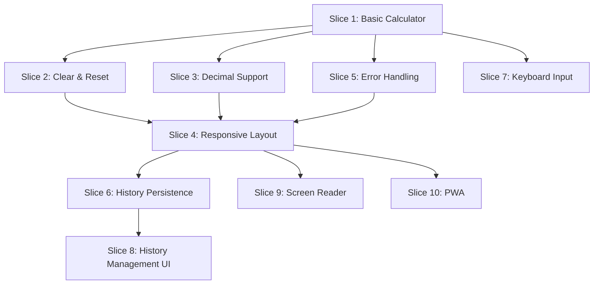

# Calculator Web App: Vertical Slice Implementation Plan

**Version**: 1.0
**Created**: February 12, 2026
**Based On**: [calculator-web-app-prd.md](./calculator-web-app-prd.md)
**Status**: Draft

---

## Table of Contents

- [Overview](#overview)
- [Vertical Slicing Principles for Frontend Applications](#vertical-slicing-principles-for-frontend-applications)
- [Feature Slice Inventory](#feature-slice-inventory)
- [Slice Prioritization](#slice-prioritization)
- [Detailed Slice Specifications](#detailed-slice-specifications)
- [Implementation Architecture](#implementation-architecture)
- [Development Workflow](#development-workflow)
- [Quality Gates](#quality-gates)
- [Success Metrics Per Slice](#success-metrics-per-slice)

---

## Overview

### Purpose

This document provides a vertical slice implementation plan for the Calculator Web App, breaking down the product requirements into independent, end-to-end feature slices. Each slice delivers complete user value and can be developed, tested, and deployed independently.

### What is a Vertical Slice?

A **vertical slice** is a complete, thin implementation of a feature that cuts through all architectural layers:

```
User Interface → State Management → Business Logic → Data Storage → Tests
```

Each slice:
- ✅ Delivers working, testable user functionality
- ✅ Can be developed independently
- ✅ Can be deployed incrementally
- ✅ Is designed for user value, not technical layers

### Why Vertical Slicing for Calculator App?

**Benefits:**
1. **Incremental Delivery**: Deploy working features progressively (Phase 1 → Phase 2 → Phase 3)
2. **Parallel Development**: Multiple slices can be developed simultaneously by different developers
3. **Reduced Risk**: Each slice is small, testable, and independently deployable
4. **User Feedback**: Get early feedback on individual features before building everything
5. **Quality Focus**: Each slice has clear acceptance criteria and dedicated tests
6. **Feature Independence**: Changes to one feature don't break others

**Alternative (Layered) Approach Problems:**
- Building "UI layer complete" → "logic layer complete" → "storage layer" means no working features until end
- Integration happens late, increasing risk
- Can't deploy partial functionality
- Harder to get user feedback early

---

## Vertical Slicing Principles for Frontend Applications

### Frontend-Specific Considerations

Unlike backend APIs with Commands/Queries/Handlers, frontend vertical slices follow this pattern:

```
Feature Slice = Component + Hook + Logic + Storage + Tests
```

**Each Slice Contains:**
1. **UI Component**: React component(s) for the feature
2. **State Hook**: Custom hook managing feature state
3. **Business Logic**: Pure functions for calculations/validation
4. **Storage**: LocalStorage integration (if needed)
5. **Tests**: Unit and integration tests for complete feature

### Feature Independence Rules

**✅ DO:**
- Create self-contained feature modules
- Use shared utilities/types from `/shared` folder
- Communicate between features via well-defined interfaces
- Keep feature state isolated

**❌ DON'T:**
- Import directly from other feature folders (`import from '../OtherFeature'`)
- Share state between features without clear contracts
- Create tightly coupled feature dependencies

### File Organization

```
/src
  /features                      # All feature slices
    /basic-calculator           # Slice 1
      BasicCalculator.tsx       # Main component
      useCalculator.ts          # State management hook
      calculator.logic.ts       # Pure business logic
      BasicCalculator.test.tsx  # Tests
      index.ts                  # Public exports
    /calculation-history        # Slice 2
      CalculationHistory.tsx
      useHistory.ts
      history.storage.ts
      CalculationHistory.test.tsx
      index.ts
    /keyboard-input             # Slice 3
      useKeyboardInput.ts
      keyboard.utils.ts
      keyboard.test.ts
      index.ts
  /shared                       # Shared utilities
    /types                      # Shared TypeScript types
    /utils                      # Shared utility functions
    /components                 # Truly reusable UI components
  /app                          # Root application
    App.tsx
    main.tsx
```

---

## Feature Slice Inventory

### Core Feature Slices

Based on the PRD, we've identified **10 primary feature slices** organized into 3 phases:

#### Phase 1: MVP (Weeks 1-4)

| Slice # | Feature Name | User Value | Complexity | Priority |
|---------|--------------|------------|------------|----------|
| **1** | Basic Calculator Operations | Perform arithmetic calculations | Medium | Critical |
| **2** | Clear & Reset Functions | Correct mistakes, start fresh | Low | Critical |
| **3** | Decimal Number Support | Work with precise values | Medium | High |
| **4** | Responsive Layout | Use on any device | Medium | High |
| **5** | Error Handling | Understand invalid operations | Low | High |

#### Phase 2: Enhanced Features (Weeks 5-7)

| Slice # | Feature Name | User Value | Complexity | Priority |
|---------|--------------|------------|------------|----------|
| **6** | Calculation History Persistence | Review past calculations | High | High |
| **7** | Keyboard Input Support | Fast power-user workflow | Medium | High |
| **8** | History Management UI | Access and reuse calculations | Medium | Medium |

#### Phase 3: Polish & Accessibility (Weeks 8-9)

| Slice # | Feature Name | User Value | Complexity | Priority |
|---------|--------------|------------|------------|----------|
| **9** | Screen Reader Support | Accessible to all users | High | High |
| **10** | Progressive Web App | Offline access, installable | Medium | Medium |

### Supporting Slices (Cross-Cutting)

These are not independent features but foundational components:

- **Shared Types**: TypeScript interfaces and types
- **Theme System**: Light/dark mode support
- **Analytics Integration**: Usage tracking
- **Error Boundary**: Global error handling

---

## Slice Prioritization

### Dependency Graph



### Development Order

**Week 1:**
- ✅ Slice 1: Basic Calculator Operations (foundational)
- ✅ Slice 2: Clear & Reset (depends on Slice 1)

**Week 2:**
- ✅ Slice 3: Decimal Support (extends Slice 1)
- ✅ Slice 5: Error Handling (extends Slice 1)

**Week 3:**
- ✅ Slice 4: Responsive Layout (integrates previous slices)

**Week 4:**
- ✅ MVP Testing & Polish
- ✅ MVP Deployment

**Week 5:**
- ✅ Slice 6: History Persistence (new capability)
- ✅ Slice 7: Keyboard Input (parallel development)

**Week 6-7:**
- ✅ Slice 8: History Management UI (depends on Slice 6)
- ✅ Integration testing

**Week 8-9:**
- ✅ Slice 9: Screen Reader Support (accessibility)
- ✅ Slice 10: PWA Features (enhancement)

---

## Detailed Slice Specifications

### Slice 1: Basic Calculator Operations

**User Story**: As a user, I want to perform basic arithmetic operations so that I can complete simple calculations quickly.

**User Value**: Core calculator functionality - foundation for all other features.

**Acceptance Criteria**:
- [ ] User can click number buttons (0-9) and see input in display
- [ ] User can click operator buttons (+, -, ×, ÷)
- [ ] User can click equals button to calculate result
- [ ] Result displays with correct value
- [ ] Consecutive operations work correctly (5 + 3 + 2 = 10)

**Files to Create**:

```
/src/features/basic-calculator/
  BasicCalculator.tsx              # Main UI component
  useCalculator.ts                 # State management hook
  calculator.logic.ts              # Pure calculation functions
  calculator.types.ts              # TypeScript types
  BasicCalculator.test.tsx         # Component tests
  calculator.logic.test.ts         # Logic unit tests
  BasicCalculator.module.css       # Component styles
  index.ts                         # Public exports
```

**Component Interface**:

```typescript
// calculator.types.ts
export type Operator = '+' | '-' | '×' | '÷' | null;

export interface CalculatorState {
  currentValue: string;
  previousValue: string;
  operator: Operator;
  result: string | null;
}

export interface CalculatorActions {
  inputNumber: (digit: string) => void;
  selectOperator: (op: Operator) => void;
  calculate: () => void;
  clear: () => void;
}
```

**Business Logic**:

```typescript
// calculator.logic.ts
export function performCalculation(
  operand1: number,
  operand2: number,
  operator: Operator
): number {
  switch (operator) {
    case '+': return operand1 + operand2;
    case '-': return operand1 - operand2;
    case '×': return operand1 * operand2;
    case '÷':
      if (operand2 === 0) throw new Error('Division by zero');
      return operand1 / operand2;
    default:
      throw new Error('Invalid operator');
  }
}

export function formatResult(value: number): string {
  // Handle floating point precision
  return Number(value.toFixed(10)).toString();
}
```

**State Management Hook**:

```typescript
// useCalculator.ts
export function useCalculator() {
  const [state, setState] = useState<CalculatorState>({
    currentValue: '0',
    previousValue: '',
    operator: null,
    result: null
  });

  const inputNumber = useCallback((digit: string) => {
    // Implementation
  }, [state]);

  const selectOperator = useCallback((op: Operator) => {
    // Implementation
  }, [state]);

  const calculate = useCallback(() => {
    // Implementation using calculator.logic.ts
  }, [state]);

  return { ...state, inputNumber, selectOperator, calculate };
}
```

**Tests**:

```typescript
// calculator.logic.test.ts
describe('Calculator Logic', () => {
  describe('performCalculation', () => {
    test('adds two numbers correctly', () => {
      expect(performCalculation(2, 3, '+')).toBe(5);
    });

    test('throws error on division by zero', () => {
      expect(() => performCalculation(5, 0, '÷')).toThrow('Division by zero');
    });
  });
});

// BasicCalculator.test.tsx
describe('BasicCalculator Component', () => {
  test('displays input when numbers clicked', () => {
    render(<BasicCalculator />);
    fireEvent.click(screen.getByText('5'));
    expect(screen.getByTestId('display')).toHaveTextContent('5');
  });

  test('performs addition correctly', () => {
    render(<BasicCalculator />);
    fireEvent.click(screen.getByText('5'));
    fireEvent.click(screen.getByText('+'));
    fireEvent.click(screen.getByText('3'));
    fireEvent.click(screen.getByText('='));
    expect(screen.getByTestId('display')).toHaveTextContent('8');
  });
});
```

**Completion Criteria**:
- [ ] All tests pass (unit and component)
- [ ] Calculation accuracy verified
- [ ] Display updates correctly
- [ ] No console errors
- [ ] Code reviewed and approved

**Estimated Effort**: 2-3 days
**Dependencies**: None (foundational slice)

---

### Slice 2: Clear & Reset Functions

**User Story**: As a user, I want to clear my current input or reset the calculator so that I can correct mistakes or start fresh.

**User Value**: Error recovery and workflow control.

**Acceptance Criteria**:
- [ ] "C" button clears current input but preserves operation
- [ ] "AC" button clears all and resets calculator state
- [ ] Calculator state resets properly after clear

**Files to Create**:

```
/src/features/clear-functions/
  ClearButtons.tsx                 # Clear/AC button components
  useClearFunctions.ts             # Clear logic hook
  clear.utils.ts                   # Clear state utilities
  ClearButtons.test.tsx            # Tests
  index.ts
```

**Component Interface**:

```typescript
export interface ClearFunctions {
  clear: () => void;          // Clear current input
  clearAll: () => void;       // Reset everything
}
```

**Integration Point**:

```typescript
// Extends useCalculator hook from Slice 1
export function useCalculator() {
  // ... existing state

  const clear = useCallback(() => {
    setState(prev => ({
      ...prev,
      currentValue: '0',
      result: null
    }));
  }, []);

  const clearAll = useCallback(() => {
    setState({
      currentValue: '0',
      previousValue: '',
      operator: null,
      result: null
    });
  }, []);

  return {
    ...state,
    inputNumber,
    selectOperator,
    calculate,
    clear,        // New
    clearAll      // New
  };
}
```

**Tests**:

```typescript
describe('Clear Functions', () => {
  test('clear removes current input but keeps operator', () => {
    // Setup: 5 + 3
    // Action: Clear
    // Expect: 5 + 0
  });

  test('clearAll resets everything', () => {
    // Setup: 5 + 3 with result
    // Action: ClearAll
    // Expect: 0, no operator
  });
});
```

**Completion Criteria**:
- [ ] All tests pass
- [ ] Integration with Slice 1 works correctly
- [ ] UI updates properly after clear
- [ ] No state leaks after reset

**Estimated Effort**: 1 day
**Dependencies**: Slice 1 (Basic Calculator)

---

### Slice 3: Decimal Number Support

**User Story**: As a user, I want to perform calculations with decimal numbers so that I can work with precise values.

**User Value**: Support for real-world calculations requiring decimal precision.

**Acceptance Criteria**:
- [ ] User can click decimal point button
- [ ] Only one decimal point allowed per number
- [ ] Decimal numbers calculate correctly
- [ ] Results format decimals appropriately
- [ ] No floating point display issues

**Files to Create**:

```
/src/features/decimal-support/
  DecimalButton.tsx                # Decimal point button
  useDecimalInput.ts               # Decimal input logic
  decimal.utils.ts                 # Decimal formatting utilities
  decimal.test.ts                  # Tests
  index.ts
```

**Business Logic**:

```typescript
// decimal.utils.ts
export function canAddDecimal(currentValue: string): boolean {
  return !currentValue.includes('.');
}

export function formatDecimalDisplay(value: string): string {
  // Prevent: 0.1000000000004
  // Allow: 0.1
  const parsed = parseFloat(value);
  return isNaN(parsed) ? value : Number(parsed.toFixed(10)).toString();
}

export function parseDecimalInput(input: string): number {
  const parsed = parseFloat(input);
  if (isNaN(parsed)) throw new Error('Invalid decimal input');
  return parsed;
}
```

**Integration Point**:

```typescript
// Extends useCalculator hook
export function useCalculator() {
  // ... existing state

  const inputDecimal = useCallback(() => {
    if (canAddDecimal(state.currentValue)) {
      setState(prev => ({
        ...prev,
        currentValue: prev.currentValue + '.'
      }));
    }
  }, [state]);

  return {
    ...state,
    inputNumber,
    selectOperator,
    calculate,
    clear,
    clearAll,
    inputDecimal  // New
  };
}
```

**Tests**:

```typescript
describe('Decimal Support', () => {
  test('allows adding decimal point', () => {
    expect(canAddDecimal('5')).toBe(true);
    expect(canAddDecimal('5.3')).toBe(false);
  });

  test('calculates decimals correctly', () => {
    // 0.1 + 0.2 = 0.3 (not 0.30000000000000004)
    const result = performCalculation(0.1, 0.2, '+');
    expect(formatDecimalDisplay(result.toString())).toBe('0.3');
  });

  test('formats display to avoid floating point issues', () => {
    expect(formatDecimalDisplay('5.0000000')).toBe('5');
    expect(formatDecimalDisplay('3.1400000')).toBe('3.14');
  });
});
```

**Completion Criteria**:
- [ ] Decimal button works correctly
- [ ] Only one decimal per number
- [ ] Calculations accurate to 10 decimal places
- [ ] Display formatting correct
- [ ] No floating point display artifacts

**Estimated Effort**: 1.5 days
**Dependencies**: Slice 1 (Basic Calculator)

---

### Slice 4: Responsive Layout

**User Story**: As a user on different devices, I want the calculator to look appropriate for my screen size so that I have an optimal experience.

**User Value**: Usability across desktop, tablet, and mobile devices.

**Acceptance Criteria**:
- [ ] Mobile (<768px): Full-screen, large touch targets
- [ ] Tablet (768-1024px): Medium layout with comfortable spacing
- [ ] Desktop (>1024px): Centered calculator, side panels
- [ ] Layout transitions smoothly when resizing
- [ ] All functionality available on all screen sizes

**Files to Create**:

```
/src/features/responsive-layout/
  ResponsiveCalculator.tsx         # Responsive wrapper component
  useResponsive.ts                 # Responsive behavior hook
  breakpoints.ts                   # Breakpoint constants
  responsive.utils.ts              # Layout utilities
  ResponsiveCalculator.test.tsx    # Tests
  responsive.module.css            # Responsive styles
  index.ts
```

**Breakpoints Definition**:

```typescript
// breakpoints.ts
export const BREAKPOINTS = {
  mobile: 0,
  tablet: 768,
  desktop: 1024
} as const;

export type DeviceType = 'mobile' | 'tablet' | 'desktop';

export function getDeviceType(width: number): DeviceType {
  if (width < BREAKPOINTS.tablet) return 'mobile';
  if (width < BREAKPOINTS.desktop) return 'tablet';
  return 'desktop';
}
```

**Responsive Hook**:

```typescript
// useResponsive.ts
export function useResponsive() {
  const [deviceType, setDeviceType] = useState<DeviceType>(() =>
    getDeviceType(window.innerWidth)
  );

  useEffect(() => {
    const handleResize = () => {
      setDeviceType(getDeviceType(window.innerWidth));
    };

    window.addEventListener('resize', handleResize);
    return () => window.removeEventListener('resize', handleResize);
  }, []);

  return {
    deviceType,
    isMobile: deviceType === 'mobile',
    isTablet: deviceType === 'tablet',
    isDesktop: deviceType === 'desktop'
  };
}
```

**Responsive Styles**:

```css
/* responsive.module.css */
.calculator {
  /* Mobile-first base styles */
  width: 100%;
  padding: 1rem;
}

.buttonGrid {
  display: grid;
  grid-template-columns: repeat(4, 1fr);
  gap: 0.5rem;
}

.button {
  min-height: 60px;  /* Mobile touch target */
  font-size: 1.25rem;
}

/* Tablet */
@media (min-width: 768px) {
  .calculator {
    max-width: 500px;
    margin: 2rem auto;
    padding: 1.5rem;
  }

  .buttonGrid {
    gap: 0.75rem;
  }

  .button {
    min-height: 70px;
    font-size: 1.5rem;
  }
}

/* Desktop */
@media (min-width: 1024px) {
  .calculator {
    max-width: 600px;
    margin: 3rem auto;
    padding: 2rem;
  }

  .buttonGrid {
    gap: 1rem;
  }

  .button {
    min-height: 80px;
    font-size: 1.75rem;
  }
}
```

**Tests**:

```typescript
describe('Responsive Layout', () => {
  test('detects mobile device correctly', () => {
    global.innerWidth = 375;
    const { result } = renderHook(() => useResponsive());
    expect(result.current.deviceType).toBe('mobile');
  });

  test('detects tablet device correctly', () => {
    global.innerWidth = 800;
    const { result } = renderHook(() => useResponsive());
    expect(result.current.deviceType).toBe('tablet');
  });

  test('detects desktop device correctly', () => {
    global.innerWidth = 1200;
    const { result } = renderHook(() => useResponsive());
    expect(result.current.deviceType).toBe('desktop');
  });
});
```

**Completion Criteria**:
- [ ] Renders correctly on mobile devices (tested on iOS Safari, Chrome Android)
- [ ] Renders correctly on tablets (portrait and landscape)
- [ ] Renders correctly on desktop browsers
- [ ] Smooth transitions when resizing
- [ ] Touch targets meet minimum 44x44px on mobile
- [ ] Lighthouse mobile score ≥90

**Estimated Effort**: 2 days
**Dependencies**: Slices 1, 2, 3 (integrates UI from previous slices)

---

### Slice 5: Error Handling

**User Story**: As a user, I want to understand when I've entered an invalid operation so that I can correct my input.

**User Value**: Clear feedback on invalid operations prevents confusion.

**Acceptance Criteria**:
- [ ] Division by zero shows error message
- [ ] Invalid operations display clear error
- [ ] Error state clears when new input entered
- [ ] Error doesn't break calculator state

**Files to Create**:

```
/src/features/error-handling/
  ErrorDisplay.tsx                 # Error message component
  useErrorHandler.ts               # Error handling hook
  error.types.ts                   # Error type definitions
  ErrorDisplay.test.tsx            # Tests
  error-display.module.css         # Error styling
  index.ts
```

**Error Types**:

```typescript
// error.types.ts
export enum CalculatorErrorType {
  DIVISION_BY_ZERO = 'DIVISION_BY_ZERO',
  INVALID_OPERATION = 'INVALID_OPERATION',
  INVALID_INPUT = 'INVALID_INPUT',
  OVERFLOW = 'OVERFLOW'
}

export interface CalculatorError {
  type: CalculatorErrorType;
  message: string;
  timestamp: Date;
}

export function createError(
  type: CalculatorErrorType,
  message: string
): CalculatorError {
  return { type, message, timestamp: new Date() };
}
```

**Error Handler Hook**:

```typescript
// useErrorHandler.ts
export function useErrorHandler() {
  const [error, setError] = useState<CalculatorError | null>(null);

  const handleError = useCallback((errorType: CalculatorErrorType) => {
    const messages: Record<CalculatorErrorType, string> = {
      [CalculatorErrorType.DIVISION_BY_ZERO]: 'Cannot divide by zero',
      [CalculatorErrorType.INVALID_OPERATION]: 'Invalid operation',
      [CalculatorErrorType.INVALID_INPUT]: 'Invalid input',
      [CalculatorErrorType.OVERFLOW]: 'Number too large'
    };

    setError(createError(errorType, messages[errorType]));
  }, []);

  const clearError = useCallback(() => {
    setError(null);
  }, []);

  return { error, handleError, clearError };
}
```

**Integration Point**:

```typescript
// Update calculator.logic.ts
export function performCalculation(
  operand1: number,
  operand2: number,
  operator: Operator
): Result<number, CalculatorError> {
  try {
    switch (operator) {
      case '+': return Ok(operand1 + operand2);
      case '-': return Ok(operand1 - operand2);
      case '×': return Ok(operand1 * operand2);
      case '÷':
        if (operand2 === 0) {
          return Err(createError(
            CalculatorErrorType.DIVISION_BY_ZERO,
            'Cannot divide by zero'
          ));
        }
        return Ok(operand1 / operand2);
      default:
        return Err(createError(
          CalculatorErrorType.INVALID_OPERATION,
          'Invalid operator'
        ));
    }
  } catch (e) {
    return Err(createError(
      CalculatorErrorType.INVALID_OPERATION,
      'Calculation error'
    ));
  }
}
```

**Error Display Component**:

```typescript
// ErrorDisplay.tsx
export function ErrorDisplay({ error }: { error: CalculatorError | null }) {
  if (!error) return null;

  return (
    <div
      className={styles.errorContainer}
      role="alert"
      aria-live="assertive"
    >
      <span className={styles.errorIcon}>⚠️</span>
      <span className={styles.errorMessage}>{error.message}</span>
    </div>
  );
}
```

**Tests**:

```typescript
describe('Error Handling', () => {
  test('displays error on division by zero', () => {
    render(<Calculator />);
    fireEvent.click(screen.getByText('5'));
    fireEvent.click(screen.getByText('÷'));
    fireEvent.click(screen.getByText('0'));
    fireEvent.click(screen.getByText('='));

    expect(screen.getByRole('alert')).toHaveTextContent('Cannot divide by zero');
  });

  test('clears error when new input entered', () => {
    // Setup error state
    // Enter new number
    // Verify error cleared
  });
});
```

**Completion Criteria**:
- [ ] All error scenarios display correct messages
- [ ] Error accessibility (role="alert", aria-live)
- [ ] Error clears appropriately
- [ ] Calculator recovers from error state
- [ ] Error styling is clear and visible

**Estimated Effort**: 1 day
**Dependencies**: Slice 1 (Basic Calculator)

---

### Slice 6: Calculation History Persistence

**User Story**: As a user, I want my calculation history to persist across browser sessions so that I can reference past calculations even after closing the browser.

**User Value**: Long-term reference and workflow continuity.

**Acceptance Criteria**:
- [ ] History saves to LocalStorage automatically
- [ ] History persists after browser close/reopen
- [ ] History loads on app startup
- [ ] Storage handles quota limits gracefully
- [ ] Old calculations auto-delete when limit reached (100 items default)

**Files to Create**:

```
/src/features/calculation-history/
  useHistoryPersistence.ts         # Persistence hook
  history.storage.ts               # LocalStorage wrapper
  history.types.ts                 # History type definitions
  history.utils.ts                 # History utilities
  history.storage.test.ts          # Storage tests
  history.utils.test.ts            # Utility tests
  index.ts
```

**Types**:

```typescript
// history.types.ts
export interface CalculationEntry {
  id: string;                      // UUID
  expression: string;              // "5 + 3"
  result: number;                  // 8
  timestamp: number;               // Unix timestamp
}

export interface HistoryState {
  calculations: CalculationEntry[];
  maxItems: number;                // Default: 100
  version: string;                 // For future migrations
}

export const HISTORY_STORAGE_KEY = 'calculator_history_v1';
export const DEFAULT_MAX_ITEMS = 100;
```

**Storage Layer**:

```typescript
// history.storage.ts
export class HistoryStorage {
  private readonly storageKey = HISTORY_STORAGE_KEY;

  load(): HistoryState | null {
    try {
      const stored = localStorage.getItem(this.storageKey);
      if (!stored) return null;

      const parsed = JSON.parse(stored);
      return this.validateHistoryState(parsed);
    } catch (error) {
      console.error('Failed to load history:', error);
      return null;
    }
  }

  save(state: HistoryState): void {
    try {
      const serialized = JSON.stringify(state);
      localStorage.setItem(this.storageKey, serialized);
    } catch (error) {
      if (this.isQuotaExceeded(error)) {
        // Remove oldest entries and retry
        this.handleQuotaExceeded(state);
      } else {
        console.error('Failed to save history:', error);
      }
    }
  }

  clear(): void {
    localStorage.removeItem(this.storageKey);
  }

  private isQuotaExceeded(error: unknown): boolean {
    return error instanceof DOMException &&
           error.name === 'QuotaExceededError';
  }

  private handleQuotaExceeded(state: HistoryState): void {
    // Remove oldest 20% of entries and retry
    const removeCount = Math.floor(state.calculations.length * 0.2);
    const trimmed = {
      ...state,
      calculations: state.calculations.slice(removeCount)
    };
    this.save(trimmed);
  }

  private validateHistoryState(data: any): HistoryState {
    // Validate structure and types
    if (!data || typeof data !== 'object') {
      throw new Error('Invalid history data');
    }
    // Additional validation...
    return data as HistoryState;
  }
}
```

**Persistence Hook**:

```typescript
// useHistoryPersistence.ts
export function useHistoryPersistence() {
  const storage = useMemo(() => new HistoryStorage(), []);
  const [history, setHistory] = useState<HistoryState>(() => {
    // Initialize from storage
    const loaded = storage.load();
    return loaded || {
      calculations: [],
      maxItems: DEFAULT_MAX_ITEMS,
      version: '1.0'
    };
  });

  // Save to storage whenever history changes
  useEffect(() => {
    storage.save(history);
  }, [history, storage]);

  const addCalculation = useCallback((entry: Omit<CalculationEntry, 'id' | 'timestamp'>) => {
    const newEntry: CalculationEntry = {
      ...entry,
      id: crypto.randomUUID(),
      timestamp: Date.now()
    };

    setHistory(prev => {
      const updated = [newEntry, ...prev.calculations];
      // Trim if exceeds max
      const trimmed = updated.slice(0, prev.maxItems);

      return {
        ...prev,
        calculations: trimmed
      };
    });
  }, []);

  const clearHistory = useCallback(() => {
    setHistory(prev => ({
      ...prev,
      calculations: []
    }));
    storage.clear();
  }, [storage]);

  const removeEntry = useCallback((id: string) => {
    setHistory(prev => ({
      ...prev,
      calculations: prev.calculations.filter(c => c.id !== id)
    }));
  }, []);

  return {
    history: history.calculations,
    addCalculation,
    clearHistory,
    removeEntry
  };
}
```

**Tests**:

```typescript
describe('History Persistence', () => {
  beforeEach(() => {
    localStorage.clear();
  });

  test('saves calculation to localStorage', () => {
    const { result } = renderHook(() => useHistoryPersistence());

    act(() => {
      result.current.addCalculation({
        expression: '5 + 3',
        result: 8
      });
    });

    const stored = localStorage.getItem(HISTORY_STORAGE_KEY);
    expect(stored).toBeTruthy();

    const parsed = JSON.parse(stored!);
    expect(parsed.calculations).toHaveLength(1);
    expect(parsed.calculations[0].expression).toBe('5 + 3');
  });

  test('loads history on initialization', () => {
    // Pre-populate localStorage
    const mockHistory: HistoryState = {
      calculations: [
        { id: '1', expression: '5 + 3', result: 8, timestamp: Date.now() }
      ],
      maxItems: 100,
      version: '1.0'
    };
    localStorage.setItem(HISTORY_STORAGE_KEY, JSON.stringify(mockHistory));

    const { result } = renderHook(() => useHistoryPersistence());

    expect(result.current.history).toHaveLength(1);
    expect(result.current.history[0].expression).toBe('5 + 3');
  });

  test('respects max items limit', () => {
    const { result } = renderHook(() => useHistoryPersistence());

    // Add 101 calculations (over the default 100 limit)
    act(() => {
      for (let i = 0; i < 101; i++) {
        result.current.addCalculation({
          expression: `${i} + 1`,
          result: i + 1
        });
      }
    });

    expect(result.current.history).toHaveLength(100);
  });

  test('handles localStorage quota exceeded', () => {
    // Mock localStorage.setItem to throw QuotaExceededError
    const originalSetItem = localStorage.setItem;
    localStorage.setItem = jest.fn(() => {
      throw new DOMException('QuotaExceededError', 'QuotaExceededError');
    });

    const storage = new HistoryStorage();
    const largeHistory: HistoryState = {
      calculations: Array(1000).fill(null).map((_, i) => ({
        id: `${i}`,
        expression: `${i} + ${i}`,
        result: i + i,
        timestamp: Date.now()
      })),
      maxItems: 100,
      version: '1.0'
    };

    expect(() => storage.save(largeHistory)).not.toThrow();

    localStorage.setItem = originalSetItem;
  });
});
```

**Completion Criteria**:
- [ ] History persists across browser sessions
- [ ] Storage quota limits handled gracefully
- [ ] Data validation prevents corrupted state
- [ ] Performance: Save operations don't block UI
- [ ] Tests cover all storage scenarios

**Estimated Effort**: 2 days
**Dependencies**: None (independent storage layer)

---

### Slice 7: Keyboard Input Support

**User Story**: As a power user, I want to use my keyboard to enter calculations so that I can work more efficiently without using my mouse.

**User Value**: Faster workflow for frequent calculator users.

**Acceptance Criteria**:
- [ ] Number keys (0-9) input numbers
- [ ] Operator keys (+, -, *, /) input operations
- [ ] Enter calculates result
- [ ] Escape clears calculator
- [ ] Backspace removes last digit
- [ ] All keyboard inputs match button functionality

**Files to Create**:

```
/src/features/keyboard-input/
  useKeyboardInput.ts              # Keyboard event handling
  keyboard.utils.ts                # Key mapping utilities
  keyboard.types.ts                # Keyboard type definitions
  keyboard.test.ts                 # Tests
  index.ts
```

**Types**:

```typescript
// keyboard.types.ts
export interface KeyboardMapping {
  [key: string]: KeyboardAction;
}

export type KeyboardAction =
  | { type: 'NUMBER'; digit: string }
  | { type: 'OPERATOR'; operator: Operator }
  | { type: 'DECIMAL' }
  | { type: 'EQUALS' }
  | { type: 'CLEAR' }
  | { type: 'CLEAR_ALL' }
  | { type: 'BACKSPACE' };

export const KEY_MAPPINGS: KeyboardMapping = {
  // Numbers
  '0': { type: 'NUMBER', digit: '0' },
  '1': { type: 'NUMBER', digit: '1' },
  '2': { type: 'NUMBER', digit: '2' },
  '3': { type: 'NUMBER', digit: '3' },
  '4': { type: 'NUMBER', digit: '4' },
  '5': { type: 'NUMBER', digit: '5' },
  '6': { type: 'NUMBER', digit: '6' },
  '7': { type: 'NUMBER', digit: '7' },
  '8': { type: 'NUMBER', digit: '8' },
  '9': { type: 'NUMBER', digit: '9' },

  // Operators
  '+': { type: 'OPERATOR', operator: '+' },
  '-': { type: 'OPERATOR', operator: '-' },
  '*': { type: 'OPERATOR', operator: '×' },
  '/': { type: 'OPERATOR', operator: '÷' },

  // Actions
  '.': { type: 'DECIMAL' },
  'Enter': { type: 'EQUALS' },
  '=': { type: 'EQUALS' },
  'Escape': { type: 'CLEAR_ALL' },
  'c': { type: 'CLEAR' },
  'C': { type: 'CLEAR' },
  'Backspace': { type: 'BACKSPACE' }
};
```

**Keyboard Input Hook**:

```typescript
// useKeyboardInput.ts
export function useKeyboardInput(calculatorActions: CalculatorActions) {
  useEffect(() => {
    const handleKeyDown = (event: KeyboardEvent) => {
      const action = KEY_MAPPINGS[event.key];

      if (!action) return; // Unhandled key

      // Prevent default for calculator keys
      event.preventDefault();

      switch (action.type) {
        case 'NUMBER':
          calculatorActions.inputNumber(action.digit);
          break;
        case 'OPERATOR':
          calculatorActions.selectOperator(action.operator);
          break;
        case 'DECIMAL':
          calculatorActions.inputDecimal();
          break;
        case 'EQUALS':
          calculatorActions.calculate();
          break;
        case 'CLEAR':
          calculatorActions.clear();
          break;
        case 'CLEAR_ALL':
          calculatorActions.clearAll();
          break;
        case 'BACKSPACE':
          calculatorActions.backspace();
          break;
      }
    };

    window.addEventListener('keydown', handleKeyDown);
    return () => window.removeEventListener('keydown', handleKeyDown);
  }, [calculatorActions]);
}
```

**Visual Feedback for Keyboard**:

```typescript
// useKeyboardFeedback.ts
export function useKeyboardFeedback(buttonRef: RefObject<HTMLButtonElement>, key: string) {
  useEffect(() => {
    const handleKeyDown = (event: KeyboardEvent) => {
      if (event.key === key && buttonRef.current) {
        buttonRef.current.classList.add('keyboard-active');
      }
    };

    const handleKeyUp = (event: KeyboardEvent) => {
      if (event.key === key && buttonRef.current) {
        buttonRef.current.classList.remove('keyboard-active');
      }
    };

    window.addEventListener('keydown', handleKeyDown);
    window.addEventListener('keyup', handleKeyUp);

    return () => {
      window.removeEventListener('keydown', handleKeyDown);
      window.removeEventListener('keyup', handleKeyUp);
    };
  }, [buttonRef, key]);
}
```

**Tests**:

```typescript
describe('Keyboard Input', () => {
  test('number keys input numbers', () => {
    render(<Calculator />);

    fireEvent.keyDown(window, { key: '5' });
    expect(screen.getByTestId('display')).toHaveTextContent('5');

    fireEvent.keyDown(window, { key: '3' });
    expect(screen.getByTestId('display')).toHaveTextContent('53');
  });

  test('operator keys work correctly', () => {
    render(<Calculator />);

    fireEvent.keyDown(window, { key: '5' });
    fireEvent.keyDown(window, { key: '+' });
    fireEvent.keyDown(window, { key: '3' });
    fireEvent.keyDown(window, { key: 'Enter' });

    expect(screen.getByTestId('display')).toHaveTextContent('8');
  });

  test('escape clears calculator', () => {
    render(<Calculator />);

    fireEvent.keyDown(window, { key: '5' });
    fireEvent.keyDown(window, { key: 'Escape' });

    expect(screen.getByTestId('display')).toHaveTextContent('0');
  });

  test('backspace removes last digit', () => {
    render(<Calculator />);

    fireEvent.keyDown(window, { key: '1' });
    fireEvent.keyDown(window, { key: '2' });
    fireEvent.keyDown(window, { key: '3' });
    fireEvent.keyDown(window, { key: 'Backspace' });

    expect(screen.getByTestId('display')).toHaveTextContent('12');
  });

  test('visual feedback on keyboard press', () => {
    render(<Calculator />);
    const button = screen.getByText('5');

    fireEvent.keyDown(window, { key: '5' });
    expect(button).toHaveClass('keyboard-active');

    fireEvent.keyUp(window, { key: '5' });
    expect(button).not.toHaveClass('keyboard-active');
  });
});
```

**Completion Criteria**:
- [ ] All keyboard shortcuts work correctly
- [ ] Visual feedback matches keyboard input
- [ ] No conflicts with browser shortcuts
- [ ] Keyboard shortcuts documented in UI
- [ ] Accessibility: Keyboard navigation works with screen readers

**Estimated Effort**: 1.5 days
**Dependencies**: Slice 1 (Basic Calculator)

---

### Slice 8: History Management UI

**User Story**: As a user, I want to view and interact with my calculation history so that I can reuse previous calculations and manage my history.

**User Value**: Visual access to history for review and reuse.

**Acceptance Criteria**:
- [ ] History panel accessible via button or shortcut (Ctrl+H)
- [ ] History displays list of calculations with timestamps
- [ ] Most recent calculations at top
- [ ] Click history item to load result into calculator
- [ ] Clear history button with confirmation
- [ ] Delete individual history items

**Files to Create**:

```
/src/features/history-ui/
  CalculationHistory.tsx           # Main history panel component
  HistoryItem.tsx                  # Individual history entry
  HistoryControls.tsx              # Clear/manage buttons
  useHistoryUI.ts                  # UI state management
  history-ui.module.css            # Styles
  CalculationHistory.test.tsx      # Component tests
  HistoryItem.test.tsx             # Item tests
  index.ts
```

**Component Structure**:

```typescript
// CalculationHistory.tsx
export function CalculationHistory() {
  const { history, clearHistory, removeEntry } = useHistoryPersistence();
  const { isOpen, toggle } = useHistoryUI();
  const { loadCalculation } = useCalculator();

  const handleItemClick = (entry: CalculationEntry) => {
    loadCalculation(entry.result);
    toggle(); // Close panel after selection
  };

  const handleClearHistory = () => {
    if (confirm('Clear all calculation history?')) {
      clearHistory();
    }
  };

  if (!isOpen) return null;

  return (
    <aside className={styles.historyPanel} aria-label="Calculation History">
      <header className={styles.historyHeader}>
        <h2>History</h2>
        <button
          onClick={toggle}
          aria-label="Close history"
          className={styles.closeButton}
        >
          ×
        </button>
      </header>

      <div className={styles.historyContent}>
        {history.length === 0 ? (
          <EmptyState />
        ) : (
          <ul className={styles.historyList}>
            {history.map(entry => (
              <HistoryItem
                key={entry.id}
                entry={entry}
                onClick={() => handleItemClick(entry)}
                onDelete={() => removeEntry(entry.id)}
              />
            ))}
          </ul>
        )}
      </div>

      <footer className={styles.historyFooter}>
        <HistoryControls
          itemCount={history.length}
          onClear={handleClearHistory}
        />
      </footer>
    </aside>
  );
}
```

**History Item Component**:

```typescript
// HistoryItem.tsx
export function HistoryItem({
  entry,
  onClick,
  onDelete
}: HistoryItemProps) {
  const formattedTime = formatRelativeTime(entry.timestamp);

  return (
    <li className={styles.historyItem}>
      <button
        className={styles.itemButton}
        onClick={onClick}
        aria-label={`Load calculation: ${entry.expression} equals ${entry.result}`}
      >
        <div className={styles.expression}>{entry.expression}</div>
        <div className={styles.result}>= {entry.result}</div>
        <time className={styles.timestamp} dateTime={new Date(entry.timestamp).toISOString()}>
          {formattedTime}
        </time>
      </button>
      <button
        className={styles.deleteButton}
        onClick={(e) => {
          e.stopPropagation();
          onDelete();
        }}
        aria-label={`Delete calculation: ${entry.expression}`}
      >
        🗑️
      </button>
    </li>
  );
}
```

**History UI State Hook**:

```typescript
// useHistoryUI.ts
export function useHistoryUI() {
  const [isOpen, setIsOpen] = useState(false);

  const toggle = useCallback(() => {
    setIsOpen(prev => !prev);
  }, []);

  const open = useCallback(() => {
    setIsOpen(true);
  }, []);

  const close = useCallback(() => {
    setIsOpen(false);
  }, []);

  // Keyboard shortcut: Ctrl+H
  useEffect(() => {
    const handleKeyboard = (event: KeyboardEvent) => {
      if (event.ctrlKey && event.key === 'h') {
        event.preventDefault();
        toggle();
      }
    };

    window.addEventListener('keydown', handleKeyboard);
    return () => window.removeEventListener('keydown', handleKeyboard);
  }, [toggle]);

  return { isOpen, toggle, open, close };
}
```

**Empty State Component**:

```typescript
// EmptyState.tsx
export function EmptyState() {
  return (
    <div className={styles.emptyState} role="status">
      <svg className={styles.emptyIcon} aria-hidden="true">
        {/* Calculator icon SVG */}
      </svg>
      <p className={styles.emptyMessage}>No calculations yet</p>
      <p className={styles.emptyHint}>Your calculation history will appear here</p>
    </div>
  );
}
```

**Responsive History Panel**:

```css
/* history-ui.module.css */
.historyPanel {
  position: fixed;
  top: 0;
  right: -100%;
  width: 100%;
  max-width: 400px;
  height: 100vh;
  background: var(--background-primary);
  box-shadow: -2px 0 8px rgba(0, 0, 0, 0.1);
  transition: right 0.3s ease;
  z-index: 1000;
}

.historyPanel[data-open="true"] {
  right: 0;
}

/* Mobile: Full screen overlay */
@media (max-width: 768px) {
  .historyPanel {
    max-width: 100%;
    width: 100%;
  }
}

/* Desktop: Side panel */
@media (min-width: 1024px) {
  .historyPanel {
    position: relative;
    right: 0;
    box-shadow: -1px 0 4px rgba(0, 0, 0, 0.05);
  }
}
```

**Tests**:

```typescript
describe('History Management UI', () => {
  test('displays history items', () => {
    const history = [
      { id: '1', expression: '5 + 3', result: 8, timestamp: Date.now() },
      { id: '2', expression: '10 - 2', result: 8, timestamp: Date.now() }
    ];

    render(<CalculationHistory />, {
      wrapper: createHistoryProvider(history)
    });

    expect(screen.getByText('5 + 3')).toBeInTheDocument();
    expect(screen.getByText('10 - 2')).toBeInTheDocument();
  });

  test('loads calculation when history item clicked', () => {
    const mockLoadCalculation = jest.fn();
    render(<CalculationHistory />, {
      calculator: { loadCalculation: mockLoadCalculation }
    });

    fireEvent.click(screen.getByText('5 + 3'));
    expect(mockLoadCalculation).toHaveBeenCalledWith(8);
  });

  test('deletes individual history item', () => {
    render(<CalculationHistory />);

    const deleteButton = screen.getAllByLabelText(/Delete calculation/)[0];
    fireEvent.click(deleteButton);

    expect(screen.queryByText('5 + 3')).not.toBeInTheDocument();
  });

  test('clears all history with confirmation', () => {
    window.confirm = jest.fn(() => true);
    render(<CalculationHistory />);

    fireEvent.click(screen.getByText('Clear History'));

    expect(window.confirm).toHaveBeenCalledWith('Clear all calculation history?');
    expect(screen.getByText('No calculations yet')).toBeInTheDocument();
  });

  test('shows empty state when no history', () => {
    render(<CalculationHistory />, {
      wrapper: createHistoryProvider([])
    });

    expect(screen.getByText('No calculations yet')).toBeInTheDocument();
  });

  test('toggles with Ctrl+H keyboard shortcut', () => {
    render(<CalculationHistory />);

    expect(screen.queryByRole('complementary')).not.toBeVisible();

    fireEvent.keyDown(window, { key: 'h', ctrlKey: true });
    expect(screen.getByRole('complementary')).toBeVisible();

    fireEvent.keyDown(window, { key: 'h', ctrlKey: true });
    expect(screen.queryByRole('complementary')).not.toBeVisible();
  });
});
```

**Completion Criteria**:
- [ ] History panel opens/closes correctly
- [ ] History items display with proper formatting
- [ ] Click to load works correctly
- [ ] Delete individual items works
- [ ] Clear all with confirmation works
- [ ] Empty state shows when no history
- [ ] Keyboard shortcut (Ctrl+H) works
- [ ] Responsive on mobile/tablet/desktop
- [ ] Accessibility: Screen reader announces history changes

**Estimated Effort**: 2 days
**Dependencies**: Slice 6 (History Persistence)

---

### Slice 9: Screen Reader Support

**User Story**: As a user who relies on a screen reader, I want all calculator functions announced clearly so that I can operate the calculator independently.

**User Value**: Accessibility for visually impaired users.

**Acceptance Criteria**:
- [ ] All buttons have descriptive ARIA labels
- [ ] Display region has role="status" for live updates
- [ ] Current input and results announced automatically
- [ ] Calculator state changes communicated clearly
- [ ] Operation selected is announced
- [ ] Tested with NVDA and VoiceOver

**Files to Create**:

```
/src/features/accessibility/
  useScreenReader.ts               # Screen reader utilities
  aria.utils.ts                    # ARIA helpers
  LiveRegion.tsx                   # Live region component
  accessibility.types.ts           # A11y type definitions
  accessibility.test.tsx           # Tests
  index.ts
```

**ARIA Utilities**:

```typescript
// aria.utils.ts
export function getButtonAriaLabel(
  type: 'number' | 'operator' | 'function',
  value: string
): string {
  const labels: Record<string, string> = {
    // Numbers
    '0': 'zero',
    '1': 'one',
    '2': 'two',
    '3': 'three',
    '4': 'four',
    '5': 'five',
    '6': 'six',
    '7': 'seven',
    '8': 'eight',
    '9': 'nine',

    // Operators
    '+': 'plus',
    '-': 'minus',
    '×': 'times',
    '÷': 'divide',
    '=': 'equals',
    '.': 'decimal point',

    // Functions
    'C': 'clear',
    'AC': 'all clear',
    'Backspace': 'backspace'
  };

  return labels[value] || value;
}

export function getCalculationAnnouncement(
  expression: string,
  result: number | string
): string {
  return `${expression} equals ${result}`;
}

export function getErrorAnnouncement(error: CalculatorError): string {
  return `Error: ${error.message}`;
}
```

**Live Region Component**:

```typescript
// LiveRegion.tsx
export function LiveRegion({
  message,
  priority = 'polite'
}: LiveRegionProps) {
  return (
    <div
      role="status"
      aria-live={priority}
      aria-atomic="true"
      className={styles.srOnly}
    >
      {message}
    </div>
  );
}

// Screen reader only CSS
const styles = {
  srOnly: {
    position: 'absolute',
    left: '-10000px',
    width: '1px',
    height: '1px',
    overflow: 'hidden'
  }
};
```

**Screen Reader Hook**:

```typescript
// useScreenReader.ts
export function useScreenReader(calculatorState: CalculatorState) {
  const [announcement, setAnnouncement] = useState<string>('');

  // Announce calculation results
  useEffect(() => {
    if (calculatorState.result !== null) {
      const message = getCalculationAnnouncement(
        `${calculatorState.previousValue} ${calculatorState.operator} ${calculatorState.currentValue}`,
        calculatorState.result
      );
      setAnnouncement(message);
    }
  }, [calculatorState.result]);

  // Announce operator selection
  useEffect(() => {
    if (calculatorState.operator) {
      setAnnouncement(`${getButtonAriaLabel('operator', calculatorState.operator)} selected`);
    }
  }, [calculatorState.operator]);

  // Announce errors
  const announceError = useCallback((error: CalculatorError) => {
    setAnnouncement(getErrorAnnouncement(error));
  }, []);

  return { announcement, announceError };
}
```

**Accessible Button Component**:

```typescript
// AccessibleButton.tsx
export function AccessibleButton({
  type,
  value,
  onClick,
  children
}: AccessibleButtonProps) {
  const ariaLabel = getButtonAriaLabel(type, value);

  return (
    <button
      onClick={onClick}
      aria-label={ariaLabel}
      className={styles.button}
      data-type={type}
    >
      {children || value}
    </button>
  );
}
```

**Calculator with Accessibility**:

```typescript
// Calculator integration
export function Calculator() {
  const calculator = useCalculator();
  const { announcement } = useScreenReader(calculator);

  return (
    <div role="application" aria-label="Calculator">
      <LiveRegion message={announcement} />

      <div
        className={styles.display}
        role="status"
        aria-live="polite"
        aria-atomic="true"
      >
        {calculator.currentValue}
      </div>

      <div className={styles.buttonGrid}>
        {/* Numbers */}
        {[7, 8, 9, 4, 5, 6, 1, 2, 3, 0].map(num => (
          <AccessibleButton
            key={num}
            type="number"
            value={String(num)}
            onClick={() => calculator.inputNumber(String(num))}
          />
        ))}

        {/* Operators */}
        <AccessibleButton
          type="operator"
          value="+"
          onClick={() => calculator.selectOperator('+')}
        />
        {/* ... more operators */}
      </div>
    </div>
  );
}
```

**Tests**:

```typescript
describe('Screen Reader Support', () => {
  test('buttons have correct aria-labels', () => {
    render(<Calculator />);

    expect(screen.getByLabelText('five')).toBeInTheDocument();
    expect(screen.getByLabelText('plus')).toBeInTheDocument();
    expect(screen.getByLabelText('equals')).toBeInTheDocument();
  });

  test('display has role="status"', () => {
    render(<Calculator />);

    const display = screen.getByRole('status', { name: /calculator display/i });
    expect(display).toBeInTheDocument();
  });

  test('announces calculation results', () => {
    render(<Calculator />);

    fireEvent.click(screen.getByLabelText('five'));
    fireEvent.click(screen.getByLabelText('plus'));
    fireEvent.click(screen.getByLabelText('three'));
    fireEvent.click(screen.getByLabelText('equals'));

    expect(screen.getByText('5 plus 3 equals 8')).toBeInTheDocument();
  });

  test('announces operator selection', () => {
    render(<Calculator />);

    fireEvent.click(screen.getByLabelText('five'));
    fireEvent.click(screen.getByLabelText('plus'));

    expect(screen.getByText('plus selected')).toBeInTheDocument();
  });

  test('announces errors', () => {
    render(<Calculator />);

    fireEvent.click(screen.getByLabelText('five'));
    fireEvent.click(screen.getByLabelText('divide'));
    fireEvent.click(screen.getByLabelText('zero'));
    fireEvent.click(screen.getByLabelText('equals'));

    expect(screen.getByText(/Error: Cannot divide by zero/i)).toBeInTheDocument();
  });
});

describe('NVDA/VoiceOver Integration', () => {
  test('screen reader reads calculator correctly', async () => {
    // Manual testing required:
    // 1. Open calculator in browser
    // 2. Enable NVDA (Windows) or VoiceOver (Mac)
    // 3. Tab through calculator buttons
    // 4. Verify all buttons announced correctly
    // 5. Perform calculation and verify result announced
    // 6. Verify error messages announced
  });
});
```

**Completion Criteria**:
- [ ] All interactive elements have proper ARIA labels
- [ ] Live regions announce state changes
- [ ] Keyboard navigation follows logical order
- [ ] Focus visible on all elements
- [ ] Tested with NVDA (Windows)
- [ ] Tested with VoiceOver (macOS/iOS)
- [ ] Lighthouse accessibility score = 100
- [ ] WCAG 2.1 AA compliant

**Estimated Effort**: 2 days
**Dependencies**: All UI slices (Slices 1-8)

---

### Slice 10: Progressive Web App (PWA)

**User Story**: As a user, I want to install the calculator as a PWA so that I can access it offline and use it like a native app.

**User Value**: Offline access, app-like experience, home screen installation.

**Acceptance Criteria**:
- [ ] Service worker caches app for offline use
- [ ] App installable from browser
- [ ] Install prompt appears appropriately
- [ ] App works offline after initial load
- [ ] Lighthouse PWA score = 100

**Files to Create**:

```
/public
  manifest.json                    # PWA manifest
  service-worker.js                # Service worker
  icons/                           # App icons (various sizes)

/src/features/pwa/
  usePWA.ts                        # PWA utilities hook
  install-prompt.tsx               # Install prompt component
  offline-indicator.tsx            # Offline status indicator
  pwa.utils.ts                     # PWA helper functions
  pwa.test.ts                      # Tests
  index.ts
```

**PWA Manifest**:

```json
// public/manifest.json
{
  "name": "Calculator Web App",
  "short_name": "Calculator",
  "description": "A modern, accessible web calculator with history and keyboard support",
  "start_url": "/",
  "display": "standalone",
  "background_color": "#ffffff",
  "theme_color": "#0066CC",
  "orientation": "portrait-primary",
  "icons": [
    {
      "src": "/icons/icon-72x72.png",
      "sizes": "72x72",
      "type": "image/png",
      "purpose": "any maskable"
    },
    {
      "src": "/icons/icon-96x96.png",
      "sizes": "96x96",
      "type": "image/png",
      "purpose": "any maskable"
    },
    {
      "src": "/icons/icon-128x128.png",
      "sizes": "128x128",
      "type": "image/png",
      "purpose": "any maskable"
    },
    {
      "src": "/icons/icon-144x144.png",
      "sizes": "144x144",
      "type": "image/png",
      "purpose": "any maskable"
    },
    {
      "src": "/icons/icon-152x152.png",
      "sizes": "152x152",
      "type": "image/png",
      "purpose": "any maskable"
    },
    {
      "src": "/icons/icon-192x192.png",
      "sizes": "192x192",
      "type": "image/png",
      "purpose": "any maskable"
    },
    {
      "src": "/icons/icon-384x384.png",
      "sizes": "384x384",
      "type": "image/png",
      "purpose": "any maskable"
    },
    {
      "src": "/icons/icon-512x512.png",
      "sizes": "512x512",
      "type": "image/png",
      "purpose": "any maskable"
    }
  ],
  "categories": ["utilities", "productivity"]
}
```

**Service Worker**:

```javascript
// public/service-worker.js
const CACHE_NAME = 'calculator-v1';
const URLS_TO_CACHE = [
  '/',
  '/index.html',
  '/static/css/main.css',
  '/static/js/main.js',
  '/manifest.json',
  '/icons/icon-192x192.png',
  '/icons/icon-512x512.png'
];

// Install event: Cache all static assets
self.addEventListener('install', (event) => {
  event.waitUntil(
    caches.open(CACHE_NAME)
      .then((cache) => {
        console.log('Opened cache');
        return cache.addAll(URLS_TO_CACHE);
      })
  );
});

// Fetch event: Serve from cache, fallback to network
self.addEventListener('fetch', (event) => {
  event.respondWith(
    caches.match(event.request)
      .then((response) => {
        // Cache hit - return response
        if (response) {
          return response;
        }

        // Clone the request
        const fetchRequest = event.request.clone();

        return fetch(fetchRequest).then((response) => {
          // Check if valid response
          if (!response || response.status !== 200 || response.type !== 'basic') {
            return response;
          }

          // Clone the response
          const responseToCache = response.clone();

          caches.open(CACHE_NAME)
            .then((cache) => {
              cache.put(event.request, responseToCache);
            });

          return response;
        });
      })
  );
});

// Activate event: Clean up old caches
self.addEventListener('activate', (event) => {
  const cacheWhitelist = [CACHE_NAME];

  event.waitUntil(
    caches.keys().then((cacheNames) => {
      return Promise.all(
        cacheNames.map((cacheName) => {
          if (cacheWhitelist.indexOf(cacheName) === -1) {
            return caches.delete(cacheName);
          }
        })
      );
    })
  );
});
```

**PWA Hook**:

```typescript
// usePWA.ts
export function usePWA() {
  const [isInstallable, setIsInstallable] = useState(false);
  const [isInstalled, setIsInstalled] = useState(false);
  const [isOffline, setIsOffline] = useState(!navigator.onLine);
  const [deferredPrompt, setDeferredPrompt] = useState<BeforeInstallPromptEvent | null>(null);

  // Listen for install prompt
  useEffect(() => {
    const handler = (e: BeforeInstallPromptEvent) => {
      e.preventDefault();
      setDeferredPrompt(e);
      setIsInstallable(true);
    };

    window.addEventListener('beforeinstallprompt', handler as any);
    return () => window.removeEventListener('beforeinstallprompt', handler as any);
  }, []);

  // Listen for install success
  useEffect(() => {
    const handler = () => {
      setIsInstalled(true);
      setIsInstallable(false);
    };

    window.addEventListener('appinstalled', handler);
    return () => window.removeEventListener('appinstalled', handler);
  }, []);

  // Listen for online/offline status
  useEffect(() => {
    const handleOnline = () => setIsOffline(false);
    const handleOffline = () => setIsOffline(true);

    window.addEventListener('online', handleOnline);
    window.addEventListener('offline', handleOffline);

    return () => {
      window.removeEventListener('online', handleOnline);
      window.removeEventListener('offline', handleOffline);
    };
  }, []);

  // Show install prompt
  const promptInstall = useCallback(async () => {
    if (!deferredPrompt) return false;

    deferredPrompt.prompt();
    const { outcome } = await deferredPrompt.userChoice;

    if (outcome === 'accepted') {
      setIsInstallable(false);
    }

    setDeferredPrompt(null);
    return outcome === 'accepted';
  }, [deferredPrompt]);

  return {
    isInstallable,
    isInstalled,
    isOffline,
    promptInstall
  };
}
```

**Install Prompt Component**:

```typescript
// install-prompt.tsx
export function InstallPrompt() {
  const { isInstallable, promptInstall } = usePWA();
  const [dismissed, setDismissed] = useState(false);

  if (!isInstallable || dismissed) return null;

  const handleInstall = async () => {
    const accepted = await promptInstall();
    if (!accepted) {
      setDismissed(true);
    }
  };

  return (
    <div className={styles.installPrompt} role="dialog" aria-label="Install app">
      <div className={styles.promptContent}>
        <h3>Install Calculator</h3>
        <p>Install this app for quick access and offline use</p>
        <div className={styles.promptActions}>
          <button onClick={handleInstall} className={styles.installButton}>
            Install
          </button>
          <button onClick={() => setDismissed(true)} className={styles.dismissButton}>
            Not now
          </button>
        </div>
      </div>
    </div>
  );
}
```

**Offline Indicator**:

```typescript
// offline-indicator.tsx
export function OfflineIndicator() {
  const { isOffline } = usePWA();

  if (!isOffline) return null;

  return (
    <div className={styles.offlineBar} role="status" aria-live="polite">
      <span className={styles.offlineIcon}>📡</span>
      <span>You're offline. The calculator will continue to work.</span>
    </div>
  );
}
```

**Service Worker Registration**:

```typescript
// main.tsx (app entry)
if ('serviceWorker' in navigator) {
  window.addEventListener('load', () => {
    navigator.serviceWorker
      .register('/service-worker.js')
      .then((registration) => {
        console.log('SW registered:', registration);
      })
      .catch((error) => {
        console.error('SW registration failed:', error);
      });
  });
}
```

**Tests**:

```typescript
describe('PWA Features', () => {
  test('detects installable state', () => {
    const mockEvent = new Event('beforeinstallprompt');
    window.dispatchEvent(mockEvent);

    const { result } = renderHook(() => usePWA());
    expect(result.current.isInstallable).toBe(true);
  });

  test('detects offline state', () => {
    const { result } = renderHook(() => usePWA());

    act(() => {
      window.dispatchEvent(new Event('offline'));
    });

    expect(result.current.isOffline).toBe(true);

    act(() => {
      window.dispatchEvent(new Event('online'));
    });

    expect(result.current.isOffline).toBe(false);
  });

  test('shows install prompt when installable', () => {
    const mockEvent = new Event('beforeinstallprompt');
    window.dispatchEvent(mockEvent);

    render(<InstallPrompt />);
    expect(screen.getByText('Install Calculator')).toBeInTheDocument();
  });

  test('shows offline indicator when offline', () => {
    render(<OfflineIndicator />);

    act(() => {
      window.dispatchEvent(new Event('offline'));
    });

    expect(screen.getByText(/You're offline/i)).toBeInTheDocument();
  });
});

describe('Service Worker', () => {
  test('caches static assets on install', async () => {
    // Test requires service worker testing environment
    // Use Workbox testing utilities or manual testing
  });

  test('serves cached content offline', async () => {
    // Manual testing:
    // 1. Load app online
    // 2. Disconnect network
    // 3. Reload app
    // 4. Verify app loads and functions
  });
});
```

**Completion Criteria**:
- [ ] Service worker registered successfully
- [ ] All static assets cached on install
- [ ] App functions offline after initial load
- [ ] Install prompt appears on supported browsers
- [ ] App installable on home screen (mobile)
- [ ] Lighthouse PWA score = 100
- [ ] Icons display correctly
- [ ] Splash screen works (mobile)
- [ ] Tested on Chrome, Safari, Firefox, Edge

**Estimated Effort**: 2 days
**Dependencies**: None (enhancement layer over existing app)

---

## Implementation Architecture

### Technology Stack

**Core Dependencies:**
```json
{
  "dependencies": {
    "react": "^18.2.0",
    "react-dom": "^18.2.0",
    "typescript": "^5.0.0"
  },
  "devDependencies": {
    "@testing-library/react": "^14.0.0",
    "@testing-library/jest-dom": "^6.0.0",
    "@testing-library/user-event": "^14.0.0",
    "vite": "^5.0.0",
    "@vitejs/plugin-react": "^4.0.0",
    "vitest": "^1.0.0",
    "playwright": "^1.40.0",
    "eslint": "^8.50.0",
    "prettier": "^3.0.0"
  }
}
```

**No External Calculation Libraries**: Build calculator logic in-house for:
- Full control over precision handling
- No external dependency risk
- Simpler codebase
- Educational value

### Folder Structure

```
/calculator-web-app
  /public
    index.html
    manifest.json
    service-worker.js
    /icons
      icon-72x72.png
      icon-192x192.png
      icon-512x512.png

  /src
    /features                        # Vertical slices
      /basic-calculator
        BasicCalculator.tsx
        useCalculator.ts
        calculator.logic.ts
        calculator.types.ts
        BasicCalculator.test.tsx
        calculator.logic.test.ts
        index.ts

      /clear-functions
        ClearButtons.tsx
        useClearFunctions.ts
        ClearButtons.test.tsx
        index.ts

      /decimal-support
        DecimalButton.tsx
        useDecimalInput.ts
        decimal.utils.ts
        decimal.test.ts
        index.ts

      /responsive-layout
        ResponsiveCalculator.tsx
        useResponsive.ts
        breakpoints.ts
        responsive.module.css
        index.ts

      /error-handling
        ErrorDisplay.tsx
        useErrorHandler.ts
        error.types.ts
        ErrorDisplay.test.tsx
        index.ts

      /calculation-history
        useHistoryPersistence.ts
        history.storage.ts
        history.types.ts
        history.test.ts
        index.ts

      /keyboard-input
        useKeyboardInput.ts
        keyboard.utils.ts
        keyboard.types.ts
        keyboard.test.ts
        index.ts

      /history-ui
        CalculationHistory.tsx
        HistoryItem.tsx
        useHistoryUI.ts
        CalculationHistory.test.tsx
        history-ui.module.css
        index.ts

      /accessibility
        useScreenReader.ts
        aria.utils.ts
        LiveRegion.tsx
        accessibility.test.tsx
        index.ts

      /pwa
        usePWA.ts
        InstallPrompt.tsx
        OfflineIndicator.tsx
        pwa.test.ts
        index.ts

    /shared                          # Shared utilities
      /types
        result.ts                    # Result<T, E> type
        common.ts                    # Common types

      /utils
        format.ts                    # Number formatting
        validation.ts                # Input validation

      /components
        Button.tsx                   # Reusable button
        Display.tsx                  # Display component

    /app
      App.tsx                        # Root component
      App.test.tsx                   # App tests
      main.tsx                       # Entry point

    /styles
      global.css                     # Global styles
      variables.css                  # CSS variables
      theme.css                      # Theme definitions

  /tests
    /e2e                             # Playwright E2E tests
      calculator.spec.ts
      history.spec.ts
      accessibility.spec.ts
      pwa.spec.ts

  vite.config.ts
  tsconfig.json
  package.json
  .eslintrc.js
  .prettierrc
  README.md
```

### State Management Strategy

**No State Management Library Needed**: Calculator is simple enough for React's built-in state.

**State Organization**:
- **Local Component State**: UI-only state (dropdown open, animation state)
- **Custom Hooks**: Feature-specific state (useCalculator, useHistory)
- **LocalStorage**: Persistence layer (history)
- **Context**: If needed for deeply nested props (theme, accessibility settings)

**Avoid**:
- Redux (overkill for calculator)
- MobX (unnecessary complexity)
- Zustand (nice but unnecessary)

**Why This Works**:
- Calculator state is simple (current value, operator, previous value)
- History is independent (separate hook)
- No complex async state management needed
- No need for global state across many components

---

## Development Workflow

### Development Order

**Parallel Tracks** (can be developed simultaneously):

**Track A: Core Calculator (Sequential)**
1. Slice 1: Basic Calculator → Slice 2: Clear → Slice 3: Decimal → Slice 5: Error Handling
2. Slice 4: Responsive Layout (integrates all)

**Track B: History (Sequential)**
1. Slice 6: History Persistence
2. Slice 8: History UI

**Track C: Input Enhancement (Parallel to A & B)**
1. Slice 7: Keyboard Input

**Track D: Polish (After A, B, C complete)**
1. Slice 9: Accessibility
2. Slice 10: PWA

### Git Branch Strategy

**Branch Naming**: `feature/slice-[number]-[name]`

Examples:
- `feature/slice-1-basic-calculator`
- `feature/slice-6-history-persistence`
- `feature/slice-9-accessibility`

**Workflow**:
1. Create branch from `main`
2. Implement slice completely (all files, tests)
3. Run tests locally
4. Create PR with slice checklist
5. Code review
6. Merge to `main`
7. Deploy to dev/staging

**Integration Branch**: `develop` (optional)
- Contains multiple merged slices
- Used for integration testing
- Promoted to `main` after validation

### Code Review Checklist

**For Each Slice PR**:

- [ ] **Functionality**: All acceptance criteria met
- [ ] **Tests**: Unit and component tests pass, coverage ≥80%
- [ ] **Types**: Full TypeScript type coverage, no `any`
- [ ] **Accessibility**: ARIA labels, keyboard navigation, screen reader support
- [ ] **Performance**: No unnecessary re-renders, memoization where appropriate
- [ ] **Error Handling**: All error cases handled gracefully
- [ ] **Documentation**: README updated, code comments for complex logic
- [ ] **Independence**: No direct dependencies on other feature folders
- [ ] **Naming**: Files and functions follow naming conventions
- [ ] **Styling**: Responsive, follows design system
- [ ] **Cleanup**: No console.logs, commented code, or TODOs

### Testing Strategy

**Unit Tests** (Jest/Vitest):
- Pure functions (calculator.logic.ts, decimal.utils.ts, etc.)
- Custom hooks (useCalculator, useHistory, etc.)
- Utilities (aria.utils.ts, keyboard.utils.ts)

**Component Tests** (React Testing Library):
- User interactions (click, keyboard input)
- State updates and display changes
- Accessibility (roles, labels, announcements)
- Error states

**Integration Tests** (Playwright):
- Complete user flows (calculation with history)
- Cross-feature interactions
- Responsive behavior on different viewports
- PWA installation flow

**Test Coverage Goals**:
- **Overall**: ≥80%
- **Business Logic**: 100% (calculator.logic.ts, decimal.utils.ts)
- **Components**: ≥80%
- **Hooks**: ≥90%

---

## Quality Gates

### Per-Slice Quality Gates

**Before Merging Each Slice:**

1. **All Tests Pass**:
   - Unit tests: 100% pass
   - Component tests: 100% pass
   - Integration tests: 100% pass (if applicable)

2. **Code Coverage**:
   - Slice coverage ≥80%
   - Business logic coverage = 100%

3. **TypeScript**:
   - No `any` types (use `unknown` if needed)
   - No TypeScript errors
   - Strict mode enabled

4. **Linting**:
   - ESLint: Zero errors, zero warnings
   - Prettier: All files formatted

5. **Accessibility**:
   - All interactive elements keyboard accessible
   - All buttons have ARIA labels
   - Focus visible on all elements
   - Color contrast ≥4.5:1

6. **Performance**:
   - No performance warnings in console
   - React DevTools: No unnecessary re-renders
   - Bundle size increase <10KB (unless expected)

7. **Browser Testing**:
   - Chrome: ✅ Works
   - Firefox: ✅ Works
   - Safari: ✅ Works
   - Edge: ✅ Works

8. **Documentation**:
   - Slice README updated
   - Public API documented
   - Complex logic commented

### Phase Quality Gates

**Phase 1 MVP Complete:**
- [ ] All Slices 1-5 merged
- [ ] Lighthouse Performance ≥90
- [ ] Lighthouse Accessibility ≥95
- [ ] All browser tests pass
- [ ] User acceptance testing complete (5+ users)
- [ ] No critical or high bugs

**Phase 2 Enhanced Complete:**
- [ ] All Slices 6-8 merged
- [ ] History persistence tested (browser restart)
- [ ] Keyboard shortcuts documented
- [ ] All Phase 1 gates still pass

**Phase 3 Production Ready:**
- [ ] All Slices 9-10 merged
- [ ] Lighthouse PWA score = 100
- [ ] Lighthouse Accessibility score = 100
- [ ] WCAG 2.1 AA compliant
- [ ] Screen reader testing complete (NVDA, VoiceOver)
- [ ] Offline functionality verified
- [ ] All browser tests pass
- [ ] Performance budget met (<200KB JS, <2s TTI)

---

## Success Metrics Per Slice

### How to Measure Slice Success

**Slice 1: Basic Calculator**
- ✅ Users complete calculations successfully (100% accuracy)
- ✅ Average calculation time <5 seconds
- ✅ Zero calculation errors reported

**Slice 2: Clear Functions**
- ✅ Clear button used in 60%+ of sessions
- ✅ Users recover from mistakes <2 seconds

**Slice 3: Decimal Support**
- ✅ 40%+ of calculations use decimals
- ✅ Zero floating-point display issues reported

**Slice 4: Responsive Layout**
- ✅ 40%+ sessions from mobile devices
- ✅ Mobile bounce rate <10%
- ✅ Lighthouse mobile score ≥90

**Slice 5: Error Handling**
- ✅ Error messages seen by <5% of users
- ✅ Users recover from errors within 5 seconds
- ✅ Zero unhandled errors in production

**Slice 6: History Persistence**
- ✅ 60%+ users access history feature
- ✅ History persists across 95%+ of browser sessions
- ✅ Zero history data loss reports

**Slice 7: Keyboard Input**
- ✅ 30%+ users use keyboard shortcuts
- ✅ Power users complete calculations 50% faster

**Slice 8: History UI**
- ✅ 70%+ of history users click to reuse calculation
- ✅ Average time to find past calculation <10 seconds

**Slice 9: Accessibility**
- ✅ Lighthouse accessibility score = 100
- ✅ Zero accessibility issues reported
- ✅ Screen reader users complete calculations successfully

**Slice 10: PWA**
- ✅ 20%+ users install PWA
- ✅ Offline functionality works for 100% of installed users
- ✅ Service worker cache hit rate >95%

---

## Conclusion

This vertical slice implementation plan breaks down the calculator web app into **10 independent, value-delivering feature slices** across **3 phases**. Each slice:

- Delivers complete, working functionality
- Includes all layers (UI, logic, storage, tests)
- Can be developed independently
- Has clear acceptance criteria and quality gates
- Contributes measurable user value

**Key Benefits of This Approach**:
1. **Incremental Delivery**: Ship working features progressively
2. **Reduced Risk**: Small, testable slices reduce integration issues
3. **Parallel Development**: Multiple slices can be built simultaneously
4. **Early Feedback**: Get user feedback on each slice before building next
5. **Clear Progress**: Each merged slice is tangible progress
6. **Quality Focus**: Each slice has dedicated tests and acceptance criteria

**Next Steps**:
1. Review and approve this plan
2. Set up project repository and tooling
3. Create Slice 1 branch and begin development
4. Follow development workflow and quality gates
5. Iterate and improve based on learnings

---

**Document Metadata**:
- **Total Slices**: 10
- **Estimated Timeline**: 9 weeks (MVP: 4 weeks, Phase 2: 3 weeks, Phase 3: 2 weeks)
- **Team Size**: Recommended 2-3 developers (parallel tracks)
- **Complexity**: Medium (frontend-focused, no backend)
- **Risk**: Low (incremental, well-defined slices)
