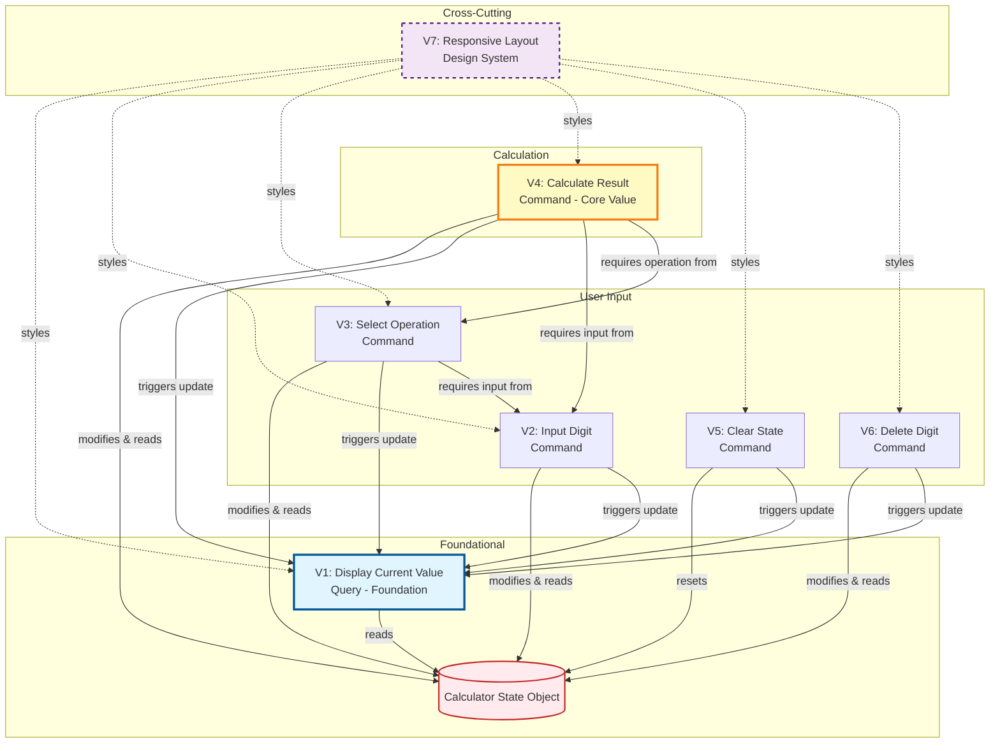
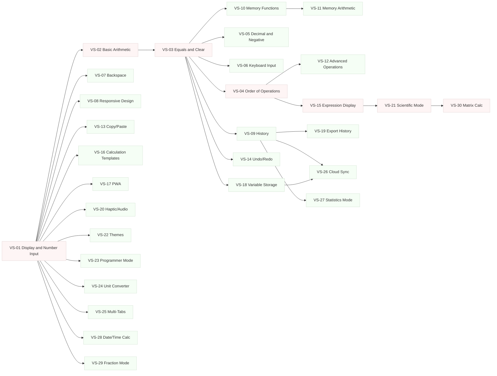

# Implementation Plan: Web Calculator - Comprehensive Vertical Slice Architecture

## Executive Summary

This document provides a complete vertical slice implementation plan for the Web Calculator project, following the guidelines from `.github/instructions/vertical-slice-planning.instructions.md` and requirements from `requirements/web-calculator-prd.md`. This plan decomposes the calculator into discrete, independently deliverable vertical slices that each provide complete user-facing functionality across all phases from MVP through advanced features.

## Planning Metadata

- **Planning Date**: 2026-02-12
- **Project**: Web Calculator - Complete Implementation (MVP through V3.0)
- **Architecture Pattern**: Vertical Slice Architecture
- **Total Identified Slices**: 30 (continuous stream)
- **Team Size**: Scalable (1-4+ developers)
- **Technology Stack**: HTML5, CSS3, Vanilla JavaScript

## Table of Contents

- [1. Requirements Analysis Summary](#1-requirements-analysis-summary)
- [2. Slice Identification & Strategy](#2-slice-identification--strategy)
- [3. Vertical Slice Specifications](#3-vertical-slice-specifications)
- [4. Dependency Analysis](#4-dependency-analysis)
- [5. Implementation Sequencing](#5-implementation-sequencing)
- [6. Test Automation Requirements](#6-test-automation-requirements)
- [7. Validation Criteria](#7-validation-criteria)
- [8. Risk Assessment & Mitigation](#8-risk-assessment--mitigation)
- [9. Quality Checklist](#9-quality-checklist)

---

## 1. Requirements Analysis Summary

### Business Capability

**Primary Goal**: Provide a fast, accessible, and reliable web-based calculator for basic arithmetic operations.

### Core User Needs (From PRD Analysis)

**Target Users**:

- Office workers needing quick calculations without app switching
- Students requiring homework verification
- Freelancers performing business calculations on any device
- Casual users for everyday arithmetic

**Success Metrics**:

- 10,000 MAU within 6 months
- <100ms calculation response time
- 30%+ mobile usage
- 50%+ keyboard operation usage
- WCAG 2.1 AA compliance

### MVP Features (From PRD Section "Core Features")

| Feature ID | Feature Name                | Priority | PRD Reference |
| ---------- | --------------------------- | -------- | ------------- |
| F1         | Basic Arithmetic Operations | P0       | F1.1-F1.8     |
| F2         | Calculator Display          | P0       | F2.1-F2.6     |
| F3         | Button Interface            | P0       | F3.1-F3.9     |
| F4         | Keyboard Support            | P0       | F4.1-F4.8     |
| F5         | Responsive Design           | P0       | F5.1-F5.5     |

### Data Entities

For this MVP implementation:

- **Calculator State** (in-memory JavaScript object):
  - `currentValue`: string (current display value)
  - `previousValue`: string (first operand in operation)
  - `operation`: string (selected operation: +, -, ×, ÷)
  - `awaitingOperand`: boolean (whether next input starts new number)
  - `displayError`: boolean (error state flag)

### External Dependencies

- **None** for MVP: Pure client-side JavaScript application
- Future: Local storage for history (V1.1 feature)

### Non-Functional Requirements

- **Performance**: Sub-100ms calculation time, <2s page load
- **Accessibility**: WCAG 2.1 AA compliance, keyboard navigation, screen reader support
- **Browser Support**: Modern evergreen browsers (Chrome, Firefox, Safari, Edge)
- **Responsive**: 320px to 4K displays
- **Security**: No sensitive data handling, client-side only

---

## 2. Slice Identification & Strategy

### Strategy Applied: User Action Decomposition + Feature Progression

Following the vertical-slice-planning instructions (Strategy 1: User Action Decomposition), we identify slices by discrete user actions and feature capabilities. Each slice represents a complete request-to-response flow from user interaction to visual feedback. The 30 slices form a continuous dependency graph where teams can work on any slice once its prerequisites are satisfied:

- **Foundation Slices**: VS-01 through VS-08 - Core calculator operations
- **Enhancement Slices**: VS-09 through VS-16 - History, memory, and workflow features
- **Progressive Slices**: VS-17 through VS-26 - PWA, scientific mode, themes, and sync
- **Advanced Slices**: VS-27 through VS-30 - Specialized calculation modes

Implementation follows the dependency graph (see Section 5) rather than sequential phases, enabling maximum parallelization.

### Classification by Type

**Query Slices** (Read-only, display state):

- VS-01: Display Current Value (foundational)

**Command Slices** (Modify state):

- VS-02 through VS-30: Various state-modifying features (arithmetic, memory, advanced operations, etc.)

**Cross-Cutting Concerns**:

- VS-08: Responsive Layout (applies to all slices)

### Slice Independence Validation

Each slice:

- ✅ Has clear boundaries (single user action or feature)
- ✅ Modifies well-defined state
- ✅ Produces visible output
- ✅ Can be implemented independently (after dependencies satisfied)
- ✅ Can be tested independently
- ✅ Delivers incremental user value

---

## 3. Vertical Slice Specifications

## Slice V1: Display Current Value (Query)

### Overview

**Slice Type**: Query (Read-Only)
**Feature**: Calculator Display (F2)
**Priority**: P0 (Critical)
**Business Value**: Foundational - Required for all other slices
**Implementation Effort**: 4 hours
**Risk Level**: Low
**Dependencies**: None

### User Story

```
As a user
I want to see the numbers I input and calculation results
So that I can verify my entries and view outcomes
```

### Acceptance Criteria

- [ ] Displays "0" on initial page load
- [ ] Updates to show `currentValue` from calculator state
- [ ] Display has minimum font size of 24px (PRD F2.1)
- [ ] Display has 4.5:1 contrast ratio minimum (PRD F2.1)
- [ ] Long numbers are truncated or formatted gracefully (PRD F2.4)
- [ ] Error messages display clearly (PRD F2.6)
- [ ] Display is readable from 2 feet away (PRD acceptance criteria)

### Technical Specification

**HTML Structure**:

```html
<div class="calculator">
  <div
    class="calculator__display"
    id="display"
    role="status"
    aria-live="polite"
  >
    <span class="display__value">0</span>
  </div>
</div>
```

**State Read**:

- Reads: `calculatorState.currentValue`
- Reads: `calculatorState.displayError`

**Rendering Logic**:

1. On state change, read `currentValue`
2. If `displayError` is true, render error message
3. If `currentValue` is empty, render "0"
4. If `currentValue` is valid, render formatted value
5. Apply truncation if length exceeds display width

**CSS Requirements**:

- Font size: 2rem (32px) minimum
- Font family: Monospace for number clarity
- Text alignment: Right-aligned
- Background: High contrast with text
- Padding: Sufficient for readability
- Border: Visual separation from buttons

**Accessibility**:

- ARIA `role="status"` for screen reader announcements
- ARIA `aria-live="polite"` for non-disruptive updates
- High contrast ratio (minimum 4.5:1)

### Test Cases

| Test Case | Input State                                 | Expected Output               | Test Type     |
| --------- | ------------------------------------------- | ----------------------------- | ------------- |
| TC-V1-01  | `currentValue: ""`                          | Display shows "0"             | Unit          |
| TC-V1-02  | `currentValue: "42"`                        | Display shows "42"            | Unit          |
| TC-V1-03  | `currentValue: "0.###"`                     | Display shows "0.123"         | Unit          |
| TC-V1-04  | `currentValue: "12345678901234567890"`      | Display truncates gracefully  | Unit          |
| TC-V1-05  | `displayError: true, currentValue: "Error"` | Display shows "Error" message | Unit          |
| TC-V1-06  | Screen reader active                        | Announces value changes       | Accessibility |
| TC-V1-07  | Various zoom levels                         | Remains readable at 200% zoom | Visual        |

### Implementation Checklist

- [ ] Create HTML display structure
- [ ] Implement `updateDisplay()` function
- [ ] Add CSS styling with accessibility compliance
- [ ] Implement number formatting logic
- [ ] Add truncation for long numbers
- [ ] Add ARIA attributes for accessibility
- [ ] Write unit tests for rendering logic
- [ ] Perform manual accessibility testing
- [ ] Validate contrast ratios with tools

---

## Slice V2: Input Digit (Command)

### Overview

**Slice Type**: Command (State Modification)
**Feature**: Button Interface (F3) + Keyboard Support (F4)
**Priority**: P0 (Critical)
**Business Value**: Critical - Enables primary user input
**Implementation Effort**: 6 hours
**Risk Level**: Low
**Dependencies**: V1 (Display Current Value)

### User Story

```
As a user
I want to input numbers using buttons or keyboard
So that I can build the calculations I need
```

### Acceptance Criteria

- [ ] Clicking number buttons (0-9) appends digit to display
- [ ] Clicking decimal button (.) adds decimal point
- [ ] Only one decimal point allowed per number
- [ ] Leading zero is removed (e.g., "07" becomes "7")
- [ ] Keyboard input (0-9, .) functions identically to buttons
- [ ] Numbers can be up to 15 digits (PRD F1.8)
- [ ] Decimal precision up to 10 places (PRD F1.6)
- [ ] Visual feedback on button press (PRD F3.8)
- [ ] Buttons are minimum 44×44px (PRD F3.7)

### Technical Specification

**HTML Structure**:

```html
<div class="calculator__buttons">
  <button class="btn btn--number" data-digit="7">7</button>
  <button class="btn btn--number" data-digit="8">8</button>
  <button class="btn btn--number" data-digit="9">9</button>
  <!-- ... additional number buttons ... -->
  <button class="btn btn--number" data-digit="0">0</button>
  <button class="btn btn--decimal" data-digit=".">.</button>
</div>
```

**State Modification**:

- Modifies: `calculatorState.currentValue`
- Modifies: `calculatorState.awaitingOperand` (sets to false)
- Clears: `calculatorState.displayError` (if error was showing)

**Business Logic**:

1. If `awaitingOperand` is true, replace `currentValue` with new digit
2. If `awaitingOperand` is false, append digit to `currentValue`
3. For decimal point:
   - Check if `currentValue` already contains "."
   - If not present, append "."
   - If already present, ignore input
4. Remove leading zeros unless followed by decimal point
5. Limit total length to 15 digits
6. Set `awaitingOperand` to false
7. Trigger display update via V1

**Event Handling**:

```javascript
// Click events
document.querySelectorAll(".btn--number, .btn--decimal").forEach((btn) => {
  btn.addEventListener("click", handleDigitInput);
});

// Keyboard events
document.addEventListener("keydown", (e) => {
  if (/^[0-9.]$/.test(e.key)) {
    handleDigitInput(e.key);
  }
});
```

**CSS Requirements**:

- Button min-size: 44×44px (touch target requirement)
- Active state: Visual feedback on press
- Hover state: Distinct from default
- Focus state: Visible outline for keyboard navigation
- Grid layout: Organized number pad layout

**Validation Rules**:

- Maximum length: 15 digits
- Only one decimal point allowed
- No non-numeric characters (except decimal)
- Leading zero removal (except for "0.xxx")

### Test Cases

| Test Case | Initial State                     | User Action        | Expected Result                               | Test Type     |
| --------- | --------------------------------- | ------------------ | --------------------------------------------- | ------------- |
| TC-V2-01  | `currentValue: "0"`               | Click "5"          | `currentValue: "5"`                           | Unit          |
| TC-V2-02  | `currentValue: "5"`               | Click "3"          | `currentValue: "53"`                          | Unit          |
| TC-V2-03  | `currentValue: "5"`               | Click "."          | `currentValue: "5."`                          | Unit          |
| TC-V2-04  | `currentValue: "5."`              | Click "."          | `currentValue: "5."` (no change)              | Unit          |
| TC-V2-05  | `currentValue: "5.2"`             | Click "3"          | `currentValue: "5.23"`                        | Unit          |
| TC-V2-06  | `currentValue: "0"`               | Click "0"          | `currentValue: "0"`                           | Unit          |
| TC-V2-07  | `currentValue: "0"`               | Click "."          | `currentValue: "0."`                          | Unit          |
| TC-V2-08  | `currentValue: ""`                | Press keyboard "8" | `currentValue: "8"`                           | Integration   |
| TC-V2-09  | `currentValue: "123456789012345"` | Click "6"          | No change (max length)                        | Unit          |
| TC-V2-10  | `awaitingOperand: true`           | Click "7"          | `currentValue: "7"`, `awaitingOperand: false` | Unit          |
| TC-V2-11  | Button click                      | -                  | Visual feedback shown                         | Visual        |
| TC-V2-12  | Tab navigation                    | Focus on button    | Visible focus indicator                       | Accessibility |

### Implementation Checklist

- [ ] Create HTML button elements for 0-9 and decimal
- [ ] Implement `handleDigitInput(digit)` function
- [ ] Add digit append logic
- [ ] Add decimal point validation
- [ ] Add maximum length check
- [ ] Add keyboard event listener
- [ ] Create CSS button styling (size, hover, active, focus)
- [ ] Ensure 44×44px minimum button size
- [ ] Write unit tests for all logic branches
- [ ] Write integration tests for keyboard input
- [ ] Perform manual testing on touch devices

---

## Slice V3: Select Operation (Command)

### Overview

**Slice Type**: Command (State Modification)
**Feature**: Basic Arithmetic Operations (F1) - Operation Selection
**Priority**: P0 (Critical)
**Business Value**: Critical - Enables arithmetic operations
**Implementation Effort**: 5 hours
**Risk Level**: Low
**Dependencies**: V1 (Display), V2 (Input Digit)

### User Story

```
As a user
I want to select an arithmetic operation (+, -, ×, ÷)
So that I can perform calculations between two numbers
```

### Acceptance Criteria

- [ ] Clicking operation buttons (+, -, ×, ÷) stores the operation
- [ ] Current display value is saved as first operand
- [ ] Display is ready to accept next number
- [ ] Selecting operations is possible via keyboard (+, -, \*, /)
- [ ] Subsequent operation selection replaces previous operation
- [ ] Visual indication of selected operation (optional enhancement)
- [ ] Operations follow standard mathematical symbols (PRD F1.1-F1.4)

### Technical Specification

**HTML Structure**:

```html
<div class="calculator__buttons">
  <button class="btn btn--operator" data-operator="+">+</button>
  <button class="btn btn--operator" data-operator="-">−</button>
  <button class="btn btn--operator" data-operator="×">×</button>
  <button class="btn btn--operator" data-operator="÷">÷</button>
</div>
```

**State Modification**:

- Reads: `calculatorState.currentValue`
- Modifies: `calculatorState.previousValue` (stores current value)
- Modifies: `calculatorState.operation` (stores selected operation)
- Modifies: `calculatorState.awaitingOperand` (sets to true)
- Modifies: `calculatorState.currentValue` (cleared for next input)

**Business Logic**:

1. Read current `currentValue`
2. If `currentValue` is empty, default to "0"
3. Store `currentValue` in `previousValue`
4. Store selected operation in `operation` (+, -, ×, ÷)
5. Set `awaitingOperand` to true (next digit starts new number)
6. Optionally clear `currentValue` or leave for display
7. Trigger display update

**Event Handling**:

```javascript
document.querySelectorAll(".btn--operator").forEach((btn) => {
  btn.addEventListener("click", handleOperatorInput);
});

document.addEventListener("keydown", (e) => {
  const operatorMap = { "+": "+", "-": "-", "*": "×", "/": "÷" };
  if (operatorMap[e.key]) {
    handleOperatorInput(operatorMap[e.key]);
  }
});
```

**CSS Requirements**:

- Distinct styling from number buttons (color differentiation)
- Same min-size: 44×44px
- Active/selected state visual feedback
- Accessible contrast ratios

**Operation Symbol Mapping**:

- Internal: `+`, `-`, `*`, `/` (JavaScript operators)
- Display: `+`, `−`, `×`, `÷` (mathematical symbols)

### Test Cases

| Test Case | Initial State                       | User Action        | Expected Result                                                 | Test Type     |
| --------- | ----------------------------------- | ------------------ | --------------------------------------------------------------- | ------------- |
| TC-V3-01  | `currentValue: "5"`                 | Click "+"          | `previousValue: "5"`, `operation: "+"`, `awaitingOperand: true` | Unit          |
| TC-V3-02  | `currentValue: "10"`                | Click "−"          | `previousValue: "10"`, `operation: "-"`                         | Unit          |
| TC-V3-03  | `currentValue: "8"`                 | Click "×"          | `previousValue: "8"`, `operation: "*"`                          | Unit          |
| TC-V3-04  | `currentValue: "20"`                | Click "÷"          | `previousValue: "20"`, `operation: "/"`                         | Unit          |
| TC-V3-05  | `currentValue: ""`                  | Click "+"          | `previousValue: "0"`, `operation: "+"`                          | Unit          |
| TC-V3-06  | `operation: "+", currentValue: "5"` | Click "−"          | `operation: "-"` (replaces)                                     | Unit          |
| TC-V3-07  | `currentValue: "7"`                 | Press keyboard "/" | `previousValue: "7"`, `operation: "/"`                          | Integration   |
| TC-V3-08  | Operation button click              | -                  | Visual feedback shown                                           | Visual        |
| TC-V3-09  | Tab to operator button              | -                  | Focus indicator visible                                         | Accessibility |

### Implementation Checklist

- [ ] Create HTML operator buttons (+, -, ×, ÷)
- [ ] Implement `handleOperatorInput(operator)` function
- [ ] Add logic to store previousValue and operation
- [ ] Add logic to set awaitingOperand flag
- [ ] Add keyboard event mapping (+, -, \*, /)
- [ ] Create CSS operator button styling
- [ ] Ensure distinct visual styling from number buttons
- [ ] Write unit tests for all operators
- [ ] Write integration tests with V2 (digit input)
- [ ] Test operation replacement behavior

---

## Slice V4: Calculate Result (Command)

### Overview

**Slice Type**: Command (State Modification)
**Feature**: Basic Arithmetic Operations (F1) - Calculation Execution
**Priority**: P0 (Critical)
**Business Value**: Critical - Core value proposition
**Implementation Effort**: 8 hours
**Risk Level**: Medium (complex logic, edge cases)
**Dependencies**: V1 (Display), V2 (Input), V3 (Operation)

### User Story

```
As a user
I want to press equals to see the result of my calculation
So that I can obtain the answer to my arithmetic problem
```

### Acceptance Criteria

- [ ] Equals button (=) executes the pending calculation
- [ ] Result is mathematically correct for all operations (PRD F1.1-F1.4)
- [ ] Division by zero displays error message (PRD F1.4)
- [ ] Result maintains decimal precision up to 10 places (PRD F1.6)
- [ ] Handles negative results correctly (PRD F1.7)
- [ ] Handles large numbers up to 15 digits (PRD F1.8)
- [ ] Floating point accuracy for 0.1 + 0.2 = 0.3 (PRD acceptance)
- [ ] Enter key triggers calculation (PRD F4.3)
- [ ] Result can be used as input for next calculation (chaining)
- [ ] PEMDAS order of operations for single operation (PRD F1.5)

### Technical Specification

**HTML Structure**:

```html
<button class="btn btn--equals" id="equalsBtn">=</button>
```

**State Modification**:

- Reads: `calculatorState.previousValue`
- Reads: `calculatorState.currentValue`
- Reads: `calculatorState.operation`
- Modifies: `calculatorState.currentValue` (stores result)
- Modifies: `calculatorState.previousValue` (clears)
- Modifies: `calculatorState.operation` (clears)
- Modifies: `calculatorState.awaitingOperand` (sets to true)
- Modifies: `calculatorState.displayError` (sets on error)

**Business Logic - Calculation Engine**:

```javascript
function calculate(previousValue, currentValue, operation) {
  const prev = parseFloat(previousValue);
  const current = parseFloat(currentValue);

  if (isNaN(prev) || isNaN(current)) {
    return { error: true, message: "Invalid input" };
  }

  let result;
  switch (operation) {
    case "+":
      result = prev + current;
      break;
    case "-":
      result = prev - current;
      break;
    case "*":
      result = prev * current;
      break;
    case "/":
      if (current === 0) {
        return { error: true, message: "Cannot divide by zero" };
      }
      result = prev / current;
      break;
    default:
      return { error: true, message: "Unknown operation" };
  }

  // Round to 10 decimal places to handle floating point precision
  result = Math.round(result * 10000000000) / 10000000000;

  // Format for display (remove trailing zeros)
  result = result.toString();

  // Check maximum digit length
  if (result.replace(".", "").replace("-", "").length > 15) {
    result = parseFloat(result).toExponential(10);
  }

  return { error: false, result: result };
}
```

**Event Handling**:

```javascript
document.getElementById("equalsBtn").addEventListener("click", handleEquals);

document.addEventListener("keydown", (e) => {
  if (e.key === "Enter") {
    handleEquals();
    e.preventDefault();
  }
});
```

**Error Handling**:

- Division by zero: Display "Cannot divide by zero"
- Invalid input: Display "Error"
- Overflow: Use scientific notation for very large results

**Floating Point Precision Fix**:

- Round to 10 decimal places using multiplication/division technique
- Handles common JavaScript floating point issues (e.g., 0.1 + 0.2)

### Test Cases

| Test Case | Previous          | Current                     | Operation                 | Expected Result              | Test Type |
| --------- | ----------------- | --------------------------- | ------------------------- | ---------------------------- | --------- |
| TC-V4-01  | "2"               | "3"                         | "+"                       | "5"                          | Unit      |
| TC-V4-02  | "10"              | "4"                         | "-"                       | "6"                          | Unit      |
| TC-V4-03  | "5"               | "6"                         | "\*"                      | "30"                         | Unit      |
| TC-V4-04  | "20"              | "4"                         | "/"                       | "5"                          | Unit      |
| TC-V4-05  | "10"              | "0"                         | "/"                       | "Cannot divide by zero"      | Unit      |
| TC-V4-06  | "0.1"             | "0.2"                       | "+"                       | "0.3" (not 0.30000000004)    | Unit      |
| TC-V4-07  | "10"              | "3"                         | "/"                       | "3.3333333333" (10 decimals) | Unit      |
| TC-V4-08  | "5"               | "3"                         | "-"                       | "2"                          | Unit      |
| TC-V4-09  | "-5"              | "3"                         | "+"                       | "-2"                         | Unit      |
| TC-V4-10  | "999999999999999" | "1"                         | "+"                       | Scientific notation or error | Unit      |
| TC-V4-11  | Result displayed  | Press keyboard "Enter"      | Calculation executes      | Integration                  |
| TC-V4-12  | Result "5"        | Click "+" then "3" then "=" | Chained calculation works | Integration                  |

### Implementation Checklist

- [ ] Create HTML equals button
- [ ] Implement `calculate()` core function
- [ ] Add logic for all four operations (+, -, ×, ÷)
- [ ] Add division by zero error handling
- [ ] Implement floating point precision rounding
- [ ] Add result formatting (remove trailing zeros)
- [ ] Add large number handling (scientific notation)
- [ ] Add keyboard Enter event listener
- [ ] Implement state clearing after calculation
- [ ] Enable result chaining for next calculation
- [ ] Write unit tests for all operations
- [ ] Write unit tests for edge cases (divide by zero, large numbers)
- [ ] Write integration tests for complete workflows
- [ ] Test floating point precision fix (0.1 + 0.2)
- [ ] Test chaining multiple operations

---

## Slice V5: Clear Calculator State (Command)

### Overview

**Slice Type**: Command (State Reset)
**Feature**: Clear Function (F3.4)
**Priority**: P0 (Critical)
**Business Value**: High - Essential for usability and testing
**Implementation Effort**: 3 hours
**Risk Level**: Low
**Dependencies**: V1 (Display)

### User Story

```
As a user
I want to clear the calculator
So that I can start a new calculation from scratch
```

### Acceptance Criteria

- [ ] Clear button (C) resets all calculator state
- [ ] Display shows "0" after clearing
- [ ] All pending operations are cleared
- [ ] Escape key performs same function (PRD F4.4)
- [ ] Works after error state
- [ ] Works at any point in calculation sequence

### Technical Specification

**HTML Structure**:

```html
<button class="btn btn--clear" id="clearBtn">C</button>
```

**State Modification**:

- Modifies: `calculatorState.currentValue` → "" (empty)
- Modifies: `calculatorState.previousValue` → "" (empty)
- Modifies: `calculatorState.operation` → null
- Modifies: `calculatorState.awaitingOperand` → false
- Modifies: `calculatorState.displayError` → false

**Business Logic**:

```javascript
function clearCalculator() {
  calculatorState.currentValue = "";
  calculatorState.previousValue = "";
  calculatorState.operation = null;
  calculatorState.awaitingOperand = false;
  calculatorState.displayError = false;
  updateDisplay(); // Display will show "0" for empty currentValue
}
```

**Event Handling**:

```javascript
document.getElementById("clearBtn").addEventListener("click", clearCalculator);

document.addEventListener("keydown", (e) => {
  if (e.key === "Escape") {
    clearCalculator();
  }
});
```

**CSS Requirements**:

- Distinct visual style (often red or prominent color)
- Same min-size: 44×44px
- Clear visual indication of function

### Test Cases

| Test Case | Initial State                                           | User Action    | Expected Result                       | Test Type   |
| --------- | ------------------------------------------------------- | -------------- | ------------------------------------- | ----------- |
| TC-V5-01  | `currentValue: "42"`                                    | Click "C"      | All state reset, display shows "0"    | Unit        |
| TC-V5-02  | `previousValue: "5", operation: "+", currentValue: "3"` | Click "C"      | All state reset                       | Unit        |
| TC-V5-03  | `displayError: true`                                    | Click "C"      | Error cleared, display shows "0"      | Unit        |
| TC-V5-04  | `currentValue: "10"`                                    | Press "Escape" | All state reset                       | Integration |
| TC-V5-05  | Mid-calculation                                         | Click "C"      | Calculator reset, ready for new input | Integration |

### Implementation Checklist

- [ ] Create HTML clear button (C)
- [ ] Implement `clearCalculator()` function
- [ ] Reset all state properties
- [ ] Trigger display update
- [ ] Add keyboard Escape event listener
- [ ] Create CSS clear button styling (distinctive color)
- [ ] Write unit tests for state clearing
- [ ] Write integration tests with various states
- [ ] Test clearing after error
- [ ] Test clearing mid-calculation

---

## Slice V6: Delete Last Digit (Command)

### Overview

**Slice Type**: Command (State Modification)
**Feature**: Delete/Backspace Function (F3.5)
**Priority**: P0 (Critical)
**Business Value**: High - Significantly improves user experience
**Implementation Effort**: 4 hours
**Risk Level**: Low
**Dependencies**: V1 (Display), V2 (Input Digit)

### User Story

```
As a user
I want to delete my last entry if I make a mistake
So that I don't have to clear and start over
```

### Acceptance Criteria

- [ ] Delete button (DEL or ←) removes last digit from current value
- [ ] Backspace key performs same function (PRD F4.5)
- [ ] If current value becomes empty, display shows "0"
- [ ] Works for both numbers and decimal points
- [ ] Does not affect previousValue or operation
- [ ] Visual feedback on press

### Technical Specification

**HTML Structure**:

```html
<button class="btn btn--delete" id="deleteBtn" title="Delete (Backspace)">
  ⌫
</button>
```

**State Modification**:

- Reads: `calculatorState.currentValue`
- Modifies: `calculatorState.currentValue` (removes last character)

**Business Logic**:

```javascript
function deleteLastDigit() {
  if (calculatorState.awaitingOperand) {
    // If awaiting operand, don't delete from previous operation
    return;
  }

  let current = calculatorState.currentValue;

  if (current.length > 0) {
    current = current.slice(0, -1);
    calculatorState.currentValue = current;
  }

  updateDisplay();
}
```

**Event Handling**:

```javascript
document.getElementById("deleteBtn").addEventListener("click", deleteLastDigit);

document.addEventListener("keydown", (e) => {
  if (e.key === "Backspace") {
    deleteLastDigit();
    e.preventDefault(); // Prevent browser back navigation
  }
});
```

**Edge Cases**:

- Empty currentValue: No action needed
- Single digit: Remove digit, display shows "0"
- Decimal point: Can be deleted like any character
- After operation selection: No deletion (awaiting operand)

### Test Cases

| Test Case | Initial State           | User Action       | Expected Result                       | Test Type   |
| --------- | ----------------------- | ----------------- | ------------------------------------- | ----------- |
| TC-V6-01  | `currentValue: "123"`   | Click "⌫"         | `currentValue: "12"`                  | Unit        |
| TC-V6-02  | `currentValue: "5"`     | Click "⌫"         | `currentValue: ""`, display shows "0" | Unit        |
| TC-V6-03  | `currentValue: "5.3"`   | Click "⌫"         | `currentValue: "5."`                  | Unit        |
| TC-V6-04  | `currentValue: "5."`    | Click "⌫"         | `currentValue: "5"`                   | Unit        |
| TC-V6-05  | `currentValue: "42"`    | Press "Backspace" | `currentValue: "4"`                   | Integration |
| TC-V6-06  | `awaitingOperand: true` | Click "⌫"         | No change to previousValue            | Unit        |
| TC-V6-07  | `currentValue: ""`      | Click "⌫"         | No error, display shows "0"           | Unit        |

### Implementation Checklist

- [ ] Create HTML delete button (⌫ or DEL)
- [ ] Implement `deleteLastDigit()` function
- [ ] Add logic to remove last character from currentValue
- [ ] Handle empty string edge case
- [ ] Add keyboard Backspace event listener
- [ ] Prevent Backspace browser navigation
- [ ] Check awaitingOperand flag
- [ ] Create CSS delete button styling
- [ ] Write unit tests for deletion logic
- [ ] Write integration tests with digit input
- [ ] Test edge cases (empty, single digit, decimal)

---

## Slice V7: Ensure Responsive Layout (Cross-Cutting)

### Overview

**Slice Type**: Cross-Cutting Concern (Layout & Design)
**Feature**: Responsive Design (F5)
**Priority**: P0 (Critical)
**Business Value**: High - Accessibility and multi-device support
**Implementation Effort**: 10 hours
**Risk Level**: Medium (CSS complexity, device testing)
**Dependencies**: All other slices (applies to all)

### User Story

```
As a mobile user
I want to use the calculator on my phone
So that I can perform calculations on the go
```

### Acceptance Criteria

- [ ] Calculator functional on viewports from 320px upward (PRD F5.1)
- [ ] Optimized layouts for mobile (320px+), tablet (768px+), desktop (1024px+) (PRD F5.2)
- [ ] No horizontal scrolling on any standard device width (PRD F5.2)
- [ ] Touch targets remain at least 44×44px on all devices (PRD F5.3)
- [ ] Works in portrait and landscape orientations (PRD F5.5)
- [ ] Display remains readable at all sizes
- [ ] Buttons remain accessible and clickable
- [ ] Layout adapts gracefully to screen size changes

### Technical Specification

**CSS Architecture**:

```css
/* Mobile-first approach - base styles for 320px+ */
.calculator {
  max-width: 100%;
  margin: 0 auto;
  padding: 1rem;
}

.calculator__display {
  font-size: 2rem; /* 32px, scales with viewport */
  padding: 1rem;
  min-height: 4rem;
}

.calculator__buttons {
  display: grid;
  grid-template-columns: repeat(4, 1fr);
  gap: 0.5rem;
}

.btn {
  min-height: 44px;
  min-width: 44px;
  font-size: 1.25rem;
  padding: 0.75rem;
}

/* Tablet: 768px+ */
@media (min-width: 768px) {
  .calculator {
    max-width: 400px;
  }

  .calculator__display {
    font-size: 2.5rem;
  }

  .btn {
    min-height: 60px;
    font-size: 1.5rem;
  }
}

/* Desktop: 1024px+ */
@media (min-width: 1024px) {
  .calculator {
    max-width: 450px;
  }

  .calculator__display {
    font-size: 3rem;
  }

  .btn {
    min-height: 70px;
    font-size: 1.75rem;
  }
}
```

**Grid Layout Configuration**:

```
Standard Calculator Layout (4×5 grid):
[  7  ][  8  ][  9  ][ ÷  ]
[  4  ][  5  ][  6  ][ ×  ]
[  1  ][  2  ][  3  ][ −  ]
[  0  ][  .  ][ ⌫  ][ +  ]
[    C    ]   [   =   ]
```

**Viewport Breakpoints**:

- **Mobile**: 320px - 767px (base styles, portrait priority)
- **Tablet**: 768px - 1023px (larger touch targets)
- **Desktop**: 1024px+ (mouse-optimized, larger display)

**Responsive Techniques**:

- CSS Grid for button layout (flexible, responsive)
- Flexbox for calculator container (centering, spacing)
- Relative units (rem, em, %) instead of fixed pixels
- CSS clamp() for scalable font sizes if needed
- Touch-friendly spacing on mobile (larger gaps)

**Accessibility Requirements**:

- Minimum touch target: 44×44px (WCAG 2.1 guideline)
- Scalable text (no fixed pixel sizes for critical text)
- Sufficient color contrast at all sizes
- Focus indicators visible at all viewport sizes
- No horizontal scrolling (overflow handled gracefully)

### Test Cases

| Test Case | Viewport Size             | Expected Behavior                     | Test Type     |
| --------- | ------------------------- | ------------------------------------- | ------------- |
| TC-V7-01  | 320×568 (iPhone SE)       | Calculator fits, no horizontal scroll | Visual        |
| TC-V7-02  | 375×667 (iPhone 8)        | Buttons min 44×44px, touch-friendly   | Visual        |
| TC-V7-03  | 768×1024 (iPad portrait)  | Layout optimized for tablet           | Visual        |
| TC-V7-04  | 1024×768 (iPad landscape) | Layout adapts to landscape            | Visual        |
| TC-V7-05  | 1920×1080 (Desktop)       | Calculator centered, appropriate size | Visual        |
| TC-V7-06  | 3840×2160 (4K)            | Display remains readable              | Visual        |
| TC-V7-07  | Rotate device             | Layout adapts without breaking        | Visual        |
| TC-V7-08  | Zoom to 200%              | Content remains accessible            | Accessibility |
| TC-V7-09  | Touch device              | All buttons responsive to touch       | Integration   |
| TC-V7-10  | Mouse device              | Hover states visible                  | Integration   |

### Implementation Checklist

- [ ] Create mobile-first base CSS
- [ ] Implement CSS Grid button layout
- [ ] Define media queries for tablet and desktop
- [ ] Ensure minimum 44×44px touch targets
- [ ] Test on physical devices (if available)
- [ ] Test on browser DevTools responsive mode
- [ ] Test portrait and landscape orientations
- [ ] Verify no horizontal scrolling at any size
- [ ] Validate text scalability
- [ ] Test zoom levels up to 200%
- [ ] Verify accessibility with WCAG tools
- [ ] Test on multiple browsers (Chrome, Firefox, Safari, Edge)

---

## 4. Dependency Analysis

### Data Dependencies

**Shared State Object**: `calculatorState`

```javascript
const calculatorState = {
  currentValue: "", // Current display value
  previousValue: "", // First operand
  operation: null, // Selected operation: +, -, *, /
  awaitingOperand: false, // Flag for next input behavior
  displayError: false, // Error state flag
};
```

**State Access Matrix**:

| Slice                 | Reads                                        | Writes                                                                          | Dependencies            |
| --------------------- | -------------------------------------------- | ------------------------------------------------------------------------------- | ----------------------- |
| V1: Display           | `currentValue`, `displayError`               | None                                                                            | None (foundational)     |
| V2: Input Digit       | `currentValue`, `awaitingOperand`            | `currentValue`, `awaitingOperand`                                               | V1 (for display update) |
| V3: Select Operation  | `currentValue`                               | `previousValue`, `operation`, `awaitingOperand`                                 | V1, V2                  |
| V4: Calculate Result  | `previousValue`, `currentValue`, `operation` | `currentValue`, `previousValue`, `operation`, `awaitingOperand`, `displayError` | V1, V2, V3              |
| V5: Clear State       | None                                         | All state properties                                                            | V1 (for display update) |
| V6: Delete Digit      | `currentValue`, `awaitingOperand`            | `currentValue`                                                                  | V1, V2                  |
| V7: Responsive Layout | None                                         | None                                                                            | All (cross-cutting)     |

### Service Dependencies

**None for MVP**: This is a pure client-side application with no external service dependencies.

### Infrastructure Dependencies

- **Browser APIs**:
  - DOM manipulation (document.querySelector, addEventListener)
  - JavaScript Math object (for calculations)
  - CSS Grid and Flexbox (for layout)
  - localStorage (future V1.1 feature for history)

- **Browser Support**:
  - Modern evergreen browsers (Chrome, Firefox, Safari, Edge)
  - ES6+ JavaScript support required
  - CSS Grid support required

### Shared Components

**updateDisplay() Function**:

- Shared by all command slices
- Implements V1 (Display Current Value) logic
- Called after any state modification

**Event Handling System**:

- Centralized keyboard event listener
- Used by V2, V3, V4, V5, V6

### Dependency Graph



### Integration Points

**Single State Management**:

- All slices share a single `calculatorState` object
- No complex state management library needed
- State updates trigger display refresh

**Event Coordination**:

- All slices hook into DOM events
- Keyboard events map to buttons for consistency
- Each slice registers its own event listeners

**Display Update Protocol**:

- Every state-modifying slice calls `updateDisplay()` after changes
- Display slice (V1) encapsulates all rendering logic
- Consistent visual feedback across all actions

### Risk Assessment by Dependency

| Slice | Coupling Level       | Risk   | Mitigation                                         |
| ----- | -------------------- | ------ | -------------------------------------------------- |
| V1    | Low (foundational)   | Low    | No dependencies                                    |
| V2    | Low                  | Low    | Minimal state interaction                          |
| V3    | Medium               | Low    | Depends on V2, simple logic                        |
| V4    | High                 | Medium | Complex logic, depends on V2+V3, most edge cases   |
| V5    | Low                  | Low    | Simple state reset                                 |
| V6    | Low                  | Low    | Simple state modification                          |
| V7    | High (cross-cutting) | Medium | Affects all slices, CSS complexity, device testing |

---

## 5. Implementation Sequencing

### Sequencing Strategy

**Primary Strategy**: Dependency-Based + Value-Based Hybrid

- Implement zero-dependency slices first (V1)
- Follow with input capabilities (V2, V5)
- Build up to core value proposition (V3, V4)
- Enhance usability (V6)
- Apply cross-cutting concerns throughout (V7)

### Prioritization Matrix

| Slice                 | Business Value | Effort | Ratio     | Risk   | Dependencies | Priority          |
| --------------------- | -------------- | ------ | --------- | ------ | ------------ | ----------------- |
| V1: Display           | Foundational   | 4h     | N/A       | Low    | None         | **1**             |
| V2: Input Digit       | Critical       | 6h     | High      | Low    | V1           | **2**             |
| V5: Clear State       | High           | 3h     | Very High | Low    | V1           | **3**             |
| V3: Select Operation  | Critical       | 5h     | High      | Low    | V1, V2       | **4**             |
| V4: Calculate Result  | Critical       | 8h     | Medium    | Medium | V1, V2, V3   | **5**             |
| V6: Delete Digit      | High           | 4h     | High      | Low    | V1, V2       | **6**             |
| V7: Responsive Layout | High           | 10h    | Medium    | Medium | All          | **7** (iterative) |

### Comprehensive Dependency Map (All 30 Vertical Slices)

The following diagram shows dependencies and parallel implementation opportunities across all 30 vertical slices as a continuous stream of work. This visualization helps teams understand the complete project scope and maximize development efficiency.



**Legend**:

- **Light Red (Critical Path)**: Sequential slices that must be completed in order - these form the longest path through the project (VS-01 → VS-02 → VS-03 → VS-04 → VS-15 → VS-21 → VS-30)
- **Light Green (Parallelizable)**: Slices that can be implemented in parallel with others once their dependencies are satisfied
- **Arrows**: Direct dependencies (prerequisite must be complete before dependent can start)
- **Multiple arrows from one slice**: Unlocks multiple parallel work streams
- **Multiple arrows to one slice**: Requires multiple prerequisites

**Parallel Implementation Analysis**:

The dependency structure reveals natural parallelization opportunities throughout the implementation:

**Foundation Layer** (VS-01):

- Critical foundation slice - everything directly or indirectly depends on this
- Once complete, unlocks 7 parallel tracks: VS-02, VS-07, VS-08, VS-13, VS-16, VS-17, VS-20, VS-22, VS-23, VS-24, VS-25, VS-28, VS-29

**Primary Critical Path** (Sequential):

- VS-01 → VS-02 → VS-03 → VS-04 → VS-12
- VS-03 → VS-09 → VS-19, VS-26, VS-27
- VS-04 → VS-15 → VS-21 → VS-30

**High Parallelization Zones**:

1. **After VS-01 completes**: Up to 13 slices can start in parallel
   - VS-02 (critical path continuation)
   - VS-07, VS-08 (independent enhancements)
   - VS-13, VS-16, VS-17, VS-20 (feature additions)
   - VS-22, VS-23, VS-24, VS-25, VS-28, VS-29 (advanced features)

2. **After VS-03 completes**: 5 additional parallel tracks open
   - VS-04 (critical path)
   - VS-05, VS-06 (input enhancements)
   - VS-09, VS-10, VS-14, VS-18 (state management features)

3. **After VS-09 completes**: 3 parallel tracks available
   - VS-19 (export)
   - VS-26 (cloud sync, also needs VS-18)
   - VS-27 (statistics)

**Critical Convergence Points**:

- **VS-26 (Cloud Sync)**: Requires both VS-09 AND VS-18
- **VS-21 (Scientific Mode)**: Unlocks VS-30 (Matrix Calculator)

**Maximum Parallelization Potential**:

- With **1 developer**: Sequential implementation (longest path ~30 slices)
- With **2-3 developers**: 40-50% time reduction (parallel critical/enhancement tracks)
- With **4-6 developers**: 60-70% time reduction (full parallelization after foundation)
- With **7+ developers**: Diminishing returns (coordination overhead)

### Implementation Roadmap

The continuous stream approach enables flexible implementation ordering based on team capacity and business priorities. Teams can pick slices from any parallelizable branch once dependencies are satisfied.

**Recommended Starting Sequence**:

1. VS-01 (required foundation)
2. VS-02 → VS-03 (critical path for basic calculator)
3. Parallelize remaining work based on team size and priorities

---

### Risk Mitigation Plan

#### High Risks

**Risk 1: Floating Point Precision Issues**

- **Impact**: High (incorrect calculations damage trust)
- **Probability**: High (JavaScript floating point is notorious)
- **Affected Slice**: V4 (Calculate Result)
- **Mitigation**:
  - Implement rounding to 10 decimal places
  - Test edge cases (0.1 + 0.2, 0.3 - 0.1, etc.)
  - Add extensive unit tests for precision
  - Consider using decimal.js library if issues persist

**Risk 2: Cross-Browser CSS Inconsistencies**

- **Impact**: High (affects user experience on specific browsers)
- **Probability**: Medium
- **Affected Slice**: V7 (Responsive Layout)
- **Mitigation**:
  - Use CSS Grid and Flexbox (well-supported modern features)
  - Test on all target browsers early
  - Use autoprefixer for vendor prefixes
  - Implement progressive enhancement

#### Medium Risks

**Risk 3: Touch Target Size on Small Screens**

- **Impact**: Medium (usability issues on mobile)
- **Probability**: Medium
- **Affected Slice**: V7 (Responsive Layout)
- **Mitigation**:
  - Design mobile-first
  - Test on physical devices (not just simulators)
  - Use minimum 44×44px touch targets
  - Add adequate spacing between buttons

**Risk 4: Complex Edge Cases in Calculation Logic**

- **Impact**: Medium (potential calculation errors)
- **Probability**: Medium
- **Affected Slice**: V4 (Calculate Result)
- **Mitigation**:
  - Implement comprehensive test suite
  - Test with extreme values (very large, very small, zero)
  - Test operation chaining
  - Review JavaScript operator precedence

#### Low Risks

**Risk 5: Keyboard Event Conflicts**

- **Impact**: Low (minor UX issue)
- **Probability**: Low
- **Affected Slices**: V2, V3, V4, V5, V6
- **Mitigation**:
  - Use `event.preventDefault()` where appropriate
  - Test keyboard navigation thoroughly
  - Document keyboard shortcuts

### Dependencies and Blockers

#### External Dependencies

- **None** - This is a self-contained client-side application with no external dependencies.

#### Potential Blockers

**Blocker 1: Browser Testing Environment**

- **Impact**: Cannot validate cross-browser compatibility
- **Mitigation**: Use BrowserStack or similar service, or test on available devices

**Blocker 2: Accessibility Testing Tools**

- **Impact**: Cannot validate WCAG compliance
- **Mitigation**: Use free tools (WAVE, axe DevTools, Chrome Lighthouse)

---

## 6. Test Automation Requirements

### Testing Strategy

**Testing Approach**: Test-Driven Development (TDD) preferred, Test-After Development acceptable

**Test Pyramid**:

- **Unit Tests** (70%): Test individual functions and slices in isolation
- **Integration Tests** (20%): Test complete workflows across multiple slices
- **Visual/E2E Tests** (10%): Test UI appearance and end-to-end user journeys

### Unit Testing

**Framework**: Jest (recommended) or Mocha + Chai

**Coverage Target**: Minimum 80% code coverage

**Unit Test Plan**:

| Slice | Component           | Test Count | Priority |
| ----- | ------------------- | ---------- | -------- |
| V1    | Display rendering   | 7 tests    | High     |
| V2    | Digit input logic   | 12 tests   | High     |
| V3    | Operation selection | 9 tests    | High     |
| V4    | Calculation engine  | 12+ tests  | Critical |
| V5    | Clear function      | 5 tests    | Medium   |
| V6    | Delete function     | 7 tests    | Medium   |
| V7    | (mostly visual)     | -          | -        |

**Sample Unit Test Structure**:

```javascript
// V4: Calculate Result - Unit Tests
describe("calculate()", () => {
  test("addition: 2 + 3 should equal 5", () => {
    const result = calculate("2", "3", "+");
    expect(result.error).toBe(false);
    expect(result.result).toBe("5");
  });

  test("division by zero should return error", () => {
    const result = calculate("10", "0", "/");
    expect(result.error).toBe(true);
    expect(result.message).toBe("Cannot divide by zero");
  });

  test("floating point precision: 0.1 + 0.2 should equal 0.3", () => {
    const result = calculate("0.1", "0.2", "+");
    expect(result.error).toBe(false);
    expect(result.result).toBe("0.3");
  });
});

describe("handleDigitInput()", () => {
  beforeEach(() => {
    calculatorState = { currentValue: "", awaitingOperand: false };
  });

  test("should append digit to empty currentValue", () => {
    handleDigitInput("5");
    expect(calculatorState.currentValue).toBe("5");
  });

  test("should prevent multiple decimal points", () => {
    calculatorState.currentValue = "5.2";
    handleDigitInput(".");
    expect(calculatorState.currentValue).toBe("5.2");
  });
});
```

### Integration Testing

**Framework**: Jest + DOM Testing Library or Cypress (Component Testing)

**Integration Test Plan**:

| Workflow             | Description                      | Test Cases | Priority |
| -------------------- | -------------------------------- | ---------- | -------- |
| Basic Addition       | Complete addition workflow       | 3 tests    | High     |
| Basic Subtraction    | Complete subtraction workflow    | 2 tests    | High     |
| Basic Multiplication | Complete multiplication workflow | 2 tests    | High     |
| Basic Division       | Complete division workflow       | 3 tests    | High     |
| Keyboard Navigation  | Full keyboard-only workflow      | 4 tests    | High     |
| Error Recovery       | Error state and recovery         | 3 tests    | Medium   |
| Operation Chaining   | Multiple operations in sequence  | 3 tests    | Medium   |

**Sample Integration Test**:

```javascript
// Integration Test: Complete Addition Workflow
describe("Addition Workflow", () => {
  test("user can add two numbers using buttons", () => {
    // Setup
    render(Calculator);

    // Act
    fireEvent.click(getByText("2"));
    fireEvent.click(getByText("+"));
    fireEvent.click(getByText("3"));
    fireEvent.click(getByText("="));

    // Assert
    const display = getByRole("status");
    expect(display).toHaveTextContent("5");
  });

  test("user can add using keyboard", () => {
    render(Calculator);

    fireEvent.keyDown(document, { key: "2" });
    fireEvent.keyDown(document, { key: "+" });
    fireEvent.keyDown(document, { key: "3" });
    fireEvent.keyDown(document, { key: "Enter" });

    expect(getByRole("status")).toHaveTextContent("5");
  });
});
```

### Visual/Accessibility Testing

**Framework**: Cypress (E2E), axe-core (Accessibility), Percy (Visual Regression)

**Visual Test Plan**:

| Test Scenario           | Viewports               | Priority |
| ----------------------- | ----------------------- | -------- |
| Initial load appearance | Mobile, Tablet, Desktop | High     |
| Button hover states     | Desktop                 | Medium   |
| Button active states    | All                     | Medium   |
| Error state display     | All                     | High     |
| Long number handling    | All                     | Medium   |
| Focus indicators        | All                     | High     |

**Accessibility Test Plan**:

| Test Area             | Tool         | Priority |
| --------------------- | ------------ | -------- |
| Color contrast        | axe DevTools | High     |
| Keyboard navigation   | Manual + axe | High     |
| Screen reader support | NVDA/JAWS    | High     |
| Focus order           | Manual       | Medium   |
| ARIA attributes       | axe DevTools | High     |

**Sample Accessibility Test**:

```javascript
// Accessibility Test
describe("Accessibility Compliance", () => {
  test("should have no WCAG 2.1 AA violations", async () => {
    const { container } = render(Calculator);
    const results = await axe(container);
    expect(results.violations).toHaveLength(0);
  });

  test("display should announce value changes to screen readers", () => {
    render(Calculator);
    const display = getByRole("status");
    expect(display).toHaveAttribute("aria-live", "polite");
  });

  test("all buttons should be keyboard accessible", () => {
    render(Calculator);
    const buttons = getAllByRole("button");
    buttons.forEach((button) => {
      expect(button).toHaveAttribute("tabindex");
    });
  });
});
```

### Test Execution Plan

**Development Workflow**:

1. Write unit tests before or alongside implementation
2. Run unit tests on every file save (watch mode)
3. Run full test suite before committing
4. Run integration tests before pushing
5. Run visual/accessibility tests before PR

**CI/CD Pipeline**:

```yaml
# GitHub Actions example
test:
  - run: npm run test:unit
  - run: npm run test:integration
  - run: npm run test:accessibility
  - run: npm run lint
  coverage:
    - run: npm run test:coverage
    - require: 80% minimum
```

### Test Data and Edge Cases

**Critical Edge Cases to Test**:

- Division by zero
- Very large numbers (>15 digits)
- Very small decimals (>10 decimal places)
- 0.1 + 0.2 (floating point precision)
- Negative numbers
- Multiple operations without equals
- Pressing equals without operation
- Deleting from empty display
- Clearing mid-calculation
- Rapid button clicking
- Keyboard and mouse interaction mixing

---

## 7. Validation Criteria

### Slice Validation Checklist

Use this checklist to validate each slice before marking it complete:

**V1: Display Current Value**

- [ ] Renders "0" on initial load
- [ ] Updates when state changes
- [ ] Handles long numbers gracefully
- [ ] Shows error messages clearly
- [ ] Meets contrast ratio requirements (4.5:1)
- [ ] Screen reader announces changes
- [ ] Unit tests pass (7/7)

**V2: Input Digit**

- [ ] All number buttons (0-9) functional
- [ ] Decimal button works
- [ ] Only one decimal allowed
- [ ] Keyboard input works (0-9, .)
- [ ] Maximum length enforced (15 digits)
- [ ] Visual feedback on button press
- [ ] Touch targets ≥44×44px
- [ ] Unit tests pass (12/12)
- [ ] Integration test with keyboard passes

**V3: Select Operation**

- [ ] All operation buttons (+, -, ×, ÷) functional
- [ ] Keyboard operators work (+, -, \*, /)
- [ ] Previous value stored correctly
- [ ] Operation stored correctly
- [ ] Awaiting operand flag set
- [ ] Visual distinction from number buttons
- [ ] Unit tests pass (9/9)
- [ ] Integration test with V2 passes

**V4: Calculate Result**

- [ ] Addition produces correct results
- [ ] Subtraction produces correct results
- [ ] Multiplication produces correct results
- [ ] Division produces correct results
- [ ] Division by zero handled gracefully
- [ ] Floating point precision correct (0.1 + 0.2 = 0.3)
- [ ] Negative results handled
- [ ] Large numbers handled (scientific notation if needed)
- [ ] Enter key triggers calculation
- [ ] Result can chain into next calculation
- [ ] Unit tests pass (12+/12+)
- [ ] Integration tests pass (all workflows)

**V5: Clear Calculator State**

- [ ] Clear button resets all state
- [ ] Display shows "0" after clear
- [ ] Escape key works identically
- [ ] Works from any state
- [ ] Works after errors
- [ ] Unit tests pass (5/5)

**V6: Delete Last Digit**

- [ ] Delete button removes last character
- [ ] Backspace key works identically
- [ ] Handles empty value gracefully
- [ ] Can delete decimal point
- [ ] Does not affect previous value
- [ ] Unit tests pass (7/7)
- [ ] Integration test passes

**V7: Ensure Responsive Layout**

- [ ] Works on 320px viewport (smallest mobile)
- [ ] Works on 375px viewport (common mobile)
- [ ] Works on 768px viewport (tablet)
- [ ] Works on 1024px+ viewport (desktop)
- [ ] No horizontal scrolling at any size
- [ ] Touch targets ≥44×44px on all devices
- [ ] Portrait and landscape orientations work
- [ ] Works on Chrome, Firefox, Safari, Edge
- [ ] WCAG 2.1 AA compliance verified
- [ ] Focus indicators visible
- [ ] Readable at 200% zoom

### MVP Completion Criteria

**Functional Requirements**:

- [ ] All core arithmetic operations functional (+, -, ×, ÷)
- [ ] Display shows input and results correctly
- [ ] All buttons functional (20+ buttons)
- [ ] Full keyboard support operational
- [ ] Responsive design across all target devices
- [ ] Error handling (division by zero) works
- [ ] Decimal precision maintained (10 places)

**Non-Functional Requirements**:

- [ ] Page load time <2 seconds (3G connection)
- [ ] Calculation response time <100ms
- [ ] Zero critical bugs in production
- [ ] WCAG 2.1 AA compliance verified
- [ ] Cross-browser compatibility confirmed
- [ ] 80%+ code test coverage achieved

**Quality Gates**:

- [ ] All unit tests passing (70+ tests)
- [ ] All integration tests passing (20+ tests)
- [ ] Accessibility audit passed (axe-core)
- [ ] Visual regression tests passed
- [ ] Code review completed
- [ ] Security review completed (if applicable)

---

## 8. Risk Assessment & Mitigation

### Overall Project Risks

| Risk                                | Impact | Probability | Severity     | Mitigation                                 |
| ----------------------------------- | ------ | ----------- | ------------ | ------------------------------------------ |
| Floating point precision errors     | High   | High        | **Critical** | Implement rounding, extensive testing      |
| Cross-browser CSS incompatibilities | Medium | Medium      | **Medium**   | Test early and often, use modern standards |
| Accessibility compliance gaps       | High   | Low         | **Medium**   | Use automated tools, manual testing        |
| Keyboard shortcut conflicts         | Low    | Low         | **Low**      | Use preventDefault, document shortcuts     |
| Mobile device touch issues          | Medium | Medium      | **Medium**   | Test on physical devices, 44px targets     |
| Complex calculation edge cases      | Medium | Medium      | **Medium**   | Comprehensive test suite                   |

### Slice-Specific Risks

**V1 (Display)**: Low Risk

- Simple rendering logic
- No complex dependencies
- Well-understood patterns

**V2 (Input Digit)**: Low Risk

- Straightforward state modification
- Clear validation rules
- Mitigation: Thorough input validation testing

**V3 (Select Operation)**: Low Risk

- Simple state transitions
- No complex calculations
- Mitigation: Clear state machine logic

**V4 (Calculate Result)**: **Medium-High Risk**

- Complex calculation logic
- Floating point precision issues
- Multiple edge cases
- Mitigation:
  - Implement decimal rounding
  - Extensive unit test coverage (20+ tests)
  - Test with edge cases early
  - Consider decimal.js library if issues persist

**V5 (Clear State)**: Low Risk

- Simple state reset
- No complex logic
- Mitigation: Test from various states

**V6 (Delete Digit)**: Low Risk

- Simple string manipulation
- Few edge cases
- Mitigation: Test edge cases (empty, single char)

**V7 (Responsive Layout)**: **Medium Risk**

- CSS complexity across devices
- Touch target sizing
- Cross-browser compatibility
- Mitigation:
  - Mobile-first development
  - Early device testing
  - Use established CSS frameworks/patterns
  - Automated visual regression tests

### Contingency Plans

**If floating point precision cannot be solved with rounding**:

- Integrate library: decimal.js or big.js
- Estimated effort: +4 hours
- Impact: Delays dependent slices (VS-04, VS-12)

**If CSS Grid support is insufficient**:

- Fallback to Flexbox layout
- Estimated effort: +6 hours
- Impact: Delays VS-08 (Responsive Design)

**If WCAG compliance audit fails**:

- Remediation effort: 4-8 hours
- Impact: Delays launch, must fix before release

---

## 9. Quality Checklist

### Planning Phase Validation

Before starting implementation, verify:

- [ ] **Requirements Analysis Complete**
  - [ ] All PRD core features (F1-F5) analyzed
  - [ ] User stories understood
  - [ ] Success metrics defined
  - [ ] Acceptance criteria documented

- [ ] **Slice Identification Valid**
  - [ ] 30 vertical slices identified
  - [ ] Each slice has clear boundaries
  - [ ] Each slice delivers user value
  - [ ] Slices are appropriately sized
  - [ ] No mega-slices (>2 days) or nano-slices (<1 hour)

- [ ] **Dependencies Mapped**
  - [ ] State dependencies documented
  - [ ] Integration points identified
  - [ ] Shared components extracted
  - [ ] Dependency graph created

- [ ] **Implementation Sequence Defined**
  - [ ] Slices prioritized by value and dependencies
  - [ ] Dependency graph created showing all slice relationships
  - [ ] Parallelization opportunities identified
  - [ ] Risk mitigation strategies documented

- [ ] **Test Plan Created**
  - [ ] Unit test cases defined (70+ tests)
  - [ ] Integration test cases defined (20+ tests)
  - [ ] Accessibility test plan created
  - [ ] 80% code coverage target set

### Implementation Phase Validation

During implementation, for each slice:

- [ ] **Code Quality**
  - [ ] Follows Single Responsibility Principle
  - [ ] Functions are small and focused (<30 lines preferred)
  - [ ] Clear, descriptive naming
  - [ ] Comments for complex logic
  - [ ] No code duplication (DRY principle)

- [ ] **Testing**
  - [ ] Unit tests written and passing
  - [ ] Integration tests passing (if applicable)
  - [ ] Edge cases tested
  - [ ] Test coverage ≥80% for slice

- [ ] **Accessibility**
  - [ ] ARIA attributes present where needed
  - [ ] Keyboard navigation functional
  - [ ] Focus indicators visible
  - [ ] Color contrast ratios ≥4.5:1
  - [ ] Screen reader tested (NVDA/JAWS)

- [ ] **Performance**
  - [ ] No performance bottlenecks
  - [ ] Efficient DOM manipulation
  - [ ] Event listeners properly managed
  - [ ] Calculations complete in <100ms

- [ ] **Documentation**
  - [ ] Code comments for complex logic
  - [ ] JSDoc for public functions
  - [ ] README updated with slice details

### Pre-Release Validation

Before marking MVP complete:

- [ ] **Functional Completeness**
  - [ ] All 7 slices implemented
  - [ ] All PRD core features (F1-F5) functional
  - [ ] All acceptance criteria met
  - [ ] Zero critical bugs

- [ ] **Test Coverage**
  - [ ] All unit tests passing
  - [ ] All integration tests passing
  - [ ] All accessibility tests passing
  - [ ] Overall code coverage ≥80%

- [ ] **Cross-Device Testing**
  - [ ] Tested on mobile (320px, 375px, 414px viewports)
  - [ ] Tested on tablet (768px, 1024px viewports)
  - [ ] Tested on desktop (1280px, 1920px viewports)
  - [ ] Tested portrait and landscape orientations
  - [ ] Works on physical devices (if available)

- [ ] **Cross-Browser Testing**
  - [ ] Chrome (latest)
  - [ ] Firefox (latest)
  - [ ] Safari (latest)
  - [ ] Edge (latest)

- [ ] **Accessibility Compliance**
  - [ ] WCAG 2.1 AA audit passed (axe-core)
  - [ ] Keyboard navigation fully functional
  - [ ] Screen reader compatibility verified
  - [ ] Focus management correct
  - [ ] Color contrast compliant

- [ ] **Performance Benchmarks**
  - [ ] Page load time <2 seconds (3G throttling)
  - [ ] Calculation response <100ms
  - [ ] Lighthouse score ≥90 (Performance, Accessibility)

- [ ] **Documentation**
  - [ ] User documentation (keyboard shortcuts, features)
  - [ ] Developer documentation (architecture, setup)
  - [ ] README complete and accurate
  - [ ] Code comments adequate

---

## Appendix A: Technology Stack Details

**Frontend**:

- HTML5 (semantic markup)
- CSS3 (Grid, Flexbox, Custom Properties)
- Vanilla JavaScript (ES6+)

**Dev Tools**:

- VS Code (editor)
- Jest (testing framework)
- axe DevTools (accessibility testing)
- Chrome DevTools (debugging, performance)

**Build Tools** (optional for MVP):

- Webpack or Vite (bundling)
- Babel (transpiling)
- PostCSS (CSS processing)

**Version Control**:

- Git
- GitHub (repository, CI/CD)

**CI/CD** (optional for MVP):

- GitHub Actions (test automation, deployment)
- Netlify or Vercel (static hosting)

---

## Appendix B: Glossary

- **Vertical Slice**: A feature implementation that cuts through all architectural layers (UI, logic, state) to deliver complete user-facing functionality.
- **Command Slice**: A slice that modifies application state (e.g., Input Digit, Calculate Result).
- **Query Slice**: A slice that reads and displays state without modifying it (e.g., Display Current Value).
- **Cross-Cutting Concern**: Functionality that affects multiple slices (e.g., Responsive Layout, Logging).
- **PEMDAS**: Parentheses, Exponents, Multiplication, Division, Addition, Subtraction - order of operations in mathematics.
- **WCAG**: Web Content Accessibility Guidelines - international standards for web accessibility.
- **Touch Target**: The clickable/tappable area of a UI element; minimum 44×44px for accessibility.
- **ARIA**: Accessible Rich Internet Applications - attributes to improve accessibility for assistive technologies.

---

## Appendix C: References

- **PRD**: `requirements/web-calculator-prd.md`
- **Vertical Slice Planning Instructions**: `.github/instructions/vertical-slice-planning.instructions.md`
- **Vertical Slice Implementation Instructions**: `.github/instructions/vertical-slice.instructions.md`
- **WCAG 2.1 Guidelines**: https://www.w3.org/WAI/WCAG21/quickref/
- **MDN Web Docs**: https://developer.mozilla.org/
- **CSS Grid Guide**: https://css-tricks.com/snippets/css/complete-guide-grid/
- **Accessibility Testing**: https://www.deque.com/axe/

---

**Plan Version**: 1.0.0
**Created**: 2026-02-12
**Author**: johnmillerATcodemag-com
**Status**: Ready for Implementation
**Next Review**: After initial foundation slices (VS-01 through VS-03) completion
