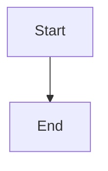
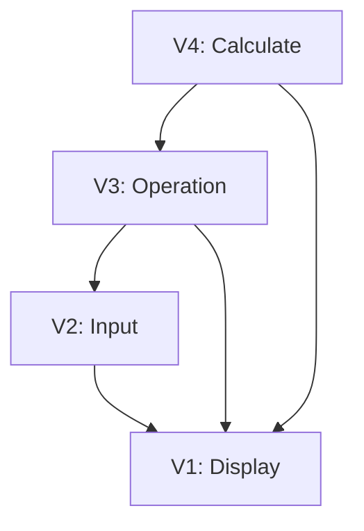

# Mermaid Test

## Simple Diagram

```mermaid
graph TD
    A[Start] --> B[End]
```

## Graph with Styling

```mermaid
graph LR
    A[Node A] --> B[Node B]
    B --> C[Node C]
    style A fill:#f9f,stroke:#333
    style B fill:#bbf,stroke:#333
```

## Original First Diagram (Simplified)

```mermaid
graph TD
    V1[V1: Display]
    V2[V2: Input]
    V3[V3: Operation]
    V4[V4: Calculate]

    V2 --> V1
    V3 --> V1
    V4 --> V1
    V3 --> V2
    V4 --> V3
```
